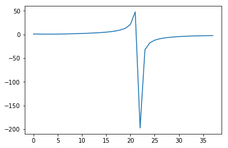

這個程式是之前用來計算一日中時間與影子長度的關係


```python
import math

def modifier_formula_b(dates_sequence_number):
    return (dates_sequence_number - 1) * 360 / 365

def modifier_formula_Et(modifier_formula_b_result):
    return 229.2*(0.000075+0.001868*math.cos(modifier_formula_b_result * math.pi / 180)-0.032077*math.sin(modifier_formula_b_result * math.pi / 180)-0.014615*math.cos(2*modifier_formula_b_result * math.pi / 180)-0.014615*math.cos(2*modifier_formula_b_result*math.pi/180)-0.04089*math.sin(2*modifier_formula_b_result*math.pi /180))

def true_solar_time(local_time_hour, local_time_minute, lat, modifier_formula_Et_result):
    #return local_time_hour + (local_time_minute - (  (math.pi / 180 * 120) - lat) * 4) / 60 + modifier_formula_Et_result
    return local_time_hour + (local_time_minute - (120 - lat) * 4) / 60 + modifier_formula_Et_result
    
def hour_angle_of_sun(true_solar_time):
    return (true_solar_time - 12) * 15

def solar_declination_angle(dates_sequence_number):
    return 23.45 * math.sin((dates_sequence_number - 80.25) * (1 - dates_sequence_number / 9500))

def solar_elevation_angle(solar_declination_angle_result, lat, hour_angle_of_sun_result):
    #return math.asin(math.sin(solar_declination_angle_result) * math.sin(lat) + math.cos(solar_declination_angle_result) * math.cos(lat) * math.cos(hour_angle_of_sun_result))
    return math.asin(math.sin(solar_declination_angle_result * math.pi / 180) * math.sin(lat * math.pi / 180) + math.cos(solar_declination_angle_result * math.pi / 180) * math.cos(lat * math.pi / 180) * math.cos(hour_angle_of_sun_result * math.pi / 180))

#計算影子長度
def shadow_length(the_length_of_the_rods, solar_elevation_angle_result):
    return the_length_of_the_rods / math.tan(solar_elevation_angle_result)

rods_length = 3
dates = 20
local_hour = 6
local_minute = 0
lat = 24.9936281
lng = 121.3009798
'''
modifier_formula_b_value = modifier_formula_b(dates)
print("modifier_formula_b_value", modifier_formula_b_value, sep = ": ")
modifier_formula_Et_value = modifier_formula_Et(modifier_formula_b_value)
print("modifier_formula_Et_value", modifier_formula_Et_value, sep = ": ")
true_solar_time_value = true_solar_time(local_hour, local_minute, lat, modifier_formula_Et_value)
print("true_solar_time_value", true_solar_time_value, sep = ": ")
hour_angle_of_sun_value = hour_angle_of_sun(true_solar_time_value)
print("hour_angle_of_sun_value", hour_angle_of_sun_value, sep = ": ")
solar_declination_angle_value = solar_declination_angle(dates)
print("solar_declination_angle_value", solar_declination_angle_value, sep = ": ")
solar_elevation_angle_value = solar_elevation_angle(solar_declination_angle_value, lat, hour_angle_of_sun_value)
print("solar_elevation_angle_value", solar_elevation_angle_value, sep = ": ")
shadow_length_value = shadow_length(rods_length, solar_elevation_angle_value)
print("shadow_length_value", shadow_length_value, sep = ": ")
'''
def increase_time(hours, minutes):
    minutes += 20
    if minutes > 59:
        minutes = 0
        hours += 1
    return [hours, minutes]

ys = []

while not(local_hour == 18 and local_minute == 40):
    local_hour = increase_time(local_hour, local_minute)[0]
    local_minute = increase_time(local_hour, local_minute)[1]
    print(local_hour, local_minute, sep = ":")
    modifier_formula_b_value = modifier_formula_b(dates)
    print("modifier_formula_b_value", modifier_formula_b_value, sep = ": ")
    modifier_formula_Et_value = modifier_formula_Et(modifier_formula_b_value)
    print("modifier_formula_Et_value", modifier_formula_Et_value, sep = ": ")
    true_solar_time_value = true_solar_time(local_hour, local_minute, lat, modifier_formula_Et_value)
    print("true_solar_time_value", true_solar_time_value, sep = ": ")
    hour_angle_of_sun_value = hour_angle_of_sun(true_solar_time_value)
    print("hour_angle_of_sun_value", hour_angle_of_sun_value, sep = ": ")
    solar_declination_angle_value = solar_declination_angle(dates)
    print("solar_declination_angle_value", solar_declination_angle_value, sep = ": ")
    solar_elevation_angle_value = solar_elevation_angle(solar_declination_angle_value, lat, hour_angle_of_sun_value)
    print("solar_elevation_angle_value", solar_elevation_angle_value, sep = ": ")
    shadow_length_value = shadow_length(rods_length, solar_elevation_angle_value)
    print("shadow_length_value", shadow_length_value, sep = ": ")
    ys += [shadow_length_value]
    print()
    
xs = []
length = len(ys)
import pylab
for x in range(length):
    xs += [x]
    print("xs: ", xs[x], "ys: ", ys[x])

pylab.plot(xs, ys)
pylab.show()

```

    6:20
    modifier_formula_b_value: 18.73972602739726
    modifier_formula_Et_value: -12.958535078797656
    true_solar_time_value: -12.95895987213099
    hour_angle_of_sun_value: -374.38439808196483
    solar_declination_angle_value: 9.837339623037964
    solar_elevation_angle_value: 1.2145729501340483
    shadow_length_value: 1.1162917792423515
    
    6:40
    modifier_formula_b_value: 18.73972602739726
    modifier_formula_Et_value: -12.958535078797656
    true_solar_time_value: -12.625626538797656
    hour_angle_of_sun_value: -369.38439808196483
    solar_declination_angle_value: 9.837339623037964
    solar_elevation_angle_value: 1.2638625952390423
    shadow_length_value: 0.950849743903559
    
    7:0
    modifier_formula_b_value: 18.73972602739726
    modifier_formula_Et_value: -12.958535078797656
    true_solar_time_value: -12.292293205464322
    hour_angle_of_sun_value: -364.38439808196483
    solar_declination_angle_value: 9.837339623037964
    solar_elevation_angle_value: 1.2964514490064851
    shadow_length_value: 0.844324412856388
    
    7:20
    modifier_formula_b_value: 18.73972602739726
    modifier_formula_Et_value: -12.958535078797656
    true_solar_time_value: -11.95895987213099
    hour_angle_of_sun_value: -359.38439808196483
    solar_declination_angle_value: 9.837339623037964
    solar_elevation_angle_value: 1.3060721141949476
    shadow_length_value: 0.8132594335657078
    
    7:40
    modifier_formula_b_value: 18.73972602739726
    modifier_formula_Et_value: -12.958535078797656
    true_solar_time_value: -11.625626538797656
    hour_angle_of_sun_value: -354.38439808196483
    solar_declination_angle_value: 9.837339623037964
    solar_elevation_angle_value: 1.2903442642750904
    shadow_length_value: 0.8641314955273992
    
    8:0
    modifier_formula_b_value: 18.73972602739726
    modifier_formula_Et_value: -12.958535078797656
    true_solar_time_value: -11.292293205464322
    hour_angle_of_sun_value: -349.38439808196483
    solar_declination_angle_value: 9.837339623037964
    solar_elevation_angle_value: 1.253019017409301
    shadow_length_value: 0.9867732980037919
    
    8:20
    modifier_formula_b_value: 18.73972602739726
    modifier_formula_Et_value: -12.958535078797656
    true_solar_time_value: -10.95895987213099
    hour_angle_of_sun_value: -344.38439808196483
    solar_declination_angle_value: 9.837339623037964
    solar_elevation_angle_value: 1.2005933819043415
    shadow_length_value: 1.1642899665552853
    
    8:40
    modifier_formula_b_value: 18.73972602739726
    modifier_formula_Et_value: -12.958535078797656
    true_solar_time_value: -10.625626538797656
    hour_angle_of_sun_value: -339.38439808196483
    solar_declination_angle_value: 9.837339623037964
    solar_elevation_angle_value: 1.138557085706065
    shadow_length_value: 1.384002126357823
    
    9:0
    modifier_formula_b_value: 18.73972602739726
    modifier_formula_Et_value: -12.958535078797656
    true_solar_time_value: -10.292293205464322
    hour_angle_of_sun_value: -334.38439808196483
    solar_declination_angle_value: 9.837339623037964
    solar_elevation_angle_value: 1.0705090389663567
    shadow_length_value: 1.6400267287746537
    
    9:20
    modifier_formula_b_value: 18.73972602739726
    modifier_formula_Et_value: -12.958535078797656
    true_solar_time_value: -9.95895987213099
    hour_angle_of_sun_value: -329.38439808196483
    solar_declination_angle_value: 9.837339623037964
    solar_elevation_angle_value: 0.9986320586572057
    shadow_length_value: 1.9320787071898398
    
    9:40
    modifier_formula_b_value: 18.73972602739726
    modifier_formula_Et_value: -12.958535078797656
    true_solar_time_value: -9.625626538797656
    hour_angle_of_sun_value: -324.38439808196483
    solar_declination_angle_value: 9.837339623037964
    solar_elevation_angle_value: 0.924248602365693
    shadow_length_value: 2.2643137614766844
    
    10:0
    modifier_formula_b_value: 18.73972602739726
    modifier_formula_Et_value: -12.958535078797656
    true_solar_time_value: -9.292293205464322
    hour_angle_of_sun_value: -319.38439808196483
    solar_declination_angle_value: 9.837339623037964
    solar_elevation_angle_value: 0.8481836338877886
    shadow_length_value: 2.6451030877181756
    
    10:20
    modifier_formula_b_value: 18.73972602739726
    modifier_formula_Et_value: -12.958535078797656
    true_solar_time_value: -8.95895987213099
    hour_angle_of_sun_value: -314.38439808196483
    solar_declination_angle_value: 9.837339623037964
    solar_elevation_angle_value: 0.7709728079469635
    shadow_length_value: 3.087825133424316
    
    10:40
    modifier_formula_b_value: 18.73972602739726
    modifier_formula_Et_value: -12.958535078797656
    true_solar_time_value: -8.625626538797656
    hour_angle_of_sun_value: -309.38439808196483
    solar_declination_angle_value: 9.837339623037964
    solar_elevation_angle_value: 0.6929794881764493
    shadow_length_value: 3.6129015709653705
    
    11:0
    modifier_formula_b_value: 18.73972602739726
    modifier_formula_Et_value: -12.958535078797656
    true_solar_time_value: -8.292293205464322
    hour_angle_of_sun_value: -304.38439808196483
    solar_declination_angle_value: 9.837339623037964
    solar_elevation_angle_value: 0.6144616623476145
    shadow_length_value: 4.251816317669859
    
    11:20
    modifier_formula_b_value: 18.73972602739726
    modifier_formula_Et_value: -12.958535078797656
    true_solar_time_value: -7.95895987213099
    hour_angle_of_sun_value: -299.38439808196483
    solar_declination_angle_value: 9.837339623037964
    solar_elevation_angle_value: 0.5356114354996023
    shadow_length_value: 5.054932018540423
    
    11:40
    modifier_formula_b_value: 18.73972602739726
    modifier_formula_Et_value: -12.958535078797656
    true_solar_time_value: -7.625626538797656
    hour_angle_of_sun_value: -294.38439808196483
    solar_declination_angle_value: 9.837339623037964
    solar_elevation_angle_value: 0.45657924466756417
    shadow_length_value: 6.107547627726593
    
    12:0
    modifier_formula_b_value: 18.73972602739726
    modifier_formula_Et_value: -12.958535078797656
    true_solar_time_value: -7.292293205464323
    hour_angle_of_sun_value: -289.38439808196483
    solar_declination_angle_value: 9.837339623037964
    solar_elevation_angle_value: 0.37748936253637555
    shadow_length_value: 7.56611897239986
    
    12:20
    modifier_formula_b_value: 18.73972602739726
    modifier_formula_Et_value: -12.958535078797656
    true_solar_time_value: -6.95895987213099
    hour_angle_of_sun_value: -284.38439808196483
    solar_declination_angle_value: 9.837339623037964
    solar_elevation_angle_value: 0.2984503377080014
    shadow_length_value: 9.751685866399677
    
    12:40
    modifier_formula_b_value: 18.73972602739726
    modifier_formula_Et_value: -12.958535078797656
    true_solar_time_value: -6.625626538797656
    hour_angle_of_sun_value: -279.38439808196483
    solar_declination_angle_value: 9.837339623037964
    solar_elevation_angle_value: 0.21956247198784562
    shadow_length_value: 13.443265815778181
    
    13:0
    modifier_formula_b_value: 18.73972602739726
    modifier_formula_Et_value: -12.958535078797656
    true_solar_time_value: -6.292293205464323
    hour_angle_of_sun_value: -274.38439808196483
    solar_declination_angle_value: 9.837339623037964
    solar_elevation_angle_value: 0.1409236008631349
    shadow_length_value: 21.14701992728117
    
    13:20
    modifier_formula_b_value: 18.73972602739726
    modifier_formula_Et_value: -12.958535078797656
    true_solar_time_value: -5.95895987213099
    hour_angle_of_sun_value: -269.38439808196483
    solar_declination_angle_value: 9.837339623037964
    solar_elevation_angle_value: 0.06263398879620885
    shadow_length_value: 47.83466636315222
    
    13:40
    modifier_formula_b_value: 18.73972602739726
    modifier_formula_Et_value: -12.958535078797656
    true_solar_time_value: -5.625626538797656
    hour_angle_of_sun_value: -264.38439808196483
    solar_declination_angle_value: 9.837339623037964
    solar_elevation_angle_value: -0.015199093661684163
    shadow_length_value: -197.36499101628715
    
    14:0
    modifier_formula_b_value: 18.73972602739726
    modifier_formula_Et_value: -12.958535078797656
    true_solar_time_value: -5.292293205464323
    hour_angle_of_sun_value: -259.38439808196483
    solar_declination_angle_value: 9.837339623037964
    solar_elevation_angle_value: -0.0924566660422261
    shadow_length_value: -32.35512394617984
    
    14:20
    modifier_formula_b_value: 18.73972602739726
    modifier_formula_Et_value: -12.958535078797656
    true_solar_time_value: -4.95895987213099
    hour_angle_of_sun_value: -254.38439808196483
    solar_declination_angle_value: 9.837339623037964
    solar_elevation_angle_value: -0.16900280741486154
    shadow_length_value: -17.58185892005498
    
    14:40
    modifier_formula_b_value: 18.73972602739726
    modifier_formula_Et_value: -12.958535078797656
    true_solar_time_value: -4.625626538797656
    hour_angle_of_sun_value: -249.3843980819648
    solar_declination_angle_value: 9.837339623037964
    solar_elevation_angle_value: -0.2446784902455845
    shadow_length_value: -12.01532722066957
    
    15:0
    modifier_formula_b_value: 18.73972602739726
    modifier_formula_Et_value: -12.958535078797656
    true_solar_time_value: -4.292293205464322
    hour_angle_of_sun_value: -244.38439808196483
    solar_declination_angle_value: 9.837339623037964
    solar_elevation_angle_value: -0.3192940199470609
    shadow_length_value: -9.074243326698532
    
    15:20
    modifier_formula_b_value: 18.73972602739726
    modifier_formula_Et_value: -12.958535078797656
    true_solar_time_value: -3.9589598721309898
    hour_angle_of_sun_value: -239.38439808196483
    solar_declination_angle_value: 9.837339623037964
    solar_elevation_angle_value: -0.39261954072776983
    shadow_length_value: -7.244270419249155
    
    15:40
    modifier_formula_b_value: 18.73972602739726
    modifier_formula_Et_value: -12.958535078797656
    true_solar_time_value: -3.625626538797656
    hour_angle_of_sun_value: -234.38439808196483
    solar_declination_angle_value: 9.837339623037964
    solar_elevation_angle_value: -0.46437297318086457
    shadow_length_value: -5.989135297126206
    
    16:0
    modifier_formula_b_value: 18.73972602739726
    modifier_formula_Et_value: -12.958535078797656
    true_solar_time_value: -3.292293205464322
    hour_angle_of_sun_value: -229.38439808196483
    solar_declination_angle_value: 9.837339623037964
    solar_elevation_angle_value: -0.5342046766681745
    shadow_length_value: -5.071172794427538
    
    16:20
    modifier_formula_b_value: 18.73972602739726
    modifier_formula_Et_value: -12.958535078797656
    true_solar_time_value: -2.9589598721309898
    hour_angle_of_sun_value: -224.38439808196483
    solar_declination_angle_value: 9.837339623037964
    solar_elevation_angle_value: -0.6016781652600481
    shadow_length_value: -4.369335493320457
    
    16:40
    modifier_formula_b_value: 18.73972602739726
    modifier_formula_Et_value: -12.958535078797656
    true_solar_time_value: -2.625626538797656
    hour_angle_of_sun_value: -219.38439808196483
    solar_declination_angle_value: 9.837339623037964
    solar_elevation_angle_value: -0.6662465318698506
    shadow_length_value: -3.816003189812249
    
    17:0
    modifier_formula_b_value: 18.73972602739726
    modifier_formula_Et_value: -12.958535078797656
    true_solar_time_value: -2.292293205464322
    hour_angle_of_sun_value: -214.38439808196483
    solar_declination_angle_value: 9.837339623037964
    solar_elevation_angle_value: -0.7272252067817427
    shadow_length_value: -3.371040927588337
    
    17:20
    modifier_formula_b_value: 18.73972602739726
    modifier_formula_Et_value: -12.958535078797656
    true_solar_time_value: -1.9589598721309898
    hour_angle_of_sun_value: -209.38439808196483
    solar_declination_angle_value: 9.837339623037964
    solar_elevation_angle_value: -0.7837639070689942
    shadow_length_value: -3.0098215977227807
    
    17:40
    modifier_formula_b_value: 18.73972602739726
    modifier_formula_Et_value: -12.958535078797656
    true_solar_time_value: -1.6256265387976558
    hour_angle_of_sun_value: -204.38439808196483
    solar_declination_angle_value: 9.837339623037964
    solar_elevation_angle_value: -0.8348249660195706
    shadow_length_value: -2.7171873663843553
    
    18:0
    modifier_formula_b_value: 18.73972602739726
    modifier_formula_Et_value: -12.958535078797656
    true_solar_time_value: -1.292293205464322
    hour_angle_of_sun_value: -199.38439808196483
    solar_declination_angle_value: 9.837339623037964
    solar_elevation_angle_value: -0.8791822431648204
    shadow_length_value: -2.4841598759149512
    
    18:20
    modifier_formula_b_value: 18.73972602739726
    modifier_formula_Et_value: -12.958535078797656
    true_solar_time_value: -0.9589598721309898
    hour_angle_of_sun_value: -194.38439808196483
    solar_declination_angle_value: 9.837339623037964
    solar_elevation_angle_value: -0.9154631689528865
    shadow_length_value: -2.305961949850772
    
    18:40
    modifier_formula_b_value: 18.73972602739726
    modifier_formula_Et_value: -12.958535078797656
    true_solar_time_value: -0.6256265387976558
    hour_angle_of_sun_value: -189.38439808196483
    solar_declination_angle_value: 9.837339623037964
    solar_elevation_angle_value: -0.9422598467601171
    shadow_length_value: -2.180626733021005
    
    xs:  0 ys:  1.1162917792423515
    xs:  1 ys:  0.950849743903559
    xs:  2 ys:  0.844324412856388
    xs:  3 ys:  0.8132594335657078
    xs:  4 ys:  0.8641314955273992
    xs:  5 ys:  0.9867732980037919
    xs:  6 ys:  1.1642899665552853
    xs:  7 ys:  1.384002126357823
    xs:  8 ys:  1.6400267287746537
    xs:  9 ys:  1.9320787071898398
    xs:  10 ys:  2.2643137614766844
    xs:  11 ys:  2.6451030877181756
    xs:  12 ys:  3.087825133424316
    xs:  13 ys:  3.6129015709653705
    xs:  14 ys:  4.251816317669859
    xs:  15 ys:  5.054932018540423
    xs:  16 ys:  6.107547627726593
    xs:  17 ys:  7.56611897239986
    xs:  18 ys:  9.751685866399677
    xs:  19 ys:  13.443265815778181
    xs:  20 ys:  21.14701992728117
    xs:  21 ys:  47.83466636315222
    xs:  22 ys:  -197.36499101628715
    xs:  23 ys:  -32.35512394617984
    xs:  24 ys:  -17.58185892005498
    xs:  25 ys:  -12.01532722066957
    xs:  26 ys:  -9.074243326698532
    xs:  27 ys:  -7.244270419249155
    xs:  28 ys:  -5.989135297126206
    xs:  29 ys:  -5.071172794427538
    xs:  30 ys:  -4.369335493320457
    xs:  31 ys:  -3.816003189812249
    xs:  32 ys:  -3.371040927588337
    xs:  33 ys:  -3.0098215977227807
    xs:  34 ys:  -2.7171873663843553
    xs:  35 ys:  -2.4841598759149512
    xs:  36 ys:  -2.305961949850772
    xs:  37 ys:  -2.180626733021005
    





```python

```


```python

```
