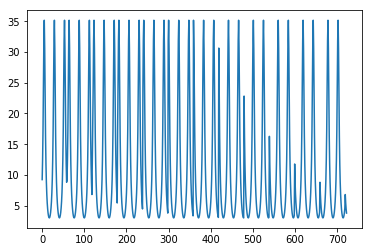

```python
rods_length = 3
year = 2017
date = 20
month = 12
day = 27
local_hour = 6
local_minute = 0
lat = 24.9936281 #Latitude
lng = 121.3009798 #Longitude

from math import *

def n_0(year):
    return 79.6764 + 0.2422 * int((year - 1985) / 4)

def ahargana(year, month, day):
    return floor(month*275/9)-floor((month+9)/12)*(floor((year-4*floor(year/4)+2)/3)+1)+day-30

def t_(ahargana_result, n_0_result):
    return ahargana_result - n_0_result

def day_angle(t_result):
    return 2 * pi * t_result / 365.2422

def solar_declination_angle(day_angle_result):
    return 0.3723 + 23.2567 * sin(day_angle_result * pi / 180) + 0.1149 * sin(2 * day_angle_result * pi / 180) - 0.1712 * sin(3 * day_angle_result * pi / 180) - 0.758 * cos(day_angle_result * pi / 180) + 0.3656 * cos(2 * day_angle_result * pi / 180) + 0.0201 * cos(3 * day_angle_result * pi / 180)

def true_solar_time(hour, lng, minute):
    return hour + (lng - 120) / 15 + minute

def easy_way_solve(lat, solar_declination_angle_result):
    return 90 - abs(lat - solar_declination_angle_result)

def solar_hour_angle(true_solar_time_result):
    return 15 * (true_solar_time_result - 12)

def solar_zenith_angle(solar_declination_angle_result, lat, solar_hour_angle_result):
    return asin(sin(solar_declination_angle_result) * sin(lat * pi / 180) + cos(solar_declination_angle_result) * cos(lat * pi / 180) * cos(solar_hour_angle_result * pi / 180))

def final_result(rods_length, solar_zenith_angle_result):
    return rods_length / tan(solar_zenith_angle_result)

'''
n_0_value = n_0(year)
print("n_0_value", n_0_value, sep = ": ")
ahargana_value = ahargana(year, month, day)
print("ahargana_value", ahargana_value, sep = ": ")
t_value = t_(ahargana_value, n_0_value)
print("t_value", t_value, sep = ": ")
day_angle_value = day_angle(t_value)
print("day_angle_value", day_angle_value, sep = ": ")
solar_declination_angle_value = solar_declination_angle(day_angle_value)
print("solar_declination_angle_value", solar_declination_angle_value, sep = ": ")
true_solar_time_value = true_solar_time(local_hour, lng, local_minute)
print("true_solar_time_value", true_solar_time_value, sep = ": ")
solar_hour_angle_value = solar_hour_angle(true_solar_time_value)
print("solar_hour_angle_value", solar_hour_angle_value, sep = ": ")
easy_way_solve_value = easy_way_solve(lat, solar_declination_angle_value)
print("easy_way_solve_value", easy_way_solve_value, sep = ": ")
'''

def increase_time(hours, minutes):
    minutes += 1
    if minutes > 59:
        minutes = 0
        hours += 1
    return [hours, minutes]

ys = []

while not(local_hour == 18 and local_minute > 2):
    print("hour: ", local_hour, " minute: ", local_minute)
    local_hour = increase_time(local_hour, local_minute)[0]
    local_minute = increase_time(local_hour, local_minute)[1]
    n_0_value = n_0(year)
    print("n_0_value", n_0_value, sep = ": ")
    ahargana_value = ahargana(year, month, day)
    print("ahargana_value", ahargana_value, sep = ": ")
    t_value = t_(ahargana_value, n_0_value)
    print("t_value", t_value, sep = ": ")
    day_angle_value = day_angle(t_value)
    print("day_angle_value", day_angle_value, sep = ": ")
    solar_declination_angle_value = solar_declination_angle(day_angle_value)
    print("solar_declination_angle_value", solar_declination_angle_value, sep = ": ")
    true_solar_time_value = true_solar_time(local_hour, lng, local_minute)
    print("true_solar_time_value", true_solar_time_value, sep = ": ")
    solar_hour_angle_value = solar_hour_angle(true_solar_time_value)
    print("solar_hour_angle_value", solar_hour_angle_value, sep = ": ")
    easy_way_solve_value = easy_way_solve(lat, solar_declination_angle_value)
    print("easy_way_solve_value", easy_way_solve_value, sep = ": ")
    solar_zenith_angle_value = solar_zenith_angle(solar_declination_angle_value, lat, solar_hour_angle_value)
    print("solar_zenith_angle_value", solar_zenith_angle_value, sep = ": ")
    final_result_value = final_result(rods_length, solar_zenith_angle_value)
    print("final_result_value", final_result_value, sep = ": ")
    ys += [final_result_value]
    print()
    
xs = []
length = len(ys)
import pylab
for x in range(length):
    xs += [x]
    print("xs: ", xs[x], "ys: ", ys[x])

pylab.plot(xs, ys)
pylab.show()
```

    hour:  6  minute:  0
    n_0_value: 81.614
    ahargana_value: 361
    t_value: 279.38599999999997
    day_angle_value: 4.806219024613464
    solar_declination_angle_value: 1.9220416949559715
    true_solar_time_value: 7.086731986666666
    solar_hour_angle_value: -73.6990202
    easy_way_solve_value: 66.92841359495597
    solar_zenith_angle_value: 0.3143416155969744
    final_result_value: 9.227325035298017
    
    hour:  6  minute:  1
    n_0_value: 81.614
    ahargana_value: 361
    t_value: 279.38599999999997
    day_angle_value: 4.806219024613464
    solar_declination_angle_value: 1.9220416949559715
    true_solar_time_value: 8.086731986666667
    solar_hour_angle_value: -58.69902019999999
    easy_way_solve_value: 66.92841359495597
    solar_zenith_angle_value: 0.2369156333222742
    final_result_value: 12.424928575706172
    
    hour:  6  minute:  2
    n_0_value: 81.614
    ahargana_value: 361
    t_value: 279.38599999999997
    day_angle_value: 4.806219024613464
    solar_declination_angle_value: 1.9220416949559715
    true_solar_time_value: 9.086731986666667
    solar_hour_angle_value: -43.69902019999999
    easy_way_solve_value: 66.92841359495597
    solar_zenith_angle_value: 0.17211017085340188
    final_result_value: 17.258244598027872
    
    hour:  6  minute:  3
    n_0_value: 81.614
    ahargana_value: 361
    t_value: 279.38599999999997
    day_angle_value: 4.806219024613464
    solar_declination_angle_value: 1.9220416949559715
    true_solar_time_value: 10.086731986666667
    solar_hour_angle_value: -28.699020199999996
    easy_way_solve_value: 66.92841359495597
    solar_zenith_angle_value: 0.12349623513452357
    final_result_value: 24.168616535128944
    
    hour:  6  minute:  4
    n_0_value: 81.614
    ahargana_value: 361
    t_value: 279.38599999999997
    day_angle_value: 4.806219024613464
    solar_declination_angle_value: 1.9220416949559715
    true_solar_time_value: 11.086731986666667
    solar_hour_angle_value: -13.699020199999996
    easy_way_solve_value: 66.92841359495597
    solar_zenith_angle_value: 0.09388241821117076
    final_result_value: 31.860927372713466
    
    hour:  6  minute:  5
    n_0_value: 81.614
    ahargana_value: 361
    t_value: 279.38599999999997
    day_angle_value: 4.806219024613464
    solar_declination_angle_value: 1.9220416949559715
    true_solar_time_value: 12.086731986666667
    solar_hour_angle_value: 1.300979800000004
    easy_way_solve_value: 66.92841359495597
    solar_zenith_angle_value: 0.08505641316951464
    final_result_value: 35.185611564867
    
    hour:  6  minute:  6
    n_0_value: 81.614
    ahargana_value: 361
    t_value: 279.38599999999997
    day_angle_value: 4.806219024613464
    solar_declination_angle_value: 1.9220416949559715
    true_solar_time_value: 13.086731986666667
    solar_hour_angle_value: 16.300979800000004
    easy_way_solve_value: 66.92841359495597
    solar_zenith_angle_value: 0.09756431486782917
    final_result_value: 30.65132125958597
    
    hour:  6  minute:  7
    n_0_value: 81.614
    ahargana_value: 361
    t_value: 279.38599999999997
    day_angle_value: 4.806219024613464
    solar_declination_angle_value: 1.9220416949559715
    true_solar_time_value: 14.086731986666667
    solar_hour_angle_value: 31.300979800000004
    easy_way_solve_value: 66.92841359495597
    solar_zenith_angle_value: 0.13063410663375066
    final_result_value: 22.834123189919485
    
    hour:  6  minute:  8
    n_0_value: 81.614
    ahargana_value: 361
    t_value: 279.38599999999997
    day_angle_value: 4.806219024613464
    solar_declination_angle_value: 1.9220416949559715
    true_solar_time_value: 15.086731986666667
    solar_hour_angle_value: 46.30097980000001
    easy_way_solve_value: 66.92841359495597
    solar_zenith_angle_value: 0.1822825684325401
    final_result_value: 16.275276649449374
    
    hour:  6  minute:  9
    n_0_value: 81.614
    ahargana_value: 361
    t_value: 279.38599999999997
    day_angle_value: 4.806219024613464
    solar_declination_angle_value: 1.9220416949559715
    true_solar_time_value: 16.086731986666667
    solar_hour_angle_value: 61.30097980000001
    easy_way_solve_value: 66.92841359495597
    solar_zenith_angle_value: 0.24955110796415556
    final_result_value: 11.770992219103311
    
    hour:  6  minute:  10
    n_0_value: 81.614
    ahargana_value: 361
    t_value: 279.38599999999997
    day_angle_value: 4.806219024613464
    solar_declination_angle_value: 1.9220416949559715
    true_solar_time_value: 17.086731986666667
    solar_hour_angle_value: 76.30097980000001
    easy_way_solve_value: 66.92841359495597
    solar_zenith_angle_value: 0.32875877332467757
    final_result_value: 8.794079469358062
    
    hour:  6  minute:  11
    n_0_value: 81.614
    ahargana_value: 361
    t_value: 279.38599999999997
    day_angle_value: 4.806219024613464
    solar_declination_angle_value: 1.9220416949559715
    true_solar_time_value: 18.086731986666667
    solar_hour_angle_value: 91.30097980000001
    easy_way_solve_value: 66.92841359495597
    solar_zenith_angle_value: 0.4156677994678792
    final_result_value: 6.796766000333439
    
    hour:  6  minute:  12
    n_0_value: 81.614
    ahargana_value: 361
    t_value: 279.38599999999997
    day_angle_value: 4.806219024613464
    solar_declination_angle_value: 1.9220416949559715
    true_solar_time_value: 19.086731986666667
    solar_hour_angle_value: 106.30097980000001
    easy_way_solve_value: 66.92841359495597
    solar_zenith_angle_value: 0.5055067486227625
    final_result_value: 5.4203053285611045
    
    hour:  6  minute:  13
    n_0_value: 81.614
    ahargana_value: 361
    t_value: 279.38599999999997
    day_angle_value: 4.806219024613464
    solar_declination_angle_value: 1.9220416949559715
    true_solar_time_value: 20.086731986666667
    solar_hour_angle_value: 121.30097980000001
    easy_way_solve_value: 66.92841359495597
    solar_zenith_angle_value: 0.5928606193152113
    final_result_value: 4.452976636703309
    
    hour:  6  minute:  14
    n_0_value: 81.614
    ahargana_value: 361
    t_value: 279.38599999999997
    day_angle_value: 4.806219024613464
    solar_declination_angle_value: 1.9220416949559715
    true_solar_time_value: 21.086731986666667
    solar_hour_angle_value: 136.3009798
    easy_way_solve_value: 66.92841359495597
    solar_zenith_angle_value: 0.6715236851487629
    final_result_value: 3.774832615576366
    
    hour:  6  minute:  15
    n_0_value: 81.614
    ahargana_value: 361
    t_value: 279.38599999999997
    day_angle_value: 4.806219024613464
    solar_declination_angle_value: 1.9220416949559715
    true_solar_time_value: 22.086731986666667
    solar_hour_angle_value: 151.3009798
    easy_way_solve_value: 66.92841359495597
    solar_zenith_angle_value: 0.7345573590321887
    final_result_value: 3.321676311333441
    
    hour:  6  minute:  16
    n_0_value: 81.614
    ahargana_value: 361
    t_value: 279.38599999999997
    day_angle_value: 4.806219024613464
    solar_declination_angle_value: 1.9220416949559715
    true_solar_time_value: 23.086731986666667
    solar_hour_angle_value: 166.3009798
    easy_way_solve_value: 66.92841359495597
    solar_zenith_angle_value: 0.7749729067860194
    final_result_value: 3.063212839878424
    
    hour:  6  minute:  17
    n_0_value: 81.614
    ahargana_value: 361
    t_value: 279.38599999999997
    day_angle_value: 4.806219024613464
    solar_declination_angle_value: 1.9220416949559715
    true_solar_time_value: 24.086731986666667
    solar_hour_angle_value: 181.3009798
    easy_way_solve_value: 66.92841359495597
    solar_zenith_angle_value: 0.7873525559680038
    final_result_value: 2.9882965029033497
    
    hour:  6  minute:  18
    n_0_value: 81.614
    ahargana_value: 361
    t_value: 279.38599999999997
    day_angle_value: 4.806219024613464
    solar_declination_angle_value: 1.9220416949559715
    true_solar_time_value: 25.086731986666667
    solar_hour_angle_value: 196.3009798
    easy_way_solve_value: 66.92841359495597
    solar_zenith_angle_value: 0.7698557603550698
    final_result_value: 3.0947344475595067
    
    hour:  6  minute:  19
    n_0_value: 81.614
    ahargana_value: 361
    t_value: 279.38599999999997
    day_angle_value: 4.806219024613464
    solar_declination_angle_value: 1.9220416949559715
    true_solar_time_value: 26.086731986666667
    solar_hour_angle_value: 211.3009798
    easy_way_solve_value: 66.92841359495597
    solar_zenith_angle_value: 0.725057411137593
    final_result_value: 3.385791819339102
    
    hour:  6  minute:  20
    n_0_value: 81.614
    ahargana_value: 361
    t_value: 279.38599999999997
    day_angle_value: 4.806219024613464
    solar_declination_angle_value: 1.9220416949559715
    true_solar_time_value: 27.086731986666667
    solar_hour_angle_value: 226.3009798
    easy_way_solve_value: 66.92841359495597
    solar_zenith_angle_value: 0.6587975598888566
    final_result_value: 3.8750678547188877
    
    hour:  6  minute:  21
    n_0_value: 81.614
    ahargana_value: 361
    t_value: 279.38599999999997
    day_angle_value: 4.806219024613464
    solar_declination_angle_value: 1.9220416949559715
    true_solar_time_value: 28.086731986666667
    solar_hour_angle_value: 241.3009798
    easy_way_solve_value: 66.92841359495597
    solar_zenith_angle_value: 0.5781461133505216
    final_result_value: 4.597546132065233
    
    hour:  6  minute:  22
    n_0_value: 81.614
    ahargana_value: 361
    t_value: 279.38599999999997
    day_angle_value: 4.806219024613464
    solar_declination_angle_value: 1.9220416949559715
    true_solar_time_value: 29.086731986666667
    solar_hour_angle_value: 256.3009798
    easy_way_solve_value: 66.92841359495597
    solar_zenith_angle_value: 0.4899397878700312
    final_result_value: 5.625237598104959
    
    hour:  6  minute:  23
    n_0_value: 81.614
    ahargana_value: 361
    t_value: 279.38599999999997
    day_angle_value: 4.806219024613464
    solar_declination_angle_value: 1.9220416949559715
    true_solar_time_value: 30.086731986666667
    solar_hour_angle_value: 271.3009798
    easy_way_solve_value: 66.92841359495597
    solar_zenith_angle_value: 0.4002410270767619
    final_result_value: 7.090901778747672
    
    hour:  6  minute:  24
    n_0_value: 81.614
    ahargana_value: 361
    t_value: 279.38599999999997
    day_angle_value: 4.806219024613464
    solar_declination_angle_value: 1.9220416949559715
    true_solar_time_value: 31.086731986666667
    solar_hour_angle_value: 286.3009798
    easy_way_solve_value: 66.92841359495597
    solar_zenith_angle_value: 0.31434161559697466
    final_result_value: 9.22732503529801
    
    hour:  6  minute:  25
    n_0_value: 81.614
    ahargana_value: 361
    t_value: 279.38599999999997
    day_angle_value: 4.806219024613464
    solar_declination_angle_value: 1.9220416949559715
    true_solar_time_value: 32.08673198666666
    solar_hour_angle_value: 301.30097979999994
    easy_way_solve_value: 66.92841359495597
    solar_zenith_angle_value: 0.23691563332227455
    final_result_value: 12.42492857570615
    
    hour:  6  minute:  26
    n_0_value: 81.614
    ahargana_value: 361
    t_value: 279.38599999999997
    day_angle_value: 4.806219024613464
    solar_declination_angle_value: 1.9220416949559715
    true_solar_time_value: 33.08673198666666
    solar_hour_angle_value: 316.30097979999994
    easy_way_solve_value: 66.92841359495597
    solar_zenith_angle_value: 0.17211017085340227
    final_result_value: 17.258244598027833
    
    hour:  6  minute:  27
    n_0_value: 81.614
    ahargana_value: 361
    t_value: 279.38599999999997
    day_angle_value: 4.806219024613464
    solar_declination_angle_value: 1.9220416949559715
    true_solar_time_value: 34.08673198666666
    solar_hour_angle_value: 331.30097979999994
    easy_way_solve_value: 66.92841359495597
    solar_zenith_angle_value: 0.12349623513452379
    final_result_value: 24.1686165351289
    
    hour:  6  minute:  28
    n_0_value: 81.614
    ahargana_value: 361
    t_value: 279.38599999999997
    day_angle_value: 4.806219024613464
    solar_declination_angle_value: 1.9220416949559715
    true_solar_time_value: 35.08673198666666
    solar_hour_angle_value: 346.30097979999994
    easy_way_solve_value: 66.92841359495597
    solar_zenith_angle_value: 0.09388241821117087
    final_result_value: 31.860927372713423
    
    hour:  6  minute:  29
    n_0_value: 81.614
    ahargana_value: 361
    t_value: 279.38599999999997
    day_angle_value: 4.806219024613464
    solar_declination_angle_value: 1.9220416949559715
    true_solar_time_value: 36.08673198666666
    solar_hour_angle_value: 361.30097979999994
    easy_way_solve_value: 66.92841359495597
    solar_zenith_angle_value: 0.08505641316951464
    final_result_value: 35.185611564867
    
    hour:  6  minute:  30
    n_0_value: 81.614
    ahargana_value: 361
    t_value: 279.38599999999997
    day_angle_value: 4.806219024613464
    solar_declination_angle_value: 1.9220416949559715
    true_solar_time_value: 37.08673198666666
    solar_hour_angle_value: 376.30097979999994
    easy_way_solve_value: 66.92841359495597
    solar_zenith_angle_value: 0.097564314867829
    final_result_value: 30.651321259586023
    
    hour:  6  minute:  31
    n_0_value: 81.614
    ahargana_value: 361
    t_value: 279.38599999999997
    day_angle_value: 4.806219024613464
    solar_declination_angle_value: 1.9220416949559715
    true_solar_time_value: 38.08673198666666
    solar_hour_angle_value: 391.30097979999994
    easy_way_solve_value: 66.92841359495597
    solar_zenith_angle_value: 0.13063410663375027
    final_result_value: 22.834123189919556
    
    hour:  6  minute:  32
    n_0_value: 81.614
    ahargana_value: 361
    t_value: 279.38599999999997
    day_angle_value: 4.806219024613464
    solar_declination_angle_value: 1.9220416949559715
    true_solar_time_value: 39.08673198666666
    solar_hour_angle_value: 406.30097979999994
    easy_way_solve_value: 66.92841359495597
    solar_zenith_angle_value: 0.18228256843253954
    final_result_value: 16.275276649449424
    
    hour:  6  minute:  33
    n_0_value: 81.614
    ahargana_value: 361
    t_value: 279.38599999999997
    day_angle_value: 4.806219024613464
    solar_declination_angle_value: 1.9220416949559715
    true_solar_time_value: 40.08673198666666
    solar_hour_angle_value: 421.30097979999994
    easy_way_solve_value: 66.92841359495597
    solar_zenith_angle_value: 0.24955110796415528
    final_result_value: 11.770992219103324
    
    hour:  6  minute:  34
    n_0_value: 81.614
    ahargana_value: 361
    t_value: 279.38599999999997
    day_angle_value: 4.806219024613464
    solar_declination_angle_value: 1.9220416949559715
    true_solar_time_value: 41.08673198666666
    solar_hour_angle_value: 436.30097979999994
    easy_way_solve_value: 66.92841359495597
    solar_zenith_angle_value: 0.3287587733246771
    final_result_value: 8.794079469358076
    
    hour:  6  minute:  35
    n_0_value: 81.614
    ahargana_value: 361
    t_value: 279.38599999999997
    day_angle_value: 4.806219024613464
    solar_declination_angle_value: 1.9220416949559715
    true_solar_time_value: 42.08673198666666
    solar_hour_angle_value: 451.30097979999994
    easy_way_solve_value: 66.92841359495597
    solar_zenith_angle_value: 0.4156677994678786
    final_result_value: 6.7967660003334505
    
    hour:  6  minute:  36
    n_0_value: 81.614
    ahargana_value: 361
    t_value: 279.38599999999997
    day_angle_value: 4.806219024613464
    solar_declination_angle_value: 1.9220416949559715
    true_solar_time_value: 43.08673198666666
    solar_hour_angle_value: 466.30097979999994
    easy_way_solve_value: 66.92841359495597
    solar_zenith_angle_value: 0.5055067486227619
    final_result_value: 5.4203053285611125
    
    hour:  6  minute:  37
    n_0_value: 81.614
    ahargana_value: 361
    t_value: 279.38599999999997
    day_angle_value: 4.806219024613464
    solar_declination_angle_value: 1.9220416949559715
    true_solar_time_value: 44.08673198666666
    solar_hour_angle_value: 481.30097979999994
    easy_way_solve_value: 66.92841359495597
    solar_zenith_angle_value: 0.5928606193152106
    final_result_value: 4.452976636703316
    
    hour:  6  minute:  38
    n_0_value: 81.614
    ahargana_value: 361
    t_value: 279.38599999999997
    day_angle_value: 4.806219024613464
    solar_declination_angle_value: 1.9220416949559715
    true_solar_time_value: 45.08673198666666
    solar_hour_angle_value: 496.30097979999994
    easy_way_solve_value: 66.92841359495597
    solar_zenith_angle_value: 0.6715236851487629
    final_result_value: 3.774832615576366
    
    hour:  6  minute:  39
    n_0_value: 81.614
    ahargana_value: 361
    t_value: 279.38599999999997
    day_angle_value: 4.806219024613464
    solar_declination_angle_value: 1.9220416949559715
    true_solar_time_value: 46.08673198666666
    solar_hour_angle_value: 511.30097979999994
    easy_way_solve_value: 66.92841359495597
    solar_zenith_angle_value: 0.7345573590321886
    final_result_value: 3.3216763113334418
    
    hour:  6  minute:  40
    n_0_value: 81.614
    ahargana_value: 361
    t_value: 279.38599999999997
    day_angle_value: 4.806219024613464
    solar_declination_angle_value: 1.9220416949559715
    true_solar_time_value: 47.08673198666666
    solar_hour_angle_value: 526.3009797999999
    easy_way_solve_value: 66.92841359495597
    solar_zenith_angle_value: 0.7749729067860194
    final_result_value: 3.063212839878424
    
    hour:  6  minute:  41
    n_0_value: 81.614
    ahargana_value: 361
    t_value: 279.38599999999997
    day_angle_value: 4.806219024613464
    solar_declination_angle_value: 1.9220416949559715
    true_solar_time_value: 48.08673198666666
    solar_hour_angle_value: 541.3009797999999
    easy_way_solve_value: 66.92841359495597
    solar_zenith_angle_value: 0.7873525559680038
    final_result_value: 2.9882965029033497
    
    hour:  6  minute:  42
    n_0_value: 81.614
    ahargana_value: 361
    t_value: 279.38599999999997
    day_angle_value: 4.806219024613464
    solar_declination_angle_value: 1.9220416949559715
    true_solar_time_value: 49.08673198666666
    solar_hour_angle_value: 556.3009797999999
    easy_way_solve_value: 66.92841359495597
    solar_zenith_angle_value: 0.76985576035507
    final_result_value: 3.0947344475595053
    
    hour:  6  minute:  43
    n_0_value: 81.614
    ahargana_value: 361
    t_value: 279.38599999999997
    day_angle_value: 4.806219024613464
    solar_declination_angle_value: 1.9220416949559715
    true_solar_time_value: 50.08673198666666
    solar_hour_angle_value: 571.3009797999999
    easy_way_solve_value: 66.92841359495597
    solar_zenith_angle_value: 0.7250574111375933
    final_result_value: 3.385791819339101
    
    hour:  6  minute:  44
    n_0_value: 81.614
    ahargana_value: 361
    t_value: 279.38599999999997
    day_angle_value: 4.806219024613464
    solar_declination_angle_value: 1.9220416949559715
    true_solar_time_value: 51.08673198666666
    solar_hour_angle_value: 586.3009797999999
    easy_way_solve_value: 66.92841359495597
    solar_zenith_angle_value: 0.6587975598888567
    final_result_value: 3.875067854718887
    
    hour:  6  minute:  45
    n_0_value: 81.614
    ahargana_value: 361
    t_value: 279.38599999999997
    day_angle_value: 4.806219024613464
    solar_declination_angle_value: 1.9220416949559715
    true_solar_time_value: 52.08673198666666
    solar_hour_angle_value: 601.3009797999999
    easy_way_solve_value: 66.92841359495597
    solar_zenith_angle_value: 0.5781461133505219
    final_result_value: 4.597546132065229
    
    hour:  6  minute:  46
    n_0_value: 81.614
    ahargana_value: 361
    t_value: 279.38599999999997
    day_angle_value: 4.806219024613464
    solar_declination_angle_value: 1.9220416949559715
    true_solar_time_value: 53.08673198666666
    solar_hour_angle_value: 616.3009797999999
    easy_way_solve_value: 66.92841359495597
    solar_zenith_angle_value: 0.48993978787003156
    final_result_value: 5.625237598104954
    
    hour:  6  minute:  47
    n_0_value: 81.614
    ahargana_value: 361
    t_value: 279.38599999999997
    day_angle_value: 4.806219024613464
    solar_declination_angle_value: 1.9220416949559715
    true_solar_time_value: 54.08673198666666
    solar_hour_angle_value: 631.3009797999999
    easy_way_solve_value: 66.92841359495597
    solar_zenith_angle_value: 0.4002410270767623
    final_result_value: 7.090901778747664
    
    hour:  6  minute:  48
    n_0_value: 81.614
    ahargana_value: 361
    t_value: 279.38599999999997
    day_angle_value: 4.806219024613464
    solar_declination_angle_value: 1.9220416949559715
    true_solar_time_value: 55.08673198666666
    solar_hour_angle_value: 646.3009797999999
    easy_way_solve_value: 66.92841359495597
    solar_zenith_angle_value: 0.314341615596975
    final_result_value: 9.227325035297998
    
    hour:  6  minute:  49
    n_0_value: 81.614
    ahargana_value: 361
    t_value: 279.38599999999997
    day_angle_value: 4.806219024613464
    solar_declination_angle_value: 1.9220416949559715
    true_solar_time_value: 56.08673198666666
    solar_hour_angle_value: 661.3009797999999
    easy_way_solve_value: 66.92841359495597
    solar_zenith_angle_value: 0.2369156333222749
    final_result_value: 12.424928575706133
    
    hour:  6  minute:  50
    n_0_value: 81.614
    ahargana_value: 361
    t_value: 279.38599999999997
    day_angle_value: 4.806219024613464
    solar_declination_angle_value: 1.9220416949559715
    true_solar_time_value: 57.08673198666666
    solar_hour_angle_value: 676.3009797999999
    easy_way_solve_value: 66.92841359495597
    solar_zenith_angle_value: 0.17211017085340213
    final_result_value: 17.258244598027847
    
    hour:  6  minute:  51
    n_0_value: 81.614
    ahargana_value: 361
    t_value: 279.38599999999997
    day_angle_value: 4.806219024613464
    solar_declination_angle_value: 1.9220416949559715
    true_solar_time_value: 58.08673198666666
    solar_hour_angle_value: 691.3009797999999
    easy_way_solve_value: 66.92841359495597
    solar_zenith_angle_value: 0.12349623513452374
    final_result_value: 24.168616535128912
    
    hour:  6  minute:  52
    n_0_value: 81.614
    ahargana_value: 361
    t_value: 279.38599999999997
    day_angle_value: 4.806219024613464
    solar_declination_angle_value: 1.9220416949559715
    true_solar_time_value: 59.08673198666666
    solar_hour_angle_value: 706.3009797999999
    easy_way_solve_value: 66.92841359495597
    solar_zenith_angle_value: 0.09388241821117087
    final_result_value: 31.860927372713423
    
    hour:  6  minute:  53
    n_0_value: 81.614
    ahargana_value: 361
    t_value: 279.38599999999997
    day_angle_value: 4.806219024613464
    solar_declination_angle_value: 1.9220416949559715
    true_solar_time_value: 60.08673198666666
    solar_hour_angle_value: 721.3009797999999
    easy_way_solve_value: 66.92841359495597
    solar_zenith_angle_value: 0.08505641316951464
    final_result_value: 35.185611564867
    
    hour:  6  minute:  54
    n_0_value: 81.614
    ahargana_value: 361
    t_value: 279.38599999999997
    day_angle_value: 4.806219024613464
    solar_declination_angle_value: 1.9220416949559715
    true_solar_time_value: 61.08673198666666
    solar_hour_angle_value: 736.3009797999999
    easy_way_solve_value: 66.92841359495597
    solar_zenith_angle_value: 0.097564314867829
    final_result_value: 30.651321259586023
    
    hour:  6  minute:  55
    n_0_value: 81.614
    ahargana_value: 361
    t_value: 279.38599999999997
    day_angle_value: 4.806219024613464
    solar_declination_angle_value: 1.9220416949559715
    true_solar_time_value: 62.08673198666666
    solar_hour_angle_value: 751.3009797999999
    easy_way_solve_value: 66.92841359495597
    solar_zenith_angle_value: 0.13063410663375027
    final_result_value: 22.834123189919556
    
    hour:  6  minute:  56
    n_0_value: 81.614
    ahargana_value: 361
    t_value: 279.38599999999997
    day_angle_value: 4.806219024613464
    solar_declination_angle_value: 1.9220416949559715
    true_solar_time_value: 63.08673198666666
    solar_hour_angle_value: 766.3009797999999
    easy_way_solve_value: 66.92841359495597
    solar_zenith_angle_value: 0.18228256843253945
    final_result_value: 16.27527664944943
    
    hour:  6  minute:  57
    n_0_value: 81.614
    ahargana_value: 361
    t_value: 279.38599999999997
    day_angle_value: 4.806219024613464
    solar_declination_angle_value: 1.9220416949559715
    true_solar_time_value: 64.08673198666666
    solar_hour_angle_value: 781.3009797999999
    easy_way_solve_value: 66.92841359495597
    solar_zenith_angle_value: 0.24955110796415472
    final_result_value: 11.770992219103352
    
    hour:  6  minute:  58
    n_0_value: 81.614
    ahargana_value: 361
    t_value: 279.38599999999997
    day_angle_value: 4.806219024613464
    solar_declination_angle_value: 1.9220416949559715
    true_solar_time_value: 65.08673198666666
    solar_hour_angle_value: 796.3009797999999
    easy_way_solve_value: 66.92841359495597
    solar_zenith_angle_value: 0.32875877332467646
    final_result_value: 8.794079469358094
    
    hour:  6  minute:  59
    n_0_value: 81.614
    ahargana_value: 361
    t_value: 279.38599999999997
    day_angle_value: 4.806219024613464
    solar_declination_angle_value: 1.9220416949559715
    true_solar_time_value: 7.086731986666666
    solar_hour_angle_value: -73.6990202
    easy_way_solve_value: 66.92841359495597
    solar_zenith_angle_value: 0.3143416155969744
    final_result_value: 9.227325035298017
    
    hour:  7  minute:  0
    n_0_value: 81.614
    ahargana_value: 361
    t_value: 279.38599999999997
    day_angle_value: 4.806219024613464
    solar_declination_angle_value: 1.9220416949559715
    true_solar_time_value: 8.086731986666667
    solar_hour_angle_value: -58.69902019999999
    easy_way_solve_value: 66.92841359495597
    solar_zenith_angle_value: 0.2369156333222742
    final_result_value: 12.424928575706172
    
    hour:  7  minute:  1
    n_0_value: 81.614
    ahargana_value: 361
    t_value: 279.38599999999997
    day_angle_value: 4.806219024613464
    solar_declination_angle_value: 1.9220416949559715
    true_solar_time_value: 9.086731986666667
    solar_hour_angle_value: -43.69902019999999
    easy_way_solve_value: 66.92841359495597
    solar_zenith_angle_value: 0.17211017085340188
    final_result_value: 17.258244598027872
    
    hour:  7  minute:  2
    n_0_value: 81.614
    ahargana_value: 361
    t_value: 279.38599999999997
    day_angle_value: 4.806219024613464
    solar_declination_angle_value: 1.9220416949559715
    true_solar_time_value: 10.086731986666667
    solar_hour_angle_value: -28.699020199999996
    easy_way_solve_value: 66.92841359495597
    solar_zenith_angle_value: 0.12349623513452357
    final_result_value: 24.168616535128944
    
    hour:  7  minute:  3
    n_0_value: 81.614
    ahargana_value: 361
    t_value: 279.38599999999997
    day_angle_value: 4.806219024613464
    solar_declination_angle_value: 1.9220416949559715
    true_solar_time_value: 11.086731986666667
    solar_hour_angle_value: -13.699020199999996
    easy_way_solve_value: 66.92841359495597
    solar_zenith_angle_value: 0.09388241821117076
    final_result_value: 31.860927372713466
    
    hour:  7  minute:  4
    n_0_value: 81.614
    ahargana_value: 361
    t_value: 279.38599999999997
    day_angle_value: 4.806219024613464
    solar_declination_angle_value: 1.9220416949559715
    true_solar_time_value: 12.086731986666667
    solar_hour_angle_value: 1.300979800000004
    easy_way_solve_value: 66.92841359495597
    solar_zenith_angle_value: 0.08505641316951464
    final_result_value: 35.185611564867
    
    hour:  7  minute:  5
    n_0_value: 81.614
    ahargana_value: 361
    t_value: 279.38599999999997
    day_angle_value: 4.806219024613464
    solar_declination_angle_value: 1.9220416949559715
    true_solar_time_value: 13.086731986666667
    solar_hour_angle_value: 16.300979800000004
    easy_way_solve_value: 66.92841359495597
    solar_zenith_angle_value: 0.09756431486782917
    final_result_value: 30.65132125958597
    
    hour:  7  minute:  6
    n_0_value: 81.614
    ahargana_value: 361
    t_value: 279.38599999999997
    day_angle_value: 4.806219024613464
    solar_declination_angle_value: 1.9220416949559715
    true_solar_time_value: 14.086731986666667
    solar_hour_angle_value: 31.300979800000004
    easy_way_solve_value: 66.92841359495597
    solar_zenith_angle_value: 0.13063410663375066
    final_result_value: 22.834123189919485
    
    hour:  7  minute:  7
    n_0_value: 81.614
    ahargana_value: 361
    t_value: 279.38599999999997
    day_angle_value: 4.806219024613464
    solar_declination_angle_value: 1.9220416949559715
    true_solar_time_value: 15.086731986666667
    solar_hour_angle_value: 46.30097980000001
    easy_way_solve_value: 66.92841359495597
    solar_zenith_angle_value: 0.1822825684325401
    final_result_value: 16.275276649449374
    
    hour:  7  minute:  8
    n_0_value: 81.614
    ahargana_value: 361
    t_value: 279.38599999999997
    day_angle_value: 4.806219024613464
    solar_declination_angle_value: 1.9220416949559715
    true_solar_time_value: 16.086731986666667
    solar_hour_angle_value: 61.30097980000001
    easy_way_solve_value: 66.92841359495597
    solar_zenith_angle_value: 0.24955110796415556
    final_result_value: 11.770992219103311
    
    hour:  7  minute:  9
    n_0_value: 81.614
    ahargana_value: 361
    t_value: 279.38599999999997
    day_angle_value: 4.806219024613464
    solar_declination_angle_value: 1.9220416949559715
    true_solar_time_value: 17.086731986666667
    solar_hour_angle_value: 76.30097980000001
    easy_way_solve_value: 66.92841359495597
    solar_zenith_angle_value: 0.32875877332467757
    final_result_value: 8.794079469358062
    
    hour:  7  minute:  10
    n_0_value: 81.614
    ahargana_value: 361
    t_value: 279.38599999999997
    day_angle_value: 4.806219024613464
    solar_declination_angle_value: 1.9220416949559715
    true_solar_time_value: 18.086731986666667
    solar_hour_angle_value: 91.30097980000001
    easy_way_solve_value: 66.92841359495597
    solar_zenith_angle_value: 0.4156677994678792
    final_result_value: 6.796766000333439
    
    hour:  7  minute:  11
    n_0_value: 81.614
    ahargana_value: 361
    t_value: 279.38599999999997
    day_angle_value: 4.806219024613464
    solar_declination_angle_value: 1.9220416949559715
    true_solar_time_value: 19.086731986666667
    solar_hour_angle_value: 106.30097980000001
    easy_way_solve_value: 66.92841359495597
    solar_zenith_angle_value: 0.5055067486227625
    final_result_value: 5.4203053285611045
    
    hour:  7  minute:  12
    n_0_value: 81.614
    ahargana_value: 361
    t_value: 279.38599999999997
    day_angle_value: 4.806219024613464
    solar_declination_angle_value: 1.9220416949559715
    true_solar_time_value: 20.086731986666667
    solar_hour_angle_value: 121.30097980000001
    easy_way_solve_value: 66.92841359495597
    solar_zenith_angle_value: 0.5928606193152113
    final_result_value: 4.452976636703309
    
    hour:  7  minute:  13
    n_0_value: 81.614
    ahargana_value: 361
    t_value: 279.38599999999997
    day_angle_value: 4.806219024613464
    solar_declination_angle_value: 1.9220416949559715
    true_solar_time_value: 21.086731986666667
    solar_hour_angle_value: 136.3009798
    easy_way_solve_value: 66.92841359495597
    solar_zenith_angle_value: 0.6715236851487629
    final_result_value: 3.774832615576366
    
    hour:  7  minute:  14
    n_0_value: 81.614
    ahargana_value: 361
    t_value: 279.38599999999997
    day_angle_value: 4.806219024613464
    solar_declination_angle_value: 1.9220416949559715
    true_solar_time_value: 22.086731986666667
    solar_hour_angle_value: 151.3009798
    easy_way_solve_value: 66.92841359495597
    solar_zenith_angle_value: 0.7345573590321887
    final_result_value: 3.321676311333441
    
    hour:  7  minute:  15
    n_0_value: 81.614
    ahargana_value: 361
    t_value: 279.38599999999997
    day_angle_value: 4.806219024613464
    solar_declination_angle_value: 1.9220416949559715
    true_solar_time_value: 23.086731986666667
    solar_hour_angle_value: 166.3009798
    easy_way_solve_value: 66.92841359495597
    solar_zenith_angle_value: 0.7749729067860194
    final_result_value: 3.063212839878424
    
    hour:  7  minute:  16
    n_0_value: 81.614
    ahargana_value: 361
    t_value: 279.38599999999997
    day_angle_value: 4.806219024613464
    solar_declination_angle_value: 1.9220416949559715
    true_solar_time_value: 24.086731986666667
    solar_hour_angle_value: 181.3009798
    easy_way_solve_value: 66.92841359495597
    solar_zenith_angle_value: 0.7873525559680038
    final_result_value: 2.9882965029033497
    
    hour:  7  minute:  17
    n_0_value: 81.614
    ahargana_value: 361
    t_value: 279.38599999999997
    day_angle_value: 4.806219024613464
    solar_declination_angle_value: 1.9220416949559715
    true_solar_time_value: 25.086731986666667
    solar_hour_angle_value: 196.3009798
    easy_way_solve_value: 66.92841359495597
    solar_zenith_angle_value: 0.7698557603550698
    final_result_value: 3.0947344475595067
    
    hour:  7  minute:  18
    n_0_value: 81.614
    ahargana_value: 361
    t_value: 279.38599999999997
    day_angle_value: 4.806219024613464
    solar_declination_angle_value: 1.9220416949559715
    true_solar_time_value: 26.086731986666667
    solar_hour_angle_value: 211.3009798
    easy_way_solve_value: 66.92841359495597
    solar_zenith_angle_value: 0.725057411137593
    final_result_value: 3.385791819339102
    
    hour:  7  minute:  19
    n_0_value: 81.614
    ahargana_value: 361
    t_value: 279.38599999999997
    day_angle_value: 4.806219024613464
    solar_declination_angle_value: 1.9220416949559715
    true_solar_time_value: 27.086731986666667
    solar_hour_angle_value: 226.3009798
    easy_way_solve_value: 66.92841359495597
    solar_zenith_angle_value: 0.6587975598888566
    final_result_value: 3.8750678547188877
    
    hour:  7  minute:  20
    n_0_value: 81.614
    ahargana_value: 361
    t_value: 279.38599999999997
    day_angle_value: 4.806219024613464
    solar_declination_angle_value: 1.9220416949559715
    true_solar_time_value: 28.086731986666667
    solar_hour_angle_value: 241.3009798
    easy_way_solve_value: 66.92841359495597
    solar_zenith_angle_value: 0.5781461133505216
    final_result_value: 4.597546132065233
    
    hour:  7  minute:  21
    n_0_value: 81.614
    ahargana_value: 361
    t_value: 279.38599999999997
    day_angle_value: 4.806219024613464
    solar_declination_angle_value: 1.9220416949559715
    true_solar_time_value: 29.086731986666667
    solar_hour_angle_value: 256.3009798
    easy_way_solve_value: 66.92841359495597
    solar_zenith_angle_value: 0.4899397878700312
    final_result_value: 5.625237598104959
    
    hour:  7  minute:  22
    n_0_value: 81.614
    ahargana_value: 361
    t_value: 279.38599999999997
    day_angle_value: 4.806219024613464
    solar_declination_angle_value: 1.9220416949559715
    true_solar_time_value: 30.086731986666667
    solar_hour_angle_value: 271.3009798
    easy_way_solve_value: 66.92841359495597
    solar_zenith_angle_value: 0.4002410270767619
    final_result_value: 7.090901778747672
    
    hour:  7  minute:  23
    n_0_value: 81.614
    ahargana_value: 361
    t_value: 279.38599999999997
    day_angle_value: 4.806219024613464
    solar_declination_angle_value: 1.9220416949559715
    true_solar_time_value: 31.086731986666667
    solar_hour_angle_value: 286.3009798
    easy_way_solve_value: 66.92841359495597
    solar_zenith_angle_value: 0.31434161559697466
    final_result_value: 9.22732503529801
    
    hour:  7  minute:  24
    n_0_value: 81.614
    ahargana_value: 361
    t_value: 279.38599999999997
    day_angle_value: 4.806219024613464
    solar_declination_angle_value: 1.9220416949559715
    true_solar_time_value: 32.08673198666666
    solar_hour_angle_value: 301.30097979999994
    easy_way_solve_value: 66.92841359495597
    solar_zenith_angle_value: 0.23691563332227455
    final_result_value: 12.42492857570615
    
    hour:  7  minute:  25
    n_0_value: 81.614
    ahargana_value: 361
    t_value: 279.38599999999997
    day_angle_value: 4.806219024613464
    solar_declination_angle_value: 1.9220416949559715
    true_solar_time_value: 33.08673198666666
    solar_hour_angle_value: 316.30097979999994
    easy_way_solve_value: 66.92841359495597
    solar_zenith_angle_value: 0.17211017085340227
    final_result_value: 17.258244598027833
    
    hour:  7  minute:  26
    n_0_value: 81.614
    ahargana_value: 361
    t_value: 279.38599999999997
    day_angle_value: 4.806219024613464
    solar_declination_angle_value: 1.9220416949559715
    true_solar_time_value: 34.08673198666666
    solar_hour_angle_value: 331.30097979999994
    easy_way_solve_value: 66.92841359495597
    solar_zenith_angle_value: 0.12349623513452379
    final_result_value: 24.1686165351289
    
    hour:  7  minute:  27
    n_0_value: 81.614
    ahargana_value: 361
    t_value: 279.38599999999997
    day_angle_value: 4.806219024613464
    solar_declination_angle_value: 1.9220416949559715
    true_solar_time_value: 35.08673198666666
    solar_hour_angle_value: 346.30097979999994
    easy_way_solve_value: 66.92841359495597
    solar_zenith_angle_value: 0.09388241821117087
    final_result_value: 31.860927372713423
    
    hour:  7  minute:  28
    n_0_value: 81.614
    ahargana_value: 361
    t_value: 279.38599999999997
    day_angle_value: 4.806219024613464
    solar_declination_angle_value: 1.9220416949559715
    true_solar_time_value: 36.08673198666666
    solar_hour_angle_value: 361.30097979999994
    easy_way_solve_value: 66.92841359495597
    solar_zenith_angle_value: 0.08505641316951464
    final_result_value: 35.185611564867
    
    hour:  7  minute:  29
    n_0_value: 81.614
    ahargana_value: 361
    t_value: 279.38599999999997
    day_angle_value: 4.806219024613464
    solar_declination_angle_value: 1.9220416949559715
    true_solar_time_value: 37.08673198666666
    solar_hour_angle_value: 376.30097979999994
    easy_way_solve_value: 66.92841359495597
    solar_zenith_angle_value: 0.097564314867829
    final_result_value: 30.651321259586023
    
    hour:  7  minute:  30
    n_0_value: 81.614
    ahargana_value: 361
    t_value: 279.38599999999997
    day_angle_value: 4.806219024613464
    solar_declination_angle_value: 1.9220416949559715
    true_solar_time_value: 38.08673198666666
    solar_hour_angle_value: 391.30097979999994
    easy_way_solve_value: 66.92841359495597
    solar_zenith_angle_value: 0.13063410663375027
    final_result_value: 22.834123189919556
    
    hour:  7  minute:  31
    n_0_value: 81.614
    ahargana_value: 361
    t_value: 279.38599999999997
    day_angle_value: 4.806219024613464
    solar_declination_angle_value: 1.9220416949559715
    true_solar_time_value: 39.08673198666666
    solar_hour_angle_value: 406.30097979999994
    easy_way_solve_value: 66.92841359495597
    solar_zenith_angle_value: 0.18228256843253954
    final_result_value: 16.275276649449424
    
    hour:  7  minute:  32
    n_0_value: 81.614
    ahargana_value: 361
    t_value: 279.38599999999997
    day_angle_value: 4.806219024613464
    solar_declination_angle_value: 1.9220416949559715
    true_solar_time_value: 40.08673198666666
    solar_hour_angle_value: 421.30097979999994
    easy_way_solve_value: 66.92841359495597
    solar_zenith_angle_value: 0.24955110796415528
    final_result_value: 11.770992219103324
    
    hour:  7  minute:  33
    n_0_value: 81.614
    ahargana_value: 361
    t_value: 279.38599999999997
    day_angle_value: 4.806219024613464
    solar_declination_angle_value: 1.9220416949559715
    true_solar_time_value: 41.08673198666666
    solar_hour_angle_value: 436.30097979999994
    easy_way_solve_value: 66.92841359495597
    solar_zenith_angle_value: 0.3287587733246771
    final_result_value: 8.794079469358076
    
    hour:  7  minute:  34
    n_0_value: 81.614
    ahargana_value: 361
    t_value: 279.38599999999997
    day_angle_value: 4.806219024613464
    solar_declination_angle_value: 1.9220416949559715
    true_solar_time_value: 42.08673198666666
    solar_hour_angle_value: 451.30097979999994
    easy_way_solve_value: 66.92841359495597
    solar_zenith_angle_value: 0.4156677994678786
    final_result_value: 6.7967660003334505
    
    hour:  7  minute:  35
    n_0_value: 81.614
    ahargana_value: 361
    t_value: 279.38599999999997
    day_angle_value: 4.806219024613464
    solar_declination_angle_value: 1.9220416949559715
    true_solar_time_value: 43.08673198666666
    solar_hour_angle_value: 466.30097979999994
    easy_way_solve_value: 66.92841359495597
    solar_zenith_angle_value: 0.5055067486227619
    final_result_value: 5.4203053285611125
    
    hour:  7  minute:  36
    n_0_value: 81.614
    ahargana_value: 361
    t_value: 279.38599999999997
    day_angle_value: 4.806219024613464
    solar_declination_angle_value: 1.9220416949559715
    true_solar_time_value: 44.08673198666666
    solar_hour_angle_value: 481.30097979999994
    easy_way_solve_value: 66.92841359495597
    solar_zenith_angle_value: 0.5928606193152106
    final_result_value: 4.452976636703316
    
    hour:  7  minute:  37
    n_0_value: 81.614
    ahargana_value: 361
    t_value: 279.38599999999997
    day_angle_value: 4.806219024613464
    solar_declination_angle_value: 1.9220416949559715
    true_solar_time_value: 45.08673198666666
    solar_hour_angle_value: 496.30097979999994
    easy_way_solve_value: 66.92841359495597
    solar_zenith_angle_value: 0.6715236851487629
    final_result_value: 3.774832615576366
    
    hour:  7  minute:  38
    n_0_value: 81.614
    ahargana_value: 361
    t_value: 279.38599999999997
    day_angle_value: 4.806219024613464
    solar_declination_angle_value: 1.9220416949559715
    true_solar_time_value: 46.08673198666666
    solar_hour_angle_value: 511.30097979999994
    easy_way_solve_value: 66.92841359495597
    solar_zenith_angle_value: 0.7345573590321886
    final_result_value: 3.3216763113334418
    
    hour:  7  minute:  39
    n_0_value: 81.614
    ahargana_value: 361
    t_value: 279.38599999999997
    day_angle_value: 4.806219024613464
    solar_declination_angle_value: 1.9220416949559715
    true_solar_time_value: 47.08673198666666
    solar_hour_angle_value: 526.3009797999999
    easy_way_solve_value: 66.92841359495597
    solar_zenith_angle_value: 0.7749729067860194
    final_result_value: 3.063212839878424
    
    hour:  7  minute:  40
    n_0_value: 81.614
    ahargana_value: 361
    t_value: 279.38599999999997
    day_angle_value: 4.806219024613464
    solar_declination_angle_value: 1.9220416949559715
    true_solar_time_value: 48.08673198666666
    solar_hour_angle_value: 541.3009797999999
    easy_way_solve_value: 66.92841359495597
    solar_zenith_angle_value: 0.7873525559680038
    final_result_value: 2.9882965029033497
    
    hour:  7  minute:  41
    n_0_value: 81.614
    ahargana_value: 361
    t_value: 279.38599999999997
    day_angle_value: 4.806219024613464
    solar_declination_angle_value: 1.9220416949559715
    true_solar_time_value: 49.08673198666666
    solar_hour_angle_value: 556.3009797999999
    easy_way_solve_value: 66.92841359495597
    solar_zenith_angle_value: 0.76985576035507
    final_result_value: 3.0947344475595053
    
    hour:  7  minute:  42
    n_0_value: 81.614
    ahargana_value: 361
    t_value: 279.38599999999997
    day_angle_value: 4.806219024613464
    solar_declination_angle_value: 1.9220416949559715
    true_solar_time_value: 50.08673198666666
    solar_hour_angle_value: 571.3009797999999
    easy_way_solve_value: 66.92841359495597
    solar_zenith_angle_value: 0.7250574111375933
    final_result_value: 3.385791819339101
    
    hour:  7  minute:  43
    n_0_value: 81.614
    ahargana_value: 361
    t_value: 279.38599999999997
    day_angle_value: 4.806219024613464
    solar_declination_angle_value: 1.9220416949559715
    true_solar_time_value: 51.08673198666666
    solar_hour_angle_value: 586.3009797999999
    easy_way_solve_value: 66.92841359495597
    solar_zenith_angle_value: 0.6587975598888567
    final_result_value: 3.875067854718887
    
    hour:  7  minute:  44
    n_0_value: 81.614
    ahargana_value: 361
    t_value: 279.38599999999997
    day_angle_value: 4.806219024613464
    solar_declination_angle_value: 1.9220416949559715
    true_solar_time_value: 52.08673198666666
    solar_hour_angle_value: 601.3009797999999
    easy_way_solve_value: 66.92841359495597
    solar_zenith_angle_value: 0.5781461133505219
    final_result_value: 4.597546132065229
    
    hour:  7  minute:  45
    n_0_value: 81.614
    ahargana_value: 361
    t_value: 279.38599999999997
    day_angle_value: 4.806219024613464
    solar_declination_angle_value: 1.9220416949559715
    true_solar_time_value: 53.08673198666666
    solar_hour_angle_value: 616.3009797999999
    easy_way_solve_value: 66.92841359495597
    solar_zenith_angle_value: 0.48993978787003156
    final_result_value: 5.625237598104954
    
    hour:  7  minute:  46
    n_0_value: 81.614
    ahargana_value: 361
    t_value: 279.38599999999997
    day_angle_value: 4.806219024613464
    solar_declination_angle_value: 1.9220416949559715
    true_solar_time_value: 54.08673198666666
    solar_hour_angle_value: 631.3009797999999
    easy_way_solve_value: 66.92841359495597
    solar_zenith_angle_value: 0.4002410270767623
    final_result_value: 7.090901778747664
    
    hour:  7  minute:  47
    n_0_value: 81.614
    ahargana_value: 361
    t_value: 279.38599999999997
    day_angle_value: 4.806219024613464
    solar_declination_angle_value: 1.9220416949559715
    true_solar_time_value: 55.08673198666666
    solar_hour_angle_value: 646.3009797999999
    easy_way_solve_value: 66.92841359495597
    solar_zenith_angle_value: 0.314341615596975
    final_result_value: 9.227325035297998
    
    hour:  7  minute:  48
    n_0_value: 81.614
    ahargana_value: 361
    t_value: 279.38599999999997
    day_angle_value: 4.806219024613464
    solar_declination_angle_value: 1.9220416949559715
    true_solar_time_value: 56.08673198666666
    solar_hour_angle_value: 661.3009797999999
    easy_way_solve_value: 66.92841359495597
    solar_zenith_angle_value: 0.2369156333222749
    final_result_value: 12.424928575706133
    
    hour:  7  minute:  49
    n_0_value: 81.614
    ahargana_value: 361
    t_value: 279.38599999999997
    day_angle_value: 4.806219024613464
    solar_declination_angle_value: 1.9220416949559715
    true_solar_time_value: 57.08673198666666
    solar_hour_angle_value: 676.3009797999999
    easy_way_solve_value: 66.92841359495597
    solar_zenith_angle_value: 0.17211017085340213
    final_result_value: 17.258244598027847
    
    hour:  7  minute:  50
    n_0_value: 81.614
    ahargana_value: 361
    t_value: 279.38599999999997
    day_angle_value: 4.806219024613464
    solar_declination_angle_value: 1.9220416949559715
    true_solar_time_value: 58.08673198666666
    solar_hour_angle_value: 691.3009797999999
    easy_way_solve_value: 66.92841359495597
    solar_zenith_angle_value: 0.12349623513452374
    final_result_value: 24.168616535128912
    
    hour:  7  minute:  51
    n_0_value: 81.614
    ahargana_value: 361
    t_value: 279.38599999999997
    day_angle_value: 4.806219024613464
    solar_declination_angle_value: 1.9220416949559715
    true_solar_time_value: 59.08673198666666
    solar_hour_angle_value: 706.3009797999999
    easy_way_solve_value: 66.92841359495597
    solar_zenith_angle_value: 0.09388241821117087
    final_result_value: 31.860927372713423
    
    hour:  7  minute:  52
    n_0_value: 81.614
    ahargana_value: 361
    t_value: 279.38599999999997
    day_angle_value: 4.806219024613464
    solar_declination_angle_value: 1.9220416949559715
    true_solar_time_value: 60.08673198666666
    solar_hour_angle_value: 721.3009797999999
    easy_way_solve_value: 66.92841359495597
    solar_zenith_angle_value: 0.08505641316951464
    final_result_value: 35.185611564867
    
    hour:  7  minute:  53
    n_0_value: 81.614
    ahargana_value: 361
    t_value: 279.38599999999997
    day_angle_value: 4.806219024613464
    solar_declination_angle_value: 1.9220416949559715
    true_solar_time_value: 61.08673198666666
    solar_hour_angle_value: 736.3009797999999
    easy_way_solve_value: 66.92841359495597
    solar_zenith_angle_value: 0.097564314867829
    final_result_value: 30.651321259586023
    
    hour:  7  minute:  54
    n_0_value: 81.614
    ahargana_value: 361
    t_value: 279.38599999999997
    day_angle_value: 4.806219024613464
    solar_declination_angle_value: 1.9220416949559715
    true_solar_time_value: 62.08673198666666
    solar_hour_angle_value: 751.3009797999999
    easy_way_solve_value: 66.92841359495597
    solar_zenith_angle_value: 0.13063410663375027
    final_result_value: 22.834123189919556
    
    hour:  7  minute:  55
    n_0_value: 81.614
    ahargana_value: 361
    t_value: 279.38599999999997
    day_angle_value: 4.806219024613464
    solar_declination_angle_value: 1.9220416949559715
    true_solar_time_value: 63.08673198666666
    solar_hour_angle_value: 766.3009797999999
    easy_way_solve_value: 66.92841359495597
    solar_zenith_angle_value: 0.18228256843253945
    final_result_value: 16.27527664944943
    
    hour:  7  minute:  56
    n_0_value: 81.614
    ahargana_value: 361
    t_value: 279.38599999999997
    day_angle_value: 4.806219024613464
    solar_declination_angle_value: 1.9220416949559715
    true_solar_time_value: 64.08673198666666
    solar_hour_angle_value: 781.3009797999999
    easy_way_solve_value: 66.92841359495597
    solar_zenith_angle_value: 0.24955110796415472
    final_result_value: 11.770992219103352
    
    hour:  7  minute:  57
    n_0_value: 81.614
    ahargana_value: 361
    t_value: 279.38599999999997
    day_angle_value: 4.806219024613464
    solar_declination_angle_value: 1.9220416949559715
    true_solar_time_value: 65.08673198666666
    solar_hour_angle_value: 796.3009797999999
    easy_way_solve_value: 66.92841359495597
    solar_zenith_angle_value: 0.32875877332467646
    final_result_value: 8.794079469358094
    
    hour:  7  minute:  58
    n_0_value: 81.614
    ahargana_value: 361
    t_value: 279.38599999999997
    day_angle_value: 4.806219024613464
    solar_declination_angle_value: 1.9220416949559715
    true_solar_time_value: 66.08673198666666
    solar_hour_angle_value: 811.3009797999999
    easy_way_solve_value: 66.92841359495597
    solar_zenith_angle_value: 0.41566779946787785
    final_result_value: 6.796766000333464
    
    hour:  7  minute:  59
    n_0_value: 81.614
    ahargana_value: 361
    t_value: 279.38599999999997
    day_angle_value: 4.806219024613464
    solar_declination_angle_value: 1.9220416949559715
    true_solar_time_value: 8.086731986666667
    solar_hour_angle_value: -58.69902019999999
    easy_way_solve_value: 66.92841359495597
    solar_zenith_angle_value: 0.2369156333222742
    final_result_value: 12.424928575706172
    
    hour:  8  minute:  0
    n_0_value: 81.614
    ahargana_value: 361
    t_value: 279.38599999999997
    day_angle_value: 4.806219024613464
    solar_declination_angle_value: 1.9220416949559715
    true_solar_time_value: 9.086731986666667
    solar_hour_angle_value: -43.69902019999999
    easy_way_solve_value: 66.92841359495597
    solar_zenith_angle_value: 0.17211017085340188
    final_result_value: 17.258244598027872
    
    hour:  8  minute:  1
    n_0_value: 81.614
    ahargana_value: 361
    t_value: 279.38599999999997
    day_angle_value: 4.806219024613464
    solar_declination_angle_value: 1.9220416949559715
    true_solar_time_value: 10.086731986666667
    solar_hour_angle_value: -28.699020199999996
    easy_way_solve_value: 66.92841359495597
    solar_zenith_angle_value: 0.12349623513452357
    final_result_value: 24.168616535128944
    
    hour:  8  minute:  2
    n_0_value: 81.614
    ahargana_value: 361
    t_value: 279.38599999999997
    day_angle_value: 4.806219024613464
    solar_declination_angle_value: 1.9220416949559715
    true_solar_time_value: 11.086731986666667
    solar_hour_angle_value: -13.699020199999996
    easy_way_solve_value: 66.92841359495597
    solar_zenith_angle_value: 0.09388241821117076
    final_result_value: 31.860927372713466
    
    hour:  8  minute:  3
    n_0_value: 81.614
    ahargana_value: 361
    t_value: 279.38599999999997
    day_angle_value: 4.806219024613464
    solar_declination_angle_value: 1.9220416949559715
    true_solar_time_value: 12.086731986666667
    solar_hour_angle_value: 1.300979800000004
    easy_way_solve_value: 66.92841359495597
    solar_zenith_angle_value: 0.08505641316951464
    final_result_value: 35.185611564867
    
    hour:  8  minute:  4
    n_0_value: 81.614
    ahargana_value: 361
    t_value: 279.38599999999997
    day_angle_value: 4.806219024613464
    solar_declination_angle_value: 1.9220416949559715
    true_solar_time_value: 13.086731986666667
    solar_hour_angle_value: 16.300979800000004
    easy_way_solve_value: 66.92841359495597
    solar_zenith_angle_value: 0.09756431486782917
    final_result_value: 30.65132125958597
    
    hour:  8  minute:  5
    n_0_value: 81.614
    ahargana_value: 361
    t_value: 279.38599999999997
    day_angle_value: 4.806219024613464
    solar_declination_angle_value: 1.9220416949559715
    true_solar_time_value: 14.086731986666667
    solar_hour_angle_value: 31.300979800000004
    easy_way_solve_value: 66.92841359495597
    solar_zenith_angle_value: 0.13063410663375066
    final_result_value: 22.834123189919485
    
    hour:  8  minute:  6
    n_0_value: 81.614
    ahargana_value: 361
    t_value: 279.38599999999997
    day_angle_value: 4.806219024613464
    solar_declination_angle_value: 1.9220416949559715
    true_solar_time_value: 15.086731986666667
    solar_hour_angle_value: 46.30097980000001
    easy_way_solve_value: 66.92841359495597
    solar_zenith_angle_value: 0.1822825684325401
    final_result_value: 16.275276649449374
    
    hour:  8  minute:  7
    n_0_value: 81.614
    ahargana_value: 361
    t_value: 279.38599999999997
    day_angle_value: 4.806219024613464
    solar_declination_angle_value: 1.9220416949559715
    true_solar_time_value: 16.086731986666667
    solar_hour_angle_value: 61.30097980000001
    easy_way_solve_value: 66.92841359495597
    solar_zenith_angle_value: 0.24955110796415556
    final_result_value: 11.770992219103311
    
    hour:  8  minute:  8
    n_0_value: 81.614
    ahargana_value: 361
    t_value: 279.38599999999997
    day_angle_value: 4.806219024613464
    solar_declination_angle_value: 1.9220416949559715
    true_solar_time_value: 17.086731986666667
    solar_hour_angle_value: 76.30097980000001
    easy_way_solve_value: 66.92841359495597
    solar_zenith_angle_value: 0.32875877332467757
    final_result_value: 8.794079469358062
    
    hour:  8  minute:  9
    n_0_value: 81.614
    ahargana_value: 361
    t_value: 279.38599999999997
    day_angle_value: 4.806219024613464
    solar_declination_angle_value: 1.9220416949559715
    true_solar_time_value: 18.086731986666667
    solar_hour_angle_value: 91.30097980000001
    easy_way_solve_value: 66.92841359495597
    solar_zenith_angle_value: 0.4156677994678792
    final_result_value: 6.796766000333439
    
    hour:  8  minute:  10
    n_0_value: 81.614
    ahargana_value: 361
    t_value: 279.38599999999997
    day_angle_value: 4.806219024613464
    solar_declination_angle_value: 1.9220416949559715
    true_solar_time_value: 19.086731986666667
    solar_hour_angle_value: 106.30097980000001
    easy_way_solve_value: 66.92841359495597
    solar_zenith_angle_value: 0.5055067486227625
    final_result_value: 5.4203053285611045
    
    hour:  8  minute:  11
    n_0_value: 81.614
    ahargana_value: 361
    t_value: 279.38599999999997
    day_angle_value: 4.806219024613464
    solar_declination_angle_value: 1.9220416949559715
    true_solar_time_value: 20.086731986666667
    solar_hour_angle_value: 121.30097980000001
    easy_way_solve_value: 66.92841359495597
    solar_zenith_angle_value: 0.5928606193152113
    final_result_value: 4.452976636703309
    
    hour:  8  minute:  12
    n_0_value: 81.614
    ahargana_value: 361
    t_value: 279.38599999999997
    day_angle_value: 4.806219024613464
    solar_declination_angle_value: 1.9220416949559715
    true_solar_time_value: 21.086731986666667
    solar_hour_angle_value: 136.3009798
    easy_way_solve_value: 66.92841359495597
    solar_zenith_angle_value: 0.6715236851487629
    final_result_value: 3.774832615576366
    
    hour:  8  minute:  13
    n_0_value: 81.614
    ahargana_value: 361
    t_value: 279.38599999999997
    day_angle_value: 4.806219024613464
    solar_declination_angle_value: 1.9220416949559715
    true_solar_time_value: 22.086731986666667
    solar_hour_angle_value: 151.3009798
    easy_way_solve_value: 66.92841359495597
    solar_zenith_angle_value: 0.7345573590321887
    final_result_value: 3.321676311333441
    
    hour:  8  minute:  14
    n_0_value: 81.614
    ahargana_value: 361
    t_value: 279.38599999999997
    day_angle_value: 4.806219024613464
    solar_declination_angle_value: 1.9220416949559715
    true_solar_time_value: 23.086731986666667
    solar_hour_angle_value: 166.3009798
    easy_way_solve_value: 66.92841359495597
    solar_zenith_angle_value: 0.7749729067860194
    final_result_value: 3.063212839878424
    
    hour:  8  minute:  15
    n_0_value: 81.614
    ahargana_value: 361
    t_value: 279.38599999999997
    day_angle_value: 4.806219024613464
    solar_declination_angle_value: 1.9220416949559715
    true_solar_time_value: 24.086731986666667
    solar_hour_angle_value: 181.3009798
    easy_way_solve_value: 66.92841359495597
    solar_zenith_angle_value: 0.7873525559680038
    final_result_value: 2.9882965029033497
    
    hour:  8  minute:  16
    n_0_value: 81.614
    ahargana_value: 361
    t_value: 279.38599999999997
    day_angle_value: 4.806219024613464
    solar_declination_angle_value: 1.9220416949559715
    true_solar_time_value: 25.086731986666667
    solar_hour_angle_value: 196.3009798
    easy_way_solve_value: 66.92841359495597
    solar_zenith_angle_value: 0.7698557603550698
    final_result_value: 3.0947344475595067
    
    hour:  8  minute:  17
    n_0_value: 81.614
    ahargana_value: 361
    t_value: 279.38599999999997
    day_angle_value: 4.806219024613464
    solar_declination_angle_value: 1.9220416949559715
    true_solar_time_value: 26.086731986666667
    solar_hour_angle_value: 211.3009798
    easy_way_solve_value: 66.92841359495597
    solar_zenith_angle_value: 0.725057411137593
    final_result_value: 3.385791819339102
    
    hour:  8  minute:  18
    n_0_value: 81.614
    ahargana_value: 361
    t_value: 279.38599999999997
    day_angle_value: 4.806219024613464
    solar_declination_angle_value: 1.9220416949559715
    true_solar_time_value: 27.086731986666667
    solar_hour_angle_value: 226.3009798
    easy_way_solve_value: 66.92841359495597
    solar_zenith_angle_value: 0.6587975598888566
    final_result_value: 3.8750678547188877
    
    hour:  8  minute:  19
    n_0_value: 81.614
    ahargana_value: 361
    t_value: 279.38599999999997
    day_angle_value: 4.806219024613464
    solar_declination_angle_value: 1.9220416949559715
    true_solar_time_value: 28.086731986666667
    solar_hour_angle_value: 241.3009798
    easy_way_solve_value: 66.92841359495597
    solar_zenith_angle_value: 0.5781461133505216
    final_result_value: 4.597546132065233
    
    hour:  8  minute:  20
    n_0_value: 81.614
    ahargana_value: 361
    t_value: 279.38599999999997
    day_angle_value: 4.806219024613464
    solar_declination_angle_value: 1.9220416949559715
    true_solar_time_value: 29.086731986666667
    solar_hour_angle_value: 256.3009798
    easy_way_solve_value: 66.92841359495597
    solar_zenith_angle_value: 0.4899397878700312
    final_result_value: 5.625237598104959
    
    hour:  8  minute:  21
    n_0_value: 81.614
    ahargana_value: 361
    t_value: 279.38599999999997
    day_angle_value: 4.806219024613464
    solar_declination_angle_value: 1.9220416949559715
    true_solar_time_value: 30.086731986666667
    solar_hour_angle_value: 271.3009798
    easy_way_solve_value: 66.92841359495597
    solar_zenith_angle_value: 0.4002410270767619
    final_result_value: 7.090901778747672
    
    hour:  8  minute:  22
    n_0_value: 81.614
    ahargana_value: 361
    t_value: 279.38599999999997
    day_angle_value: 4.806219024613464
    solar_declination_angle_value: 1.9220416949559715
    true_solar_time_value: 31.086731986666667
    solar_hour_angle_value: 286.3009798
    easy_way_solve_value: 66.92841359495597
    solar_zenith_angle_value: 0.31434161559697466
    final_result_value: 9.22732503529801
    
    hour:  8  minute:  23
    n_0_value: 81.614
    ahargana_value: 361
    t_value: 279.38599999999997
    day_angle_value: 4.806219024613464
    solar_declination_angle_value: 1.9220416949559715
    true_solar_time_value: 32.08673198666666
    solar_hour_angle_value: 301.30097979999994
    easy_way_solve_value: 66.92841359495597
    solar_zenith_angle_value: 0.23691563332227455
    final_result_value: 12.42492857570615
    
    hour:  8  minute:  24
    n_0_value: 81.614
    ahargana_value: 361
    t_value: 279.38599999999997
    day_angle_value: 4.806219024613464
    solar_declination_angle_value: 1.9220416949559715
    true_solar_time_value: 33.08673198666666
    solar_hour_angle_value: 316.30097979999994
    easy_way_solve_value: 66.92841359495597
    solar_zenith_angle_value: 0.17211017085340227
    final_result_value: 17.258244598027833
    
    hour:  8  minute:  25
    n_0_value: 81.614
    ahargana_value: 361
    t_value: 279.38599999999997
    day_angle_value: 4.806219024613464
    solar_declination_angle_value: 1.9220416949559715
    true_solar_time_value: 34.08673198666666
    solar_hour_angle_value: 331.30097979999994
    easy_way_solve_value: 66.92841359495597
    solar_zenith_angle_value: 0.12349623513452379
    final_result_value: 24.1686165351289
    
    hour:  8  minute:  26
    n_0_value: 81.614
    ahargana_value: 361
    t_value: 279.38599999999997
    day_angle_value: 4.806219024613464
    solar_declination_angle_value: 1.9220416949559715
    true_solar_time_value: 35.08673198666666
    solar_hour_angle_value: 346.30097979999994
    easy_way_solve_value: 66.92841359495597
    solar_zenith_angle_value: 0.09388241821117087
    final_result_value: 31.860927372713423
    
    hour:  8  minute:  27
    n_0_value: 81.614
    ahargana_value: 361
    t_value: 279.38599999999997
    day_angle_value: 4.806219024613464
    solar_declination_angle_value: 1.9220416949559715
    true_solar_time_value: 36.08673198666666
    solar_hour_angle_value: 361.30097979999994
    easy_way_solve_value: 66.92841359495597
    solar_zenith_angle_value: 0.08505641316951464
    final_result_value: 35.185611564867
    
    hour:  8  minute:  28
    n_0_value: 81.614
    ahargana_value: 361
    t_value: 279.38599999999997
    day_angle_value: 4.806219024613464
    solar_declination_angle_value: 1.9220416949559715
    true_solar_time_value: 37.08673198666666
    solar_hour_angle_value: 376.30097979999994
    easy_way_solve_value: 66.92841359495597
    solar_zenith_angle_value: 0.097564314867829
    final_result_value: 30.651321259586023
    
    hour:  8  minute:  29
    n_0_value: 81.614
    ahargana_value: 361
    t_value: 279.38599999999997
    day_angle_value: 4.806219024613464
    solar_declination_angle_value: 1.9220416949559715
    true_solar_time_value: 38.08673198666666
    solar_hour_angle_value: 391.30097979999994
    easy_way_solve_value: 66.92841359495597
    solar_zenith_angle_value: 0.13063410663375027
    final_result_value: 22.834123189919556
    
    hour:  8  minute:  30
    n_0_value: 81.614
    ahargana_value: 361
    t_value: 279.38599999999997
    day_angle_value: 4.806219024613464
    solar_declination_angle_value: 1.9220416949559715
    true_solar_time_value: 39.08673198666666
    solar_hour_angle_value: 406.30097979999994
    easy_way_solve_value: 66.92841359495597
    solar_zenith_angle_value: 0.18228256843253954
    final_result_value: 16.275276649449424
    
    hour:  8  minute:  31
    n_0_value: 81.614
    ahargana_value: 361
    t_value: 279.38599999999997
    day_angle_value: 4.806219024613464
    solar_declination_angle_value: 1.9220416949559715
    true_solar_time_value: 40.08673198666666
    solar_hour_angle_value: 421.30097979999994
    easy_way_solve_value: 66.92841359495597
    solar_zenith_angle_value: 0.24955110796415528
    final_result_value: 11.770992219103324
    
    hour:  8  minute:  32
    n_0_value: 81.614
    ahargana_value: 361
    t_value: 279.38599999999997
    day_angle_value: 4.806219024613464
    solar_declination_angle_value: 1.9220416949559715
    true_solar_time_value: 41.08673198666666
    solar_hour_angle_value: 436.30097979999994
    easy_way_solve_value: 66.92841359495597
    solar_zenith_angle_value: 0.3287587733246771
    final_result_value: 8.794079469358076
    
    hour:  8  minute:  33
    n_0_value: 81.614
    ahargana_value: 361
    t_value: 279.38599999999997
    day_angle_value: 4.806219024613464
    solar_declination_angle_value: 1.9220416949559715
    true_solar_time_value: 42.08673198666666
    solar_hour_angle_value: 451.30097979999994
    easy_way_solve_value: 66.92841359495597
    solar_zenith_angle_value: 0.4156677994678786
    final_result_value: 6.7967660003334505
    
    hour:  8  minute:  34
    n_0_value: 81.614
    ahargana_value: 361
    t_value: 279.38599999999997
    day_angle_value: 4.806219024613464
    solar_declination_angle_value: 1.9220416949559715
    true_solar_time_value: 43.08673198666666
    solar_hour_angle_value: 466.30097979999994
    easy_way_solve_value: 66.92841359495597
    solar_zenith_angle_value: 0.5055067486227619
    final_result_value: 5.4203053285611125
    
    hour:  8  minute:  35
    n_0_value: 81.614
    ahargana_value: 361
    t_value: 279.38599999999997
    day_angle_value: 4.806219024613464
    solar_declination_angle_value: 1.9220416949559715
    true_solar_time_value: 44.08673198666666
    solar_hour_angle_value: 481.30097979999994
    easy_way_solve_value: 66.92841359495597
    solar_zenith_angle_value: 0.5928606193152106
    final_result_value: 4.452976636703316
    
    hour:  8  minute:  36
    n_0_value: 81.614
    ahargana_value: 361
    t_value: 279.38599999999997
    day_angle_value: 4.806219024613464
    solar_declination_angle_value: 1.9220416949559715
    true_solar_time_value: 45.08673198666666
    solar_hour_angle_value: 496.30097979999994
    easy_way_solve_value: 66.92841359495597
    solar_zenith_angle_value: 0.6715236851487629
    final_result_value: 3.774832615576366
    
    hour:  8  minute:  37
    n_0_value: 81.614
    ahargana_value: 361
    t_value: 279.38599999999997
    day_angle_value: 4.806219024613464
    solar_declination_angle_value: 1.9220416949559715
    true_solar_time_value: 46.08673198666666
    solar_hour_angle_value: 511.30097979999994
    easy_way_solve_value: 66.92841359495597
    solar_zenith_angle_value: 0.7345573590321886
    final_result_value: 3.3216763113334418
    
    hour:  8  minute:  38
    n_0_value: 81.614
    ahargana_value: 361
    t_value: 279.38599999999997
    day_angle_value: 4.806219024613464
    solar_declination_angle_value: 1.9220416949559715
    true_solar_time_value: 47.08673198666666
    solar_hour_angle_value: 526.3009797999999
    easy_way_solve_value: 66.92841359495597
    solar_zenith_angle_value: 0.7749729067860194
    final_result_value: 3.063212839878424
    
    hour:  8  minute:  39
    n_0_value: 81.614
    ahargana_value: 361
    t_value: 279.38599999999997
    day_angle_value: 4.806219024613464
    solar_declination_angle_value: 1.9220416949559715
    true_solar_time_value: 48.08673198666666
    solar_hour_angle_value: 541.3009797999999
    easy_way_solve_value: 66.92841359495597
    solar_zenith_angle_value: 0.7873525559680038
    final_result_value: 2.9882965029033497
    
    hour:  8  minute:  40
    n_0_value: 81.614
    ahargana_value: 361
    t_value: 279.38599999999997
    day_angle_value: 4.806219024613464
    solar_declination_angle_value: 1.9220416949559715
    true_solar_time_value: 49.08673198666666
    solar_hour_angle_value: 556.3009797999999
    easy_way_solve_value: 66.92841359495597
    solar_zenith_angle_value: 0.76985576035507
    final_result_value: 3.0947344475595053
    
    hour:  8  minute:  41
    n_0_value: 81.614
    ahargana_value: 361
    t_value: 279.38599999999997
    day_angle_value: 4.806219024613464
    solar_declination_angle_value: 1.9220416949559715
    true_solar_time_value: 50.08673198666666
    solar_hour_angle_value: 571.3009797999999
    easy_way_solve_value: 66.92841359495597
    solar_zenith_angle_value: 0.7250574111375933
    final_result_value: 3.385791819339101
    
    hour:  8  minute:  42
    n_0_value: 81.614
    ahargana_value: 361
    t_value: 279.38599999999997
    day_angle_value: 4.806219024613464
    solar_declination_angle_value: 1.9220416949559715
    true_solar_time_value: 51.08673198666666
    solar_hour_angle_value: 586.3009797999999
    easy_way_solve_value: 66.92841359495597
    solar_zenith_angle_value: 0.6587975598888567
    final_result_value: 3.875067854718887
    
    hour:  8  minute:  43
    n_0_value: 81.614
    ahargana_value: 361
    t_value: 279.38599999999997
    day_angle_value: 4.806219024613464
    solar_declination_angle_value: 1.9220416949559715
    true_solar_time_value: 52.08673198666666
    solar_hour_angle_value: 601.3009797999999
    easy_way_solve_value: 66.92841359495597
    solar_zenith_angle_value: 0.5781461133505219
    final_result_value: 4.597546132065229
    
    hour:  8  minute:  44
    n_0_value: 81.614
    ahargana_value: 361
    t_value: 279.38599999999997
    day_angle_value: 4.806219024613464
    solar_declination_angle_value: 1.9220416949559715
    true_solar_time_value: 53.08673198666666
    solar_hour_angle_value: 616.3009797999999
    easy_way_solve_value: 66.92841359495597
    solar_zenith_angle_value: 0.48993978787003156
    final_result_value: 5.625237598104954
    
    hour:  8  minute:  45
    n_0_value: 81.614
    ahargana_value: 361
    t_value: 279.38599999999997
    day_angle_value: 4.806219024613464
    solar_declination_angle_value: 1.9220416949559715
    true_solar_time_value: 54.08673198666666
    solar_hour_angle_value: 631.3009797999999
    easy_way_solve_value: 66.92841359495597
    solar_zenith_angle_value: 0.4002410270767623
    final_result_value: 7.090901778747664
    
    hour:  8  minute:  46
    n_0_value: 81.614
    ahargana_value: 361
    t_value: 279.38599999999997
    day_angle_value: 4.806219024613464
    solar_declination_angle_value: 1.9220416949559715
    true_solar_time_value: 55.08673198666666
    solar_hour_angle_value: 646.3009797999999
    easy_way_solve_value: 66.92841359495597
    solar_zenith_angle_value: 0.314341615596975
    final_result_value: 9.227325035297998
    
    hour:  8  minute:  47
    n_0_value: 81.614
    ahargana_value: 361
    t_value: 279.38599999999997
    day_angle_value: 4.806219024613464
    solar_declination_angle_value: 1.9220416949559715
    true_solar_time_value: 56.08673198666666
    solar_hour_angle_value: 661.3009797999999
    easy_way_solve_value: 66.92841359495597
    solar_zenith_angle_value: 0.2369156333222749
    final_result_value: 12.424928575706133
    
    hour:  8  minute:  48
    n_0_value: 81.614
    ahargana_value: 361
    t_value: 279.38599999999997
    day_angle_value: 4.806219024613464
    solar_declination_angle_value: 1.9220416949559715
    true_solar_time_value: 57.08673198666666
    solar_hour_angle_value: 676.3009797999999
    easy_way_solve_value: 66.92841359495597
    solar_zenith_angle_value: 0.17211017085340213
    final_result_value: 17.258244598027847
    
    hour:  8  minute:  49
    n_0_value: 81.614
    ahargana_value: 361
    t_value: 279.38599999999997
    day_angle_value: 4.806219024613464
    solar_declination_angle_value: 1.9220416949559715
    true_solar_time_value: 58.08673198666666
    solar_hour_angle_value: 691.3009797999999
    easy_way_solve_value: 66.92841359495597
    solar_zenith_angle_value: 0.12349623513452374
    final_result_value: 24.168616535128912
    
    hour:  8  minute:  50
    n_0_value: 81.614
    ahargana_value: 361
    t_value: 279.38599999999997
    day_angle_value: 4.806219024613464
    solar_declination_angle_value: 1.9220416949559715
    true_solar_time_value: 59.08673198666666
    solar_hour_angle_value: 706.3009797999999
    easy_way_solve_value: 66.92841359495597
    solar_zenith_angle_value: 0.09388241821117087
    final_result_value: 31.860927372713423
    
    hour:  8  minute:  51
    n_0_value: 81.614
    ahargana_value: 361
    t_value: 279.38599999999997
    day_angle_value: 4.806219024613464
    solar_declination_angle_value: 1.9220416949559715
    true_solar_time_value: 60.08673198666666
    solar_hour_angle_value: 721.3009797999999
    easy_way_solve_value: 66.92841359495597
    solar_zenith_angle_value: 0.08505641316951464
    final_result_value: 35.185611564867
    
    hour:  8  minute:  52
    n_0_value: 81.614
    ahargana_value: 361
    t_value: 279.38599999999997
    day_angle_value: 4.806219024613464
    solar_declination_angle_value: 1.9220416949559715
    true_solar_time_value: 61.08673198666666
    solar_hour_angle_value: 736.3009797999999
    easy_way_solve_value: 66.92841359495597
    solar_zenith_angle_value: 0.097564314867829
    final_result_value: 30.651321259586023
    
    hour:  8  minute:  53
    n_0_value: 81.614
    ahargana_value: 361
    t_value: 279.38599999999997
    day_angle_value: 4.806219024613464
    solar_declination_angle_value: 1.9220416949559715
    true_solar_time_value: 62.08673198666666
    solar_hour_angle_value: 751.3009797999999
    easy_way_solve_value: 66.92841359495597
    solar_zenith_angle_value: 0.13063410663375027
    final_result_value: 22.834123189919556
    
    hour:  8  minute:  54
    n_0_value: 81.614
    ahargana_value: 361
    t_value: 279.38599999999997
    day_angle_value: 4.806219024613464
    solar_declination_angle_value: 1.9220416949559715
    true_solar_time_value: 63.08673198666666
    solar_hour_angle_value: 766.3009797999999
    easy_way_solve_value: 66.92841359495597
    solar_zenith_angle_value: 0.18228256843253945
    final_result_value: 16.27527664944943
    
    hour:  8  minute:  55
    n_0_value: 81.614
    ahargana_value: 361
    t_value: 279.38599999999997
    day_angle_value: 4.806219024613464
    solar_declination_angle_value: 1.9220416949559715
    true_solar_time_value: 64.08673198666666
    solar_hour_angle_value: 781.3009797999999
    easy_way_solve_value: 66.92841359495597
    solar_zenith_angle_value: 0.24955110796415472
    final_result_value: 11.770992219103352
    
    hour:  8  minute:  56
    n_0_value: 81.614
    ahargana_value: 361
    t_value: 279.38599999999997
    day_angle_value: 4.806219024613464
    solar_declination_angle_value: 1.9220416949559715
    true_solar_time_value: 65.08673198666666
    solar_hour_angle_value: 796.3009797999999
    easy_way_solve_value: 66.92841359495597
    solar_zenith_angle_value: 0.32875877332467646
    final_result_value: 8.794079469358094
    
    hour:  8  minute:  57
    n_0_value: 81.614
    ahargana_value: 361
    t_value: 279.38599999999997
    day_angle_value: 4.806219024613464
    solar_declination_angle_value: 1.9220416949559715
    true_solar_time_value: 66.08673198666666
    solar_hour_angle_value: 811.3009797999999
    easy_way_solve_value: 66.92841359495597
    solar_zenith_angle_value: 0.41566779946787785
    final_result_value: 6.796766000333464
    
    hour:  8  minute:  58
    n_0_value: 81.614
    ahargana_value: 361
    t_value: 279.38599999999997
    day_angle_value: 4.806219024613464
    solar_declination_angle_value: 1.9220416949559715
    true_solar_time_value: 67.08673198666666
    solar_hour_angle_value: 826.3009797999999
    easy_way_solve_value: 66.92841359495597
    solar_zenith_angle_value: 0.5055067486227623
    final_result_value: 5.420305328561105
    
    hour:  8  minute:  59
    n_0_value: 81.614
    ahargana_value: 361
    t_value: 279.38599999999997
    day_angle_value: 4.806219024613464
    solar_declination_angle_value: 1.9220416949559715
    true_solar_time_value: 9.086731986666667
    solar_hour_angle_value: -43.69902019999999
    easy_way_solve_value: 66.92841359495597
    solar_zenith_angle_value: 0.17211017085340188
    final_result_value: 17.258244598027872
    
    hour:  9  minute:  0
    n_0_value: 81.614
    ahargana_value: 361
    t_value: 279.38599999999997
    day_angle_value: 4.806219024613464
    solar_declination_angle_value: 1.9220416949559715
    true_solar_time_value: 10.086731986666667
    solar_hour_angle_value: -28.699020199999996
    easy_way_solve_value: 66.92841359495597
    solar_zenith_angle_value: 0.12349623513452357
    final_result_value: 24.168616535128944
    
    hour:  9  minute:  1
    n_0_value: 81.614
    ahargana_value: 361
    t_value: 279.38599999999997
    day_angle_value: 4.806219024613464
    solar_declination_angle_value: 1.9220416949559715
    true_solar_time_value: 11.086731986666667
    solar_hour_angle_value: -13.699020199999996
    easy_way_solve_value: 66.92841359495597
    solar_zenith_angle_value: 0.09388241821117076
    final_result_value: 31.860927372713466
    
    hour:  9  minute:  2
    n_0_value: 81.614
    ahargana_value: 361
    t_value: 279.38599999999997
    day_angle_value: 4.806219024613464
    solar_declination_angle_value: 1.9220416949559715
    true_solar_time_value: 12.086731986666667
    solar_hour_angle_value: 1.300979800000004
    easy_way_solve_value: 66.92841359495597
    solar_zenith_angle_value: 0.08505641316951464
    final_result_value: 35.185611564867
    
    hour:  9  minute:  3
    n_0_value: 81.614
    ahargana_value: 361
    t_value: 279.38599999999997
    day_angle_value: 4.806219024613464
    solar_declination_angle_value: 1.9220416949559715
    true_solar_time_value: 13.086731986666667
    solar_hour_angle_value: 16.300979800000004
    easy_way_solve_value: 66.92841359495597
    solar_zenith_angle_value: 0.09756431486782917
    final_result_value: 30.65132125958597
    
    hour:  9  minute:  4
    n_0_value: 81.614
    ahargana_value: 361
    t_value: 279.38599999999997
    day_angle_value: 4.806219024613464
    solar_declination_angle_value: 1.9220416949559715
    true_solar_time_value: 14.086731986666667
    solar_hour_angle_value: 31.300979800000004
    easy_way_solve_value: 66.92841359495597
    solar_zenith_angle_value: 0.13063410663375066
    final_result_value: 22.834123189919485
    
    hour:  9  minute:  5
    n_0_value: 81.614
    ahargana_value: 361
    t_value: 279.38599999999997
    day_angle_value: 4.806219024613464
    solar_declination_angle_value: 1.9220416949559715
    true_solar_time_value: 15.086731986666667
    solar_hour_angle_value: 46.30097980000001
    easy_way_solve_value: 66.92841359495597
    solar_zenith_angle_value: 0.1822825684325401
    final_result_value: 16.275276649449374
    
    hour:  9  minute:  6
    n_0_value: 81.614
    ahargana_value: 361
    t_value: 279.38599999999997
    day_angle_value: 4.806219024613464
    solar_declination_angle_value: 1.9220416949559715
    true_solar_time_value: 16.086731986666667
    solar_hour_angle_value: 61.30097980000001
    easy_way_solve_value: 66.92841359495597
    solar_zenith_angle_value: 0.24955110796415556
    final_result_value: 11.770992219103311
    
    hour:  9  minute:  7
    n_0_value: 81.614
    ahargana_value: 361
    t_value: 279.38599999999997
    day_angle_value: 4.806219024613464
    solar_declination_angle_value: 1.9220416949559715
    true_solar_time_value: 17.086731986666667
    solar_hour_angle_value: 76.30097980000001
    easy_way_solve_value: 66.92841359495597
    solar_zenith_angle_value: 0.32875877332467757
    final_result_value: 8.794079469358062
    
    hour:  9  minute:  8
    n_0_value: 81.614
    ahargana_value: 361
    t_value: 279.38599999999997
    day_angle_value: 4.806219024613464
    solar_declination_angle_value: 1.9220416949559715
    true_solar_time_value: 18.086731986666667
    solar_hour_angle_value: 91.30097980000001
    easy_way_solve_value: 66.92841359495597
    solar_zenith_angle_value: 0.4156677994678792
    final_result_value: 6.796766000333439
    
    hour:  9  minute:  9
    n_0_value: 81.614
    ahargana_value: 361
    t_value: 279.38599999999997
    day_angle_value: 4.806219024613464
    solar_declination_angle_value: 1.9220416949559715
    true_solar_time_value: 19.086731986666667
    solar_hour_angle_value: 106.30097980000001
    easy_way_solve_value: 66.92841359495597
    solar_zenith_angle_value: 0.5055067486227625
    final_result_value: 5.4203053285611045
    
    hour:  9  minute:  10
    n_0_value: 81.614
    ahargana_value: 361
    t_value: 279.38599999999997
    day_angle_value: 4.806219024613464
    solar_declination_angle_value: 1.9220416949559715
    true_solar_time_value: 20.086731986666667
    solar_hour_angle_value: 121.30097980000001
    easy_way_solve_value: 66.92841359495597
    solar_zenith_angle_value: 0.5928606193152113
    final_result_value: 4.452976636703309
    
    hour:  9  minute:  11
    n_0_value: 81.614
    ahargana_value: 361
    t_value: 279.38599999999997
    day_angle_value: 4.806219024613464
    solar_declination_angle_value: 1.9220416949559715
    true_solar_time_value: 21.086731986666667
    solar_hour_angle_value: 136.3009798
    easy_way_solve_value: 66.92841359495597
    solar_zenith_angle_value: 0.6715236851487629
    final_result_value: 3.774832615576366
    
    hour:  9  minute:  12
    n_0_value: 81.614
    ahargana_value: 361
    t_value: 279.38599999999997
    day_angle_value: 4.806219024613464
    solar_declination_angle_value: 1.9220416949559715
    true_solar_time_value: 22.086731986666667
    solar_hour_angle_value: 151.3009798
    easy_way_solve_value: 66.92841359495597
    solar_zenith_angle_value: 0.7345573590321887
    final_result_value: 3.321676311333441
    
    hour:  9  minute:  13
    n_0_value: 81.614
    ahargana_value: 361
    t_value: 279.38599999999997
    day_angle_value: 4.806219024613464
    solar_declination_angle_value: 1.9220416949559715
    true_solar_time_value: 23.086731986666667
    solar_hour_angle_value: 166.3009798
    easy_way_solve_value: 66.92841359495597
    solar_zenith_angle_value: 0.7749729067860194
    final_result_value: 3.063212839878424
    
    hour:  9  minute:  14
    n_0_value: 81.614
    ahargana_value: 361
    t_value: 279.38599999999997
    day_angle_value: 4.806219024613464
    solar_declination_angle_value: 1.9220416949559715
    true_solar_time_value: 24.086731986666667
    solar_hour_angle_value: 181.3009798
    easy_way_solve_value: 66.92841359495597
    solar_zenith_angle_value: 0.7873525559680038
    final_result_value: 2.9882965029033497
    
    hour:  9  minute:  15
    n_0_value: 81.614
    ahargana_value: 361
    t_value: 279.38599999999997
    day_angle_value: 4.806219024613464
    solar_declination_angle_value: 1.9220416949559715
    true_solar_time_value: 25.086731986666667
    solar_hour_angle_value: 196.3009798
    easy_way_solve_value: 66.92841359495597
    solar_zenith_angle_value: 0.7698557603550698
    final_result_value: 3.0947344475595067
    
    hour:  9  minute:  16
    n_0_value: 81.614
    ahargana_value: 361
    t_value: 279.38599999999997
    day_angle_value: 4.806219024613464
    solar_declination_angle_value: 1.9220416949559715
    true_solar_time_value: 26.086731986666667
    solar_hour_angle_value: 211.3009798
    easy_way_solve_value: 66.92841359495597
    solar_zenith_angle_value: 0.725057411137593
    final_result_value: 3.385791819339102
    
    hour:  9  minute:  17
    n_0_value: 81.614
    ahargana_value: 361
    t_value: 279.38599999999997
    day_angle_value: 4.806219024613464
    solar_declination_angle_value: 1.9220416949559715
    true_solar_time_value: 27.086731986666667
    solar_hour_angle_value: 226.3009798
    easy_way_solve_value: 66.92841359495597
    solar_zenith_angle_value: 0.6587975598888566
    final_result_value: 3.8750678547188877
    
    hour:  9  minute:  18
    n_0_value: 81.614
    ahargana_value: 361
    t_value: 279.38599999999997
    day_angle_value: 4.806219024613464
    solar_declination_angle_value: 1.9220416949559715
    true_solar_time_value: 28.086731986666667
    solar_hour_angle_value: 241.3009798
    easy_way_solve_value: 66.92841359495597
    solar_zenith_angle_value: 0.5781461133505216
    final_result_value: 4.597546132065233
    
    hour:  9  minute:  19
    n_0_value: 81.614
    ahargana_value: 361
    t_value: 279.38599999999997
    day_angle_value: 4.806219024613464
    solar_declination_angle_value: 1.9220416949559715
    true_solar_time_value: 29.086731986666667
    solar_hour_angle_value: 256.3009798
    easy_way_solve_value: 66.92841359495597
    solar_zenith_angle_value: 0.4899397878700312
    final_result_value: 5.625237598104959
    
    hour:  9  minute:  20
    n_0_value: 81.614
    ahargana_value: 361
    t_value: 279.38599999999997
    day_angle_value: 4.806219024613464
    solar_declination_angle_value: 1.9220416949559715
    true_solar_time_value: 30.086731986666667
    solar_hour_angle_value: 271.3009798
    easy_way_solve_value: 66.92841359495597
    solar_zenith_angle_value: 0.4002410270767619
    final_result_value: 7.090901778747672
    
    hour:  9  minute:  21
    n_0_value: 81.614
    ahargana_value: 361
    t_value: 279.38599999999997
    day_angle_value: 4.806219024613464
    solar_declination_angle_value: 1.9220416949559715
    true_solar_time_value: 31.086731986666667
    solar_hour_angle_value: 286.3009798
    easy_way_solve_value: 66.92841359495597
    solar_zenith_angle_value: 0.31434161559697466
    final_result_value: 9.22732503529801
    
    hour:  9  minute:  22
    n_0_value: 81.614
    ahargana_value: 361
    t_value: 279.38599999999997
    day_angle_value: 4.806219024613464
    solar_declination_angle_value: 1.9220416949559715
    true_solar_time_value: 32.08673198666666
    solar_hour_angle_value: 301.30097979999994
    easy_way_solve_value: 66.92841359495597
    solar_zenith_angle_value: 0.23691563332227455
    final_result_value: 12.42492857570615
    
    hour:  9  minute:  23
    n_0_value: 81.614
    ahargana_value: 361
    t_value: 279.38599999999997
    day_angle_value: 4.806219024613464
    solar_declination_angle_value: 1.9220416949559715
    true_solar_time_value: 33.08673198666666
    solar_hour_angle_value: 316.30097979999994
    easy_way_solve_value: 66.92841359495597
    solar_zenith_angle_value: 0.17211017085340227
    final_result_value: 17.258244598027833
    
    hour:  9  minute:  24
    n_0_value: 81.614
    ahargana_value: 361
    t_value: 279.38599999999997
    day_angle_value: 4.806219024613464
    solar_declination_angle_value: 1.9220416949559715
    true_solar_time_value: 34.08673198666666
    solar_hour_angle_value: 331.30097979999994
    easy_way_solve_value: 66.92841359495597
    solar_zenith_angle_value: 0.12349623513452379
    final_result_value: 24.1686165351289
    
    hour:  9  minute:  25
    n_0_value: 81.614
    ahargana_value: 361
    t_value: 279.38599999999997
    day_angle_value: 4.806219024613464
    solar_declination_angle_value: 1.9220416949559715
    true_solar_time_value: 35.08673198666666
    solar_hour_angle_value: 346.30097979999994
    easy_way_solve_value: 66.92841359495597
    solar_zenith_angle_value: 0.09388241821117087
    final_result_value: 31.860927372713423
    
    hour:  9  minute:  26
    n_0_value: 81.614
    ahargana_value: 361
    t_value: 279.38599999999997
    day_angle_value: 4.806219024613464
    solar_declination_angle_value: 1.9220416949559715
    true_solar_time_value: 36.08673198666666
    solar_hour_angle_value: 361.30097979999994
    easy_way_solve_value: 66.92841359495597
    solar_zenith_angle_value: 0.08505641316951464
    final_result_value: 35.185611564867
    
    hour:  9  minute:  27
    n_0_value: 81.614
    ahargana_value: 361
    t_value: 279.38599999999997
    day_angle_value: 4.806219024613464
    solar_declination_angle_value: 1.9220416949559715
    true_solar_time_value: 37.08673198666666
    solar_hour_angle_value: 376.30097979999994
    easy_way_solve_value: 66.92841359495597
    solar_zenith_angle_value: 0.097564314867829
    final_result_value: 30.651321259586023
    
    hour:  9  minute:  28
    n_0_value: 81.614
    ahargana_value: 361
    t_value: 279.38599999999997
    day_angle_value: 4.806219024613464
    solar_declination_angle_value: 1.9220416949559715
    true_solar_time_value: 38.08673198666666
    solar_hour_angle_value: 391.30097979999994
    easy_way_solve_value: 66.92841359495597
    solar_zenith_angle_value: 0.13063410663375027
    final_result_value: 22.834123189919556
    
    hour:  9  minute:  29
    n_0_value: 81.614
    ahargana_value: 361
    t_value: 279.38599999999997
    day_angle_value: 4.806219024613464
    solar_declination_angle_value: 1.9220416949559715
    true_solar_time_value: 39.08673198666666
    solar_hour_angle_value: 406.30097979999994
    easy_way_solve_value: 66.92841359495597
    solar_zenith_angle_value: 0.18228256843253954
    final_result_value: 16.275276649449424
    
    hour:  9  minute:  30
    n_0_value: 81.614
    ahargana_value: 361
    t_value: 279.38599999999997
    day_angle_value: 4.806219024613464
    solar_declination_angle_value: 1.9220416949559715
    true_solar_time_value: 40.08673198666666
    solar_hour_angle_value: 421.30097979999994
    easy_way_solve_value: 66.92841359495597
    solar_zenith_angle_value: 0.24955110796415528
    final_result_value: 11.770992219103324
    
    hour:  9  minute:  31
    n_0_value: 81.614
    ahargana_value: 361
    t_value: 279.38599999999997
    day_angle_value: 4.806219024613464
    solar_declination_angle_value: 1.9220416949559715
    true_solar_time_value: 41.08673198666666
    solar_hour_angle_value: 436.30097979999994
    easy_way_solve_value: 66.92841359495597
    solar_zenith_angle_value: 0.3287587733246771
    final_result_value: 8.794079469358076
    
    hour:  9  minute:  32
    n_0_value: 81.614
    ahargana_value: 361
    t_value: 279.38599999999997
    day_angle_value: 4.806219024613464
    solar_declination_angle_value: 1.9220416949559715
    true_solar_time_value: 42.08673198666666
    solar_hour_angle_value: 451.30097979999994
    easy_way_solve_value: 66.92841359495597
    solar_zenith_angle_value: 0.4156677994678786
    final_result_value: 6.7967660003334505
    
    hour:  9  minute:  33
    n_0_value: 81.614
    ahargana_value: 361
    t_value: 279.38599999999997
    day_angle_value: 4.806219024613464
    solar_declination_angle_value: 1.9220416949559715
    true_solar_time_value: 43.08673198666666
    solar_hour_angle_value: 466.30097979999994
    easy_way_solve_value: 66.92841359495597
    solar_zenith_angle_value: 0.5055067486227619
    final_result_value: 5.4203053285611125
    
    hour:  9  minute:  34
    n_0_value: 81.614
    ahargana_value: 361
    t_value: 279.38599999999997
    day_angle_value: 4.806219024613464
    solar_declination_angle_value: 1.9220416949559715
    true_solar_time_value: 44.08673198666666
    solar_hour_angle_value: 481.30097979999994
    easy_way_solve_value: 66.92841359495597
    solar_zenith_angle_value: 0.5928606193152106
    final_result_value: 4.452976636703316
    
    hour:  9  minute:  35
    n_0_value: 81.614
    ahargana_value: 361
    t_value: 279.38599999999997
    day_angle_value: 4.806219024613464
    solar_declination_angle_value: 1.9220416949559715
    true_solar_time_value: 45.08673198666666
    solar_hour_angle_value: 496.30097979999994
    easy_way_solve_value: 66.92841359495597
    solar_zenith_angle_value: 0.6715236851487629
    final_result_value: 3.774832615576366
    
    hour:  9  minute:  36
    n_0_value: 81.614
    ahargana_value: 361
    t_value: 279.38599999999997
    day_angle_value: 4.806219024613464
    solar_declination_angle_value: 1.9220416949559715
    true_solar_time_value: 46.08673198666666
    solar_hour_angle_value: 511.30097979999994
    easy_way_solve_value: 66.92841359495597
    solar_zenith_angle_value: 0.7345573590321886
    final_result_value: 3.3216763113334418
    
    hour:  9  minute:  37
    n_0_value: 81.614
    ahargana_value: 361
    t_value: 279.38599999999997
    day_angle_value: 4.806219024613464
    solar_declination_angle_value: 1.9220416949559715
    true_solar_time_value: 47.08673198666666
    solar_hour_angle_value: 526.3009797999999
    easy_way_solve_value: 66.92841359495597
    solar_zenith_angle_value: 0.7749729067860194
    final_result_value: 3.063212839878424
    
    hour:  9  minute:  38
    n_0_value: 81.614
    ahargana_value: 361
    t_value: 279.38599999999997
    day_angle_value: 4.806219024613464
    solar_declination_angle_value: 1.9220416949559715
    true_solar_time_value: 48.08673198666666
    solar_hour_angle_value: 541.3009797999999
    easy_way_solve_value: 66.92841359495597
    solar_zenith_angle_value: 0.7873525559680038
    final_result_value: 2.9882965029033497
    
    hour:  9  minute:  39
    n_0_value: 81.614
    ahargana_value: 361
    t_value: 279.38599999999997
    day_angle_value: 4.806219024613464
    solar_declination_angle_value: 1.9220416949559715
    true_solar_time_value: 49.08673198666666
    solar_hour_angle_value: 556.3009797999999
    easy_way_solve_value: 66.92841359495597
    solar_zenith_angle_value: 0.76985576035507
    final_result_value: 3.0947344475595053
    
    hour:  9  minute:  40
    n_0_value: 81.614
    ahargana_value: 361
    t_value: 279.38599999999997
    day_angle_value: 4.806219024613464
    solar_declination_angle_value: 1.9220416949559715
    true_solar_time_value: 50.08673198666666
    solar_hour_angle_value: 571.3009797999999
    easy_way_solve_value: 66.92841359495597
    solar_zenith_angle_value: 0.7250574111375933
    final_result_value: 3.385791819339101
    
    hour:  9  minute:  41
    n_0_value: 81.614
    ahargana_value: 361
    t_value: 279.38599999999997
    day_angle_value: 4.806219024613464
    solar_declination_angle_value: 1.9220416949559715
    true_solar_time_value: 51.08673198666666
    solar_hour_angle_value: 586.3009797999999
    easy_way_solve_value: 66.92841359495597
    solar_zenith_angle_value: 0.6587975598888567
    final_result_value: 3.875067854718887
    
    hour:  9  minute:  42
    n_0_value: 81.614
    ahargana_value: 361
    t_value: 279.38599999999997
    day_angle_value: 4.806219024613464
    solar_declination_angle_value: 1.9220416949559715
    true_solar_time_value: 52.08673198666666
    solar_hour_angle_value: 601.3009797999999
    easy_way_solve_value: 66.92841359495597
    solar_zenith_angle_value: 0.5781461133505219
    final_result_value: 4.597546132065229
    
    hour:  9  minute:  43
    n_0_value: 81.614
    ahargana_value: 361
    t_value: 279.38599999999997
    day_angle_value: 4.806219024613464
    solar_declination_angle_value: 1.9220416949559715
    true_solar_time_value: 53.08673198666666
    solar_hour_angle_value: 616.3009797999999
    easy_way_solve_value: 66.92841359495597
    solar_zenith_angle_value: 0.48993978787003156
    final_result_value: 5.625237598104954
    
    hour:  9  minute:  44
    n_0_value: 81.614
    ahargana_value: 361
    t_value: 279.38599999999997
    day_angle_value: 4.806219024613464
    solar_declination_angle_value: 1.9220416949559715
    true_solar_time_value: 54.08673198666666
    solar_hour_angle_value: 631.3009797999999
    easy_way_solve_value: 66.92841359495597
    solar_zenith_angle_value: 0.4002410270767623
    final_result_value: 7.090901778747664
    
    hour:  9  minute:  45
    n_0_value: 81.614
    ahargana_value: 361
    t_value: 279.38599999999997
    day_angle_value: 4.806219024613464
    solar_declination_angle_value: 1.9220416949559715
    true_solar_time_value: 55.08673198666666
    solar_hour_angle_value: 646.3009797999999
    easy_way_solve_value: 66.92841359495597
    solar_zenith_angle_value: 0.314341615596975
    final_result_value: 9.227325035297998
    
    hour:  9  minute:  46
    n_0_value: 81.614
    ahargana_value: 361
    t_value: 279.38599999999997
    day_angle_value: 4.806219024613464
    solar_declination_angle_value: 1.9220416949559715
    true_solar_time_value: 56.08673198666666
    solar_hour_angle_value: 661.3009797999999
    easy_way_solve_value: 66.92841359495597
    solar_zenith_angle_value: 0.2369156333222749
    final_result_value: 12.424928575706133
    
    hour:  9  minute:  47
    n_0_value: 81.614
    ahargana_value: 361
    t_value: 279.38599999999997
    day_angle_value: 4.806219024613464
    solar_declination_angle_value: 1.9220416949559715
    true_solar_time_value: 57.08673198666666
    solar_hour_angle_value: 676.3009797999999
    easy_way_solve_value: 66.92841359495597
    solar_zenith_angle_value: 0.17211017085340213
    final_result_value: 17.258244598027847
    
    hour:  9  minute:  48
    n_0_value: 81.614
    ahargana_value: 361
    t_value: 279.38599999999997
    day_angle_value: 4.806219024613464
    solar_declination_angle_value: 1.9220416949559715
    true_solar_time_value: 58.08673198666666
    solar_hour_angle_value: 691.3009797999999
    easy_way_solve_value: 66.92841359495597
    solar_zenith_angle_value: 0.12349623513452374
    final_result_value: 24.168616535128912
    
    hour:  9  minute:  49
    n_0_value: 81.614
    ahargana_value: 361
    t_value: 279.38599999999997
    day_angle_value: 4.806219024613464
    solar_declination_angle_value: 1.9220416949559715
    true_solar_time_value: 59.08673198666666
    solar_hour_angle_value: 706.3009797999999
    easy_way_solve_value: 66.92841359495597
    solar_zenith_angle_value: 0.09388241821117087
    final_result_value: 31.860927372713423
    
    hour:  9  minute:  50
    n_0_value: 81.614
    ahargana_value: 361
    t_value: 279.38599999999997
    day_angle_value: 4.806219024613464
    solar_declination_angle_value: 1.9220416949559715
    true_solar_time_value: 60.08673198666666
    solar_hour_angle_value: 721.3009797999999
    easy_way_solve_value: 66.92841359495597
    solar_zenith_angle_value: 0.08505641316951464
    final_result_value: 35.185611564867
    
    hour:  9  minute:  51
    n_0_value: 81.614
    ahargana_value: 361
    t_value: 279.38599999999997
    day_angle_value: 4.806219024613464
    solar_declination_angle_value: 1.9220416949559715
    true_solar_time_value: 61.08673198666666
    solar_hour_angle_value: 736.3009797999999
    easy_way_solve_value: 66.92841359495597
    solar_zenith_angle_value: 0.097564314867829
    final_result_value: 30.651321259586023
    
    hour:  9  minute:  52
    n_0_value: 81.614
    ahargana_value: 361
    t_value: 279.38599999999997
    day_angle_value: 4.806219024613464
    solar_declination_angle_value: 1.9220416949559715
    true_solar_time_value: 62.08673198666666
    solar_hour_angle_value: 751.3009797999999
    easy_way_solve_value: 66.92841359495597
    solar_zenith_angle_value: 0.13063410663375027
    final_result_value: 22.834123189919556
    
    hour:  9  minute:  53
    n_0_value: 81.614
    ahargana_value: 361
    t_value: 279.38599999999997
    day_angle_value: 4.806219024613464
    solar_declination_angle_value: 1.9220416949559715
    true_solar_time_value: 63.08673198666666
    solar_hour_angle_value: 766.3009797999999
    easy_way_solve_value: 66.92841359495597
    solar_zenith_angle_value: 0.18228256843253945
    final_result_value: 16.27527664944943
    
    hour:  9  minute:  54
    n_0_value: 81.614
    ahargana_value: 361
    t_value: 279.38599999999997
    day_angle_value: 4.806219024613464
    solar_declination_angle_value: 1.9220416949559715
    true_solar_time_value: 64.08673198666666
    solar_hour_angle_value: 781.3009797999999
    easy_way_solve_value: 66.92841359495597
    solar_zenith_angle_value: 0.24955110796415472
    final_result_value: 11.770992219103352
    
    hour:  9  minute:  55
    n_0_value: 81.614
    ahargana_value: 361
    t_value: 279.38599999999997
    day_angle_value: 4.806219024613464
    solar_declination_angle_value: 1.9220416949559715
    true_solar_time_value: 65.08673198666666
    solar_hour_angle_value: 796.3009797999999
    easy_way_solve_value: 66.92841359495597
    solar_zenith_angle_value: 0.32875877332467646
    final_result_value: 8.794079469358094
    
    hour:  9  minute:  56
    n_0_value: 81.614
    ahargana_value: 361
    t_value: 279.38599999999997
    day_angle_value: 4.806219024613464
    solar_declination_angle_value: 1.9220416949559715
    true_solar_time_value: 66.08673198666666
    solar_hour_angle_value: 811.3009797999999
    easy_way_solve_value: 66.92841359495597
    solar_zenith_angle_value: 0.41566779946787785
    final_result_value: 6.796766000333464
    
    hour:  9  minute:  57
    n_0_value: 81.614
    ahargana_value: 361
    t_value: 279.38599999999997
    day_angle_value: 4.806219024613464
    solar_declination_angle_value: 1.9220416949559715
    true_solar_time_value: 67.08673198666666
    solar_hour_angle_value: 826.3009797999999
    easy_way_solve_value: 66.92841359495597
    solar_zenith_angle_value: 0.5055067486227623
    final_result_value: 5.420305328561105
    
    hour:  9  minute:  58
    n_0_value: 81.614
    ahargana_value: 361
    t_value: 279.38599999999997
    day_angle_value: 4.806219024613464
    solar_declination_angle_value: 1.9220416949559715
    true_solar_time_value: 68.08673198666666
    solar_hour_angle_value: 841.3009797999999
    easy_way_solve_value: 66.92841359495597
    solar_zenith_angle_value: 0.5928606193152111
    final_result_value: 4.452976636703312
    
    hour:  9  minute:  59
    n_0_value: 81.614
    ahargana_value: 361
    t_value: 279.38599999999997
    day_angle_value: 4.806219024613464
    solar_declination_angle_value: 1.9220416949559715
    true_solar_time_value: 10.086731986666667
    solar_hour_angle_value: -28.699020199999996
    easy_way_solve_value: 66.92841359495597
    solar_zenith_angle_value: 0.12349623513452357
    final_result_value: 24.168616535128944
    
    hour:  10  minute:  0
    n_0_value: 81.614
    ahargana_value: 361
    t_value: 279.38599999999997
    day_angle_value: 4.806219024613464
    solar_declination_angle_value: 1.9220416949559715
    true_solar_time_value: 11.086731986666667
    solar_hour_angle_value: -13.699020199999996
    easy_way_solve_value: 66.92841359495597
    solar_zenith_angle_value: 0.09388241821117076
    final_result_value: 31.860927372713466
    
    hour:  10  minute:  1
    n_0_value: 81.614
    ahargana_value: 361
    t_value: 279.38599999999997
    day_angle_value: 4.806219024613464
    solar_declination_angle_value: 1.9220416949559715
    true_solar_time_value: 12.086731986666667
    solar_hour_angle_value: 1.300979800000004
    easy_way_solve_value: 66.92841359495597
    solar_zenith_angle_value: 0.08505641316951464
    final_result_value: 35.185611564867
    
    hour:  10  minute:  2
    n_0_value: 81.614
    ahargana_value: 361
    t_value: 279.38599999999997
    day_angle_value: 4.806219024613464
    solar_declination_angle_value: 1.9220416949559715
    true_solar_time_value: 13.086731986666667
    solar_hour_angle_value: 16.300979800000004
    easy_way_solve_value: 66.92841359495597
    solar_zenith_angle_value: 0.09756431486782917
    final_result_value: 30.65132125958597
    
    hour:  10  minute:  3
    n_0_value: 81.614
    ahargana_value: 361
    t_value: 279.38599999999997
    day_angle_value: 4.806219024613464
    solar_declination_angle_value: 1.9220416949559715
    true_solar_time_value: 14.086731986666667
    solar_hour_angle_value: 31.300979800000004
    easy_way_solve_value: 66.92841359495597
    solar_zenith_angle_value: 0.13063410663375066
    final_result_value: 22.834123189919485
    
    hour:  10  minute:  4
    n_0_value: 81.614
    ahargana_value: 361
    t_value: 279.38599999999997
    day_angle_value: 4.806219024613464
    solar_declination_angle_value: 1.9220416949559715
    true_solar_time_value: 15.086731986666667
    solar_hour_angle_value: 46.30097980000001
    easy_way_solve_value: 66.92841359495597
    solar_zenith_angle_value: 0.1822825684325401
    final_result_value: 16.275276649449374
    
    hour:  10  minute:  5
    n_0_value: 81.614
    ahargana_value: 361
    t_value: 279.38599999999997
    day_angle_value: 4.806219024613464
    solar_declination_angle_value: 1.9220416949559715
    true_solar_time_value: 16.086731986666667
    solar_hour_angle_value: 61.30097980000001
    easy_way_solve_value: 66.92841359495597
    solar_zenith_angle_value: 0.24955110796415556
    final_result_value: 11.770992219103311
    
    hour:  10  minute:  6
    n_0_value: 81.614
    ahargana_value: 361
    t_value: 279.38599999999997
    day_angle_value: 4.806219024613464
    solar_declination_angle_value: 1.9220416949559715
    true_solar_time_value: 17.086731986666667
    solar_hour_angle_value: 76.30097980000001
    easy_way_solve_value: 66.92841359495597
    solar_zenith_angle_value: 0.32875877332467757
    final_result_value: 8.794079469358062
    
    hour:  10  minute:  7
    n_0_value: 81.614
    ahargana_value: 361
    t_value: 279.38599999999997
    day_angle_value: 4.806219024613464
    solar_declination_angle_value: 1.9220416949559715
    true_solar_time_value: 18.086731986666667
    solar_hour_angle_value: 91.30097980000001
    easy_way_solve_value: 66.92841359495597
    solar_zenith_angle_value: 0.4156677994678792
    final_result_value: 6.796766000333439
    
    hour:  10  minute:  8
    n_0_value: 81.614
    ahargana_value: 361
    t_value: 279.38599999999997
    day_angle_value: 4.806219024613464
    solar_declination_angle_value: 1.9220416949559715
    true_solar_time_value: 19.086731986666667
    solar_hour_angle_value: 106.30097980000001
    easy_way_solve_value: 66.92841359495597
    solar_zenith_angle_value: 0.5055067486227625
    final_result_value: 5.4203053285611045
    
    hour:  10  minute:  9
    n_0_value: 81.614
    ahargana_value: 361
    t_value: 279.38599999999997
    day_angle_value: 4.806219024613464
    solar_declination_angle_value: 1.9220416949559715
    true_solar_time_value: 20.086731986666667
    solar_hour_angle_value: 121.30097980000001
    easy_way_solve_value: 66.92841359495597
    solar_zenith_angle_value: 0.5928606193152113
    final_result_value: 4.452976636703309
    
    hour:  10  minute:  10
    n_0_value: 81.614
    ahargana_value: 361
    t_value: 279.38599999999997
    day_angle_value: 4.806219024613464
    solar_declination_angle_value: 1.9220416949559715
    true_solar_time_value: 21.086731986666667
    solar_hour_angle_value: 136.3009798
    easy_way_solve_value: 66.92841359495597
    solar_zenith_angle_value: 0.6715236851487629
    final_result_value: 3.774832615576366
    
    hour:  10  minute:  11
    n_0_value: 81.614
    ahargana_value: 361
    t_value: 279.38599999999997
    day_angle_value: 4.806219024613464
    solar_declination_angle_value: 1.9220416949559715
    true_solar_time_value: 22.086731986666667
    solar_hour_angle_value: 151.3009798
    easy_way_solve_value: 66.92841359495597
    solar_zenith_angle_value: 0.7345573590321887
    final_result_value: 3.321676311333441
    
    hour:  10  minute:  12
    n_0_value: 81.614
    ahargana_value: 361
    t_value: 279.38599999999997
    day_angle_value: 4.806219024613464
    solar_declination_angle_value: 1.9220416949559715
    true_solar_time_value: 23.086731986666667
    solar_hour_angle_value: 166.3009798
    easy_way_solve_value: 66.92841359495597
    solar_zenith_angle_value: 0.7749729067860194
    final_result_value: 3.063212839878424
    
    hour:  10  minute:  13
    n_0_value: 81.614
    ahargana_value: 361
    t_value: 279.38599999999997
    day_angle_value: 4.806219024613464
    solar_declination_angle_value: 1.9220416949559715
    true_solar_time_value: 24.086731986666667
    solar_hour_angle_value: 181.3009798
    easy_way_solve_value: 66.92841359495597
    solar_zenith_angle_value: 0.7873525559680038
    final_result_value: 2.9882965029033497
    
    hour:  10  minute:  14
    n_0_value: 81.614
    ahargana_value: 361
    t_value: 279.38599999999997
    day_angle_value: 4.806219024613464
    solar_declination_angle_value: 1.9220416949559715
    true_solar_time_value: 25.086731986666667
    solar_hour_angle_value: 196.3009798
    easy_way_solve_value: 66.92841359495597
    solar_zenith_angle_value: 0.7698557603550698
    final_result_value: 3.0947344475595067
    
    hour:  10  minute:  15
    n_0_value: 81.614
    ahargana_value: 361
    t_value: 279.38599999999997
    day_angle_value: 4.806219024613464
    solar_declination_angle_value: 1.9220416949559715
    true_solar_time_value: 26.086731986666667
    solar_hour_angle_value: 211.3009798
    easy_way_solve_value: 66.92841359495597
    solar_zenith_angle_value: 0.725057411137593
    final_result_value: 3.385791819339102
    
    hour:  10  minute:  16
    n_0_value: 81.614
    ahargana_value: 361
    t_value: 279.38599999999997
    day_angle_value: 4.806219024613464
    solar_declination_angle_value: 1.9220416949559715
    true_solar_time_value: 27.086731986666667
    solar_hour_angle_value: 226.3009798
    easy_way_solve_value: 66.92841359495597
    solar_zenith_angle_value: 0.6587975598888566
    final_result_value: 3.8750678547188877
    
    hour:  10  minute:  17
    n_0_value: 81.614
    ahargana_value: 361
    t_value: 279.38599999999997
    day_angle_value: 4.806219024613464
    solar_declination_angle_value: 1.9220416949559715
    true_solar_time_value: 28.086731986666667
    solar_hour_angle_value: 241.3009798
    easy_way_solve_value: 66.92841359495597
    solar_zenith_angle_value: 0.5781461133505216
    final_result_value: 4.597546132065233
    
    hour:  10  minute:  18
    n_0_value: 81.614
    ahargana_value: 361
    t_value: 279.38599999999997
    day_angle_value: 4.806219024613464
    solar_declination_angle_value: 1.9220416949559715
    true_solar_time_value: 29.086731986666667
    solar_hour_angle_value: 256.3009798
    easy_way_solve_value: 66.92841359495597
    solar_zenith_angle_value: 0.4899397878700312
    final_result_value: 5.625237598104959
    
    hour:  10  minute:  19
    n_0_value: 81.614
    ahargana_value: 361
    t_value: 279.38599999999997
    day_angle_value: 4.806219024613464
    solar_declination_angle_value: 1.9220416949559715
    true_solar_time_value: 30.086731986666667
    solar_hour_angle_value: 271.3009798
    easy_way_solve_value: 66.92841359495597
    solar_zenith_angle_value: 0.4002410270767619
    final_result_value: 7.090901778747672
    
    hour:  10  minute:  20
    n_0_value: 81.614
    ahargana_value: 361
    t_value: 279.38599999999997
    day_angle_value: 4.806219024613464
    solar_declination_angle_value: 1.9220416949559715
    true_solar_time_value: 31.086731986666667
    solar_hour_angle_value: 286.3009798
    easy_way_solve_value: 66.92841359495597
    solar_zenith_angle_value: 0.31434161559697466
    final_result_value: 9.22732503529801
    
    hour:  10  minute:  21
    n_0_value: 81.614
    ahargana_value: 361
    t_value: 279.38599999999997
    day_angle_value: 4.806219024613464
    solar_declination_angle_value: 1.9220416949559715
    true_solar_time_value: 32.08673198666666
    solar_hour_angle_value: 301.30097979999994
    easy_way_solve_value: 66.92841359495597
    solar_zenith_angle_value: 0.23691563332227455
    final_result_value: 12.42492857570615
    
    hour:  10  minute:  22
    n_0_value: 81.614
    ahargana_value: 361
    t_value: 279.38599999999997
    day_angle_value: 4.806219024613464
    solar_declination_angle_value: 1.9220416949559715
    true_solar_time_value: 33.08673198666666
    solar_hour_angle_value: 316.30097979999994
    easy_way_solve_value: 66.92841359495597
    solar_zenith_angle_value: 0.17211017085340227
    final_result_value: 17.258244598027833
    
    hour:  10  minute:  23
    n_0_value: 81.614
    ahargana_value: 361
    t_value: 279.38599999999997
    day_angle_value: 4.806219024613464
    solar_declination_angle_value: 1.9220416949559715
    true_solar_time_value: 34.08673198666666
    solar_hour_angle_value: 331.30097979999994
    easy_way_solve_value: 66.92841359495597
    solar_zenith_angle_value: 0.12349623513452379
    final_result_value: 24.1686165351289
    
    hour:  10  minute:  24
    n_0_value: 81.614
    ahargana_value: 361
    t_value: 279.38599999999997
    day_angle_value: 4.806219024613464
    solar_declination_angle_value: 1.9220416949559715
    true_solar_time_value: 35.08673198666666
    solar_hour_angle_value: 346.30097979999994
    easy_way_solve_value: 66.92841359495597
    solar_zenith_angle_value: 0.09388241821117087
    final_result_value: 31.860927372713423
    
    hour:  10  minute:  25
    n_0_value: 81.614
    ahargana_value: 361
    t_value: 279.38599999999997
    day_angle_value: 4.806219024613464
    solar_declination_angle_value: 1.9220416949559715
    true_solar_time_value: 36.08673198666666
    solar_hour_angle_value: 361.30097979999994
    easy_way_solve_value: 66.92841359495597
    solar_zenith_angle_value: 0.08505641316951464
    final_result_value: 35.185611564867
    
    hour:  10  minute:  26
    n_0_value: 81.614
    ahargana_value: 361
    t_value: 279.38599999999997
    day_angle_value: 4.806219024613464
    solar_declination_angle_value: 1.9220416949559715
    true_solar_time_value: 37.08673198666666
    solar_hour_angle_value: 376.30097979999994
    easy_way_solve_value: 66.92841359495597
    solar_zenith_angle_value: 0.097564314867829
    final_result_value: 30.651321259586023
    
    hour:  10  minute:  27
    n_0_value: 81.614
    ahargana_value: 361
    t_value: 279.38599999999997
    day_angle_value: 4.806219024613464
    solar_declination_angle_value: 1.9220416949559715
    true_solar_time_value: 38.08673198666666
    solar_hour_angle_value: 391.30097979999994
    easy_way_solve_value: 66.92841359495597
    solar_zenith_angle_value: 0.13063410663375027
    final_result_value: 22.834123189919556
    
    hour:  10  minute:  28
    n_0_value: 81.614
    ahargana_value: 361
    t_value: 279.38599999999997
    day_angle_value: 4.806219024613464
    solar_declination_angle_value: 1.9220416949559715
    true_solar_time_value: 39.08673198666666
    solar_hour_angle_value: 406.30097979999994
    easy_way_solve_value: 66.92841359495597
    solar_zenith_angle_value: 0.18228256843253954
    final_result_value: 16.275276649449424
    
    hour:  10  minute:  29
    n_0_value: 81.614
    ahargana_value: 361
    t_value: 279.38599999999997
    day_angle_value: 4.806219024613464
    solar_declination_angle_value: 1.9220416949559715
    true_solar_time_value: 40.08673198666666
    solar_hour_angle_value: 421.30097979999994
    easy_way_solve_value: 66.92841359495597
    solar_zenith_angle_value: 0.24955110796415528
    final_result_value: 11.770992219103324
    
    hour:  10  minute:  30
    n_0_value: 81.614
    ahargana_value: 361
    t_value: 279.38599999999997
    day_angle_value: 4.806219024613464
    solar_declination_angle_value: 1.9220416949559715
    true_solar_time_value: 41.08673198666666
    solar_hour_angle_value: 436.30097979999994
    easy_way_solve_value: 66.92841359495597
    solar_zenith_angle_value: 0.3287587733246771
    final_result_value: 8.794079469358076
    
    hour:  10  minute:  31
    n_0_value: 81.614
    ahargana_value: 361
    t_value: 279.38599999999997
    day_angle_value: 4.806219024613464
    solar_declination_angle_value: 1.9220416949559715
    true_solar_time_value: 42.08673198666666
    solar_hour_angle_value: 451.30097979999994
    easy_way_solve_value: 66.92841359495597
    solar_zenith_angle_value: 0.4156677994678786
    final_result_value: 6.7967660003334505
    
    hour:  10  minute:  32
    n_0_value: 81.614
    ahargana_value: 361
    t_value: 279.38599999999997
    day_angle_value: 4.806219024613464
    solar_declination_angle_value: 1.9220416949559715
    true_solar_time_value: 43.08673198666666
    solar_hour_angle_value: 466.30097979999994
    easy_way_solve_value: 66.92841359495597
    solar_zenith_angle_value: 0.5055067486227619
    final_result_value: 5.4203053285611125
    
    hour:  10  minute:  33
    n_0_value: 81.614
    ahargana_value: 361
    t_value: 279.38599999999997
    day_angle_value: 4.806219024613464
    solar_declination_angle_value: 1.9220416949559715
    true_solar_time_value: 44.08673198666666
    solar_hour_angle_value: 481.30097979999994
    easy_way_solve_value: 66.92841359495597
    solar_zenith_angle_value: 0.5928606193152106
    final_result_value: 4.452976636703316
    
    hour:  10  minute:  34
    n_0_value: 81.614
    ahargana_value: 361
    t_value: 279.38599999999997
    day_angle_value: 4.806219024613464
    solar_declination_angle_value: 1.9220416949559715
    true_solar_time_value: 45.08673198666666
    solar_hour_angle_value: 496.30097979999994
    easy_way_solve_value: 66.92841359495597
    solar_zenith_angle_value: 0.6715236851487629
    final_result_value: 3.774832615576366
    
    hour:  10  minute:  35
    n_0_value: 81.614
    ahargana_value: 361
    t_value: 279.38599999999997
    day_angle_value: 4.806219024613464
    solar_declination_angle_value: 1.9220416949559715
    true_solar_time_value: 46.08673198666666
    solar_hour_angle_value: 511.30097979999994
    easy_way_solve_value: 66.92841359495597
    solar_zenith_angle_value: 0.7345573590321886
    final_result_value: 3.3216763113334418
    
    hour:  10  minute:  36
    n_0_value: 81.614
    ahargana_value: 361
    t_value: 279.38599999999997
    day_angle_value: 4.806219024613464
    solar_declination_angle_value: 1.9220416949559715
    true_solar_time_value: 47.08673198666666
    solar_hour_angle_value: 526.3009797999999
    easy_way_solve_value: 66.92841359495597
    solar_zenith_angle_value: 0.7749729067860194
    final_result_value: 3.063212839878424
    
    hour:  10  minute:  37
    n_0_value: 81.614
    ahargana_value: 361
    t_value: 279.38599999999997
    day_angle_value: 4.806219024613464
    solar_declination_angle_value: 1.9220416949559715
    true_solar_time_value: 48.08673198666666
    solar_hour_angle_value: 541.3009797999999
    easy_way_solve_value: 66.92841359495597
    solar_zenith_angle_value: 0.7873525559680038
    final_result_value: 2.9882965029033497
    
    hour:  10  minute:  38
    n_0_value: 81.614
    ahargana_value: 361
    t_value: 279.38599999999997
    day_angle_value: 4.806219024613464
    solar_declination_angle_value: 1.9220416949559715
    true_solar_time_value: 49.08673198666666
    solar_hour_angle_value: 556.3009797999999
    easy_way_solve_value: 66.92841359495597
    solar_zenith_angle_value: 0.76985576035507
    final_result_value: 3.0947344475595053
    
    hour:  10  minute:  39
    n_0_value: 81.614
    ahargana_value: 361
    t_value: 279.38599999999997
    day_angle_value: 4.806219024613464
    solar_declination_angle_value: 1.9220416949559715
    true_solar_time_value: 50.08673198666666
    solar_hour_angle_value: 571.3009797999999
    easy_way_solve_value: 66.92841359495597
    solar_zenith_angle_value: 0.7250574111375933
    final_result_value: 3.385791819339101
    
    hour:  10  minute:  40
    n_0_value: 81.614
    ahargana_value: 361
    t_value: 279.38599999999997
    day_angle_value: 4.806219024613464
    solar_declination_angle_value: 1.9220416949559715
    true_solar_time_value: 51.08673198666666
    solar_hour_angle_value: 586.3009797999999
    easy_way_solve_value: 66.92841359495597
    solar_zenith_angle_value: 0.6587975598888567
    final_result_value: 3.875067854718887
    
    hour:  10  minute:  41
    n_0_value: 81.614
    ahargana_value: 361
    t_value: 279.38599999999997
    day_angle_value: 4.806219024613464
    solar_declination_angle_value: 1.9220416949559715
    true_solar_time_value: 52.08673198666666
    solar_hour_angle_value: 601.3009797999999
    easy_way_solve_value: 66.92841359495597
    solar_zenith_angle_value: 0.5781461133505219
    final_result_value: 4.597546132065229
    
    hour:  10  minute:  42
    n_0_value: 81.614
    ahargana_value: 361
    t_value: 279.38599999999997
    day_angle_value: 4.806219024613464
    solar_declination_angle_value: 1.9220416949559715
    true_solar_time_value: 53.08673198666666
    solar_hour_angle_value: 616.3009797999999
    easy_way_solve_value: 66.92841359495597
    solar_zenith_angle_value: 0.48993978787003156
    final_result_value: 5.625237598104954
    
    hour:  10  minute:  43
    n_0_value: 81.614
    ahargana_value: 361
    t_value: 279.38599999999997
    day_angle_value: 4.806219024613464
    solar_declination_angle_value: 1.9220416949559715
    true_solar_time_value: 54.08673198666666
    solar_hour_angle_value: 631.3009797999999
    easy_way_solve_value: 66.92841359495597
    solar_zenith_angle_value: 0.4002410270767623
    final_result_value: 7.090901778747664
    
    hour:  10  minute:  44
    n_0_value: 81.614
    ahargana_value: 361
    t_value: 279.38599999999997
    day_angle_value: 4.806219024613464
    solar_declination_angle_value: 1.9220416949559715
    true_solar_time_value: 55.08673198666666
    solar_hour_angle_value: 646.3009797999999
    easy_way_solve_value: 66.92841359495597
    solar_zenith_angle_value: 0.314341615596975
    final_result_value: 9.227325035297998
    
    hour:  10  minute:  45
    n_0_value: 81.614
    ahargana_value: 361
    t_value: 279.38599999999997
    day_angle_value: 4.806219024613464
    solar_declination_angle_value: 1.9220416949559715
    true_solar_time_value: 56.08673198666666
    solar_hour_angle_value: 661.3009797999999
    easy_way_solve_value: 66.92841359495597
    solar_zenith_angle_value: 0.2369156333222749
    final_result_value: 12.424928575706133
    
    hour:  10  minute:  46
    n_0_value: 81.614
    ahargana_value: 361
    t_value: 279.38599999999997
    day_angle_value: 4.806219024613464
    solar_declination_angle_value: 1.9220416949559715
    true_solar_time_value: 57.08673198666666
    solar_hour_angle_value: 676.3009797999999
    easy_way_solve_value: 66.92841359495597
    solar_zenith_angle_value: 0.17211017085340213
    final_result_value: 17.258244598027847
    
    hour:  10  minute:  47
    n_0_value: 81.614
    ahargana_value: 361
    t_value: 279.38599999999997
    day_angle_value: 4.806219024613464
    solar_declination_angle_value: 1.9220416949559715
    true_solar_time_value: 58.08673198666666
    solar_hour_angle_value: 691.3009797999999
    easy_way_solve_value: 66.92841359495597
    solar_zenith_angle_value: 0.12349623513452374
    final_result_value: 24.168616535128912
    
    hour:  10  minute:  48
    n_0_value: 81.614
    ahargana_value: 361
    t_value: 279.38599999999997
    day_angle_value: 4.806219024613464
    solar_declination_angle_value: 1.9220416949559715
    true_solar_time_value: 59.08673198666666
    solar_hour_angle_value: 706.3009797999999
    easy_way_solve_value: 66.92841359495597
    solar_zenith_angle_value: 0.09388241821117087
    final_result_value: 31.860927372713423
    
    hour:  10  minute:  49
    n_0_value: 81.614
    ahargana_value: 361
    t_value: 279.38599999999997
    day_angle_value: 4.806219024613464
    solar_declination_angle_value: 1.9220416949559715
    true_solar_time_value: 60.08673198666666
    solar_hour_angle_value: 721.3009797999999
    easy_way_solve_value: 66.92841359495597
    solar_zenith_angle_value: 0.08505641316951464
    final_result_value: 35.185611564867
    
    hour:  10  minute:  50
    n_0_value: 81.614
    ahargana_value: 361
    t_value: 279.38599999999997
    day_angle_value: 4.806219024613464
    solar_declination_angle_value: 1.9220416949559715
    true_solar_time_value: 61.08673198666666
    solar_hour_angle_value: 736.3009797999999
    easy_way_solve_value: 66.92841359495597
    solar_zenith_angle_value: 0.097564314867829
    final_result_value: 30.651321259586023
    
    hour:  10  minute:  51
    n_0_value: 81.614
    ahargana_value: 361
    t_value: 279.38599999999997
    day_angle_value: 4.806219024613464
    solar_declination_angle_value: 1.9220416949559715
    true_solar_time_value: 62.08673198666666
    solar_hour_angle_value: 751.3009797999999
    easy_way_solve_value: 66.92841359495597
    solar_zenith_angle_value: 0.13063410663375027
    final_result_value: 22.834123189919556
    
    hour:  10  minute:  52
    n_0_value: 81.614
    ahargana_value: 361
    t_value: 279.38599999999997
    day_angle_value: 4.806219024613464
    solar_declination_angle_value: 1.9220416949559715
    true_solar_time_value: 63.08673198666666
    solar_hour_angle_value: 766.3009797999999
    easy_way_solve_value: 66.92841359495597
    solar_zenith_angle_value: 0.18228256843253945
    final_result_value: 16.27527664944943
    
    hour:  10  minute:  53
    n_0_value: 81.614
    ahargana_value: 361
    t_value: 279.38599999999997
    day_angle_value: 4.806219024613464
    solar_declination_angle_value: 1.9220416949559715
    true_solar_time_value: 64.08673198666666
    solar_hour_angle_value: 781.3009797999999
    easy_way_solve_value: 66.92841359495597
    solar_zenith_angle_value: 0.24955110796415472
    final_result_value: 11.770992219103352
    
    hour:  10  minute:  54
    n_0_value: 81.614
    ahargana_value: 361
    t_value: 279.38599999999997
    day_angle_value: 4.806219024613464
    solar_declination_angle_value: 1.9220416949559715
    true_solar_time_value: 65.08673198666666
    solar_hour_angle_value: 796.3009797999999
    easy_way_solve_value: 66.92841359495597
    solar_zenith_angle_value: 0.32875877332467646
    final_result_value: 8.794079469358094
    
    hour:  10  minute:  55
    n_0_value: 81.614
    ahargana_value: 361
    t_value: 279.38599999999997
    day_angle_value: 4.806219024613464
    solar_declination_angle_value: 1.9220416949559715
    true_solar_time_value: 66.08673198666666
    solar_hour_angle_value: 811.3009797999999
    easy_way_solve_value: 66.92841359495597
    solar_zenith_angle_value: 0.41566779946787785
    final_result_value: 6.796766000333464
    
    hour:  10  minute:  56
    n_0_value: 81.614
    ahargana_value: 361
    t_value: 279.38599999999997
    day_angle_value: 4.806219024613464
    solar_declination_angle_value: 1.9220416949559715
    true_solar_time_value: 67.08673198666666
    solar_hour_angle_value: 826.3009797999999
    easy_way_solve_value: 66.92841359495597
    solar_zenith_angle_value: 0.5055067486227623
    final_result_value: 5.420305328561105
    
    hour:  10  minute:  57
    n_0_value: 81.614
    ahargana_value: 361
    t_value: 279.38599999999997
    day_angle_value: 4.806219024613464
    solar_declination_angle_value: 1.9220416949559715
    true_solar_time_value: 68.08673198666666
    solar_hour_angle_value: 841.3009797999999
    easy_way_solve_value: 66.92841359495597
    solar_zenith_angle_value: 0.5928606193152111
    final_result_value: 4.452976636703312
    
    hour:  10  minute:  58
    n_0_value: 81.614
    ahargana_value: 361
    t_value: 279.38599999999997
    day_angle_value: 4.806219024613464
    solar_declination_angle_value: 1.9220416949559715
    true_solar_time_value: 69.08673198666666
    solar_hour_angle_value: 856.3009797999999
    easy_way_solve_value: 66.92841359495597
    solar_zenith_angle_value: 0.6715236851487629
    final_result_value: 3.774832615576366
    
    hour:  10  minute:  59
    n_0_value: 81.614
    ahargana_value: 361
    t_value: 279.38599999999997
    day_angle_value: 4.806219024613464
    solar_declination_angle_value: 1.9220416949559715
    true_solar_time_value: 11.086731986666667
    solar_hour_angle_value: -13.699020199999996
    easy_way_solve_value: 66.92841359495597
    solar_zenith_angle_value: 0.09388241821117076
    final_result_value: 31.860927372713466
    
    hour:  11  minute:  0
    n_0_value: 81.614
    ahargana_value: 361
    t_value: 279.38599999999997
    day_angle_value: 4.806219024613464
    solar_declination_angle_value: 1.9220416949559715
    true_solar_time_value: 12.086731986666667
    solar_hour_angle_value: 1.300979800000004
    easy_way_solve_value: 66.92841359495597
    solar_zenith_angle_value: 0.08505641316951464
    final_result_value: 35.185611564867
    
    hour:  11  minute:  1
    n_0_value: 81.614
    ahargana_value: 361
    t_value: 279.38599999999997
    day_angle_value: 4.806219024613464
    solar_declination_angle_value: 1.9220416949559715
    true_solar_time_value: 13.086731986666667
    solar_hour_angle_value: 16.300979800000004
    easy_way_solve_value: 66.92841359495597
    solar_zenith_angle_value: 0.09756431486782917
    final_result_value: 30.65132125958597
    
    hour:  11  minute:  2
    n_0_value: 81.614
    ahargana_value: 361
    t_value: 279.38599999999997
    day_angle_value: 4.806219024613464
    solar_declination_angle_value: 1.9220416949559715
    true_solar_time_value: 14.086731986666667
    solar_hour_angle_value: 31.300979800000004
    easy_way_solve_value: 66.92841359495597
    solar_zenith_angle_value: 0.13063410663375066
    final_result_value: 22.834123189919485
    
    hour:  11  minute:  3
    n_0_value: 81.614
    ahargana_value: 361
    t_value: 279.38599999999997
    day_angle_value: 4.806219024613464
    solar_declination_angle_value: 1.9220416949559715
    true_solar_time_value: 15.086731986666667
    solar_hour_angle_value: 46.30097980000001
    easy_way_solve_value: 66.92841359495597
    solar_zenith_angle_value: 0.1822825684325401
    final_result_value: 16.275276649449374
    
    hour:  11  minute:  4
    n_0_value: 81.614
    ahargana_value: 361
    t_value: 279.38599999999997
    day_angle_value: 4.806219024613464
    solar_declination_angle_value: 1.9220416949559715
    true_solar_time_value: 16.086731986666667
    solar_hour_angle_value: 61.30097980000001
    easy_way_solve_value: 66.92841359495597
    solar_zenith_angle_value: 0.24955110796415556
    final_result_value: 11.770992219103311
    
    hour:  11  minute:  5
    n_0_value: 81.614
    ahargana_value: 361
    t_value: 279.38599999999997
    day_angle_value: 4.806219024613464
    solar_declination_angle_value: 1.9220416949559715
    true_solar_time_value: 17.086731986666667
    solar_hour_angle_value: 76.30097980000001
    easy_way_solve_value: 66.92841359495597
    solar_zenith_angle_value: 0.32875877332467757
    final_result_value: 8.794079469358062
    
    hour:  11  minute:  6
    n_0_value: 81.614
    ahargana_value: 361
    t_value: 279.38599999999997
    day_angle_value: 4.806219024613464
    solar_declination_angle_value: 1.9220416949559715
    true_solar_time_value: 18.086731986666667
    solar_hour_angle_value: 91.30097980000001
    easy_way_solve_value: 66.92841359495597
    solar_zenith_angle_value: 0.4156677994678792
    final_result_value: 6.796766000333439
    
    hour:  11  minute:  7
    n_0_value: 81.614
    ahargana_value: 361
    t_value: 279.38599999999997
    day_angle_value: 4.806219024613464
    solar_declination_angle_value: 1.9220416949559715
    true_solar_time_value: 19.086731986666667
    solar_hour_angle_value: 106.30097980000001
    easy_way_solve_value: 66.92841359495597
    solar_zenith_angle_value: 0.5055067486227625
    final_result_value: 5.4203053285611045
    
    hour:  11  minute:  8
    n_0_value: 81.614
    ahargana_value: 361
    t_value: 279.38599999999997
    day_angle_value: 4.806219024613464
    solar_declination_angle_value: 1.9220416949559715
    true_solar_time_value: 20.086731986666667
    solar_hour_angle_value: 121.30097980000001
    easy_way_solve_value: 66.92841359495597
    solar_zenith_angle_value: 0.5928606193152113
    final_result_value: 4.452976636703309
    
    hour:  11  minute:  9
    n_0_value: 81.614
    ahargana_value: 361
    t_value: 279.38599999999997
    day_angle_value: 4.806219024613464
    solar_declination_angle_value: 1.9220416949559715
    true_solar_time_value: 21.086731986666667
    solar_hour_angle_value: 136.3009798
    easy_way_solve_value: 66.92841359495597
    solar_zenith_angle_value: 0.6715236851487629
    final_result_value: 3.774832615576366
    
    hour:  11  minute:  10
    n_0_value: 81.614
    ahargana_value: 361
    t_value: 279.38599999999997
    day_angle_value: 4.806219024613464
    solar_declination_angle_value: 1.9220416949559715
    true_solar_time_value: 22.086731986666667
    solar_hour_angle_value: 151.3009798
    easy_way_solve_value: 66.92841359495597
    solar_zenith_angle_value: 0.7345573590321887
    final_result_value: 3.321676311333441
    
    hour:  11  minute:  11
    n_0_value: 81.614
    ahargana_value: 361
    t_value: 279.38599999999997
    day_angle_value: 4.806219024613464
    solar_declination_angle_value: 1.9220416949559715
    true_solar_time_value: 23.086731986666667
    solar_hour_angle_value: 166.3009798
    easy_way_solve_value: 66.92841359495597
    solar_zenith_angle_value: 0.7749729067860194
    final_result_value: 3.063212839878424
    
    hour:  11  minute:  12
    n_0_value: 81.614
    ahargana_value: 361
    t_value: 279.38599999999997
    day_angle_value: 4.806219024613464
    solar_declination_angle_value: 1.9220416949559715
    true_solar_time_value: 24.086731986666667
    solar_hour_angle_value: 181.3009798
    easy_way_solve_value: 66.92841359495597
    solar_zenith_angle_value: 0.7873525559680038
    final_result_value: 2.9882965029033497
    
    hour:  11  minute:  13
    n_0_value: 81.614
    ahargana_value: 361
    t_value: 279.38599999999997
    day_angle_value: 4.806219024613464
    solar_declination_angle_value: 1.9220416949559715
    true_solar_time_value: 25.086731986666667
    solar_hour_angle_value: 196.3009798
    easy_way_solve_value: 66.92841359495597
    solar_zenith_angle_value: 0.7698557603550698
    final_result_value: 3.0947344475595067
    
    hour:  11  minute:  14
    n_0_value: 81.614
    ahargana_value: 361
    t_value: 279.38599999999997
    day_angle_value: 4.806219024613464
    solar_declination_angle_value: 1.9220416949559715
    true_solar_time_value: 26.086731986666667
    solar_hour_angle_value: 211.3009798
    easy_way_solve_value: 66.92841359495597
    solar_zenith_angle_value: 0.725057411137593
    final_result_value: 3.385791819339102
    
    hour:  11  minute:  15
    n_0_value: 81.614
    ahargana_value: 361
    t_value: 279.38599999999997
    day_angle_value: 4.806219024613464
    solar_declination_angle_value: 1.9220416949559715
    true_solar_time_value: 27.086731986666667
    solar_hour_angle_value: 226.3009798
    easy_way_solve_value: 66.92841359495597
    solar_zenith_angle_value: 0.6587975598888566
    final_result_value: 3.8750678547188877
    
    hour:  11  minute:  16
    n_0_value: 81.614
    ahargana_value: 361
    t_value: 279.38599999999997
    day_angle_value: 4.806219024613464
    solar_declination_angle_value: 1.9220416949559715
    true_solar_time_value: 28.086731986666667
    solar_hour_angle_value: 241.3009798
    easy_way_solve_value: 66.92841359495597
    solar_zenith_angle_value: 0.5781461133505216
    final_result_value: 4.597546132065233
    
    hour:  11  minute:  17
    n_0_value: 81.614
    ahargana_value: 361
    t_value: 279.38599999999997
    day_angle_value: 4.806219024613464
    solar_declination_angle_value: 1.9220416949559715
    true_solar_time_value: 29.086731986666667
    solar_hour_angle_value: 256.3009798
    easy_way_solve_value: 66.92841359495597
    solar_zenith_angle_value: 0.4899397878700312
    final_result_value: 5.625237598104959
    
    hour:  11  minute:  18
    n_0_value: 81.614
    ahargana_value: 361
    t_value: 279.38599999999997
    day_angle_value: 4.806219024613464
    solar_declination_angle_value: 1.9220416949559715
    true_solar_time_value: 30.086731986666667
    solar_hour_angle_value: 271.3009798
    easy_way_solve_value: 66.92841359495597
    solar_zenith_angle_value: 0.4002410270767619
    final_result_value: 7.090901778747672
    
    hour:  11  minute:  19
    n_0_value: 81.614
    ahargana_value: 361
    t_value: 279.38599999999997
    day_angle_value: 4.806219024613464
    solar_declination_angle_value: 1.9220416949559715
    true_solar_time_value: 31.086731986666667
    solar_hour_angle_value: 286.3009798
    easy_way_solve_value: 66.92841359495597
    solar_zenith_angle_value: 0.31434161559697466
    final_result_value: 9.22732503529801
    
    hour:  11  minute:  20
    n_0_value: 81.614
    ahargana_value: 361
    t_value: 279.38599999999997
    day_angle_value: 4.806219024613464
    solar_declination_angle_value: 1.9220416949559715
    true_solar_time_value: 32.08673198666666
    solar_hour_angle_value: 301.30097979999994
    easy_way_solve_value: 66.92841359495597
    solar_zenith_angle_value: 0.23691563332227455
    final_result_value: 12.42492857570615
    
    hour:  11  minute:  21
    n_0_value: 81.614
    ahargana_value: 361
    t_value: 279.38599999999997
    day_angle_value: 4.806219024613464
    solar_declination_angle_value: 1.9220416949559715
    true_solar_time_value: 33.08673198666666
    solar_hour_angle_value: 316.30097979999994
    easy_way_solve_value: 66.92841359495597
    solar_zenith_angle_value: 0.17211017085340227
    final_result_value: 17.258244598027833
    
    hour:  11  minute:  22
    n_0_value: 81.614
    ahargana_value: 361
    t_value: 279.38599999999997
    day_angle_value: 4.806219024613464
    solar_declination_angle_value: 1.9220416949559715
    true_solar_time_value: 34.08673198666666
    solar_hour_angle_value: 331.30097979999994
    easy_way_solve_value: 66.92841359495597
    solar_zenith_angle_value: 0.12349623513452379
    final_result_value: 24.1686165351289
    
    hour:  11  minute:  23
    n_0_value: 81.614
    ahargana_value: 361
    t_value: 279.38599999999997
    day_angle_value: 4.806219024613464
    solar_declination_angle_value: 1.9220416949559715
    true_solar_time_value: 35.08673198666666
    solar_hour_angle_value: 346.30097979999994
    easy_way_solve_value: 66.92841359495597
    solar_zenith_angle_value: 0.09388241821117087
    final_result_value: 31.860927372713423
    
    hour:  11  minute:  24
    n_0_value: 81.614
    ahargana_value: 361
    t_value: 279.38599999999997
    day_angle_value: 4.806219024613464
    solar_declination_angle_value: 1.9220416949559715
    true_solar_time_value: 36.08673198666666
    solar_hour_angle_value: 361.30097979999994
    easy_way_solve_value: 66.92841359495597
    solar_zenith_angle_value: 0.08505641316951464
    final_result_value: 35.185611564867
    
    hour:  11  minute:  25
    n_0_value: 81.614
    ahargana_value: 361
    t_value: 279.38599999999997
    day_angle_value: 4.806219024613464
    solar_declination_angle_value: 1.9220416949559715
    true_solar_time_value: 37.08673198666666
    solar_hour_angle_value: 376.30097979999994
    easy_way_solve_value: 66.92841359495597
    solar_zenith_angle_value: 0.097564314867829
    final_result_value: 30.651321259586023
    
    hour:  11  minute:  26
    n_0_value: 81.614
    ahargana_value: 361
    t_value: 279.38599999999997
    day_angle_value: 4.806219024613464
    solar_declination_angle_value: 1.9220416949559715
    true_solar_time_value: 38.08673198666666
    solar_hour_angle_value: 391.30097979999994
    easy_way_solve_value: 66.92841359495597
    solar_zenith_angle_value: 0.13063410663375027
    final_result_value: 22.834123189919556
    
    hour:  11  minute:  27
    n_0_value: 81.614
    ahargana_value: 361
    t_value: 279.38599999999997
    day_angle_value: 4.806219024613464
    solar_declination_angle_value: 1.9220416949559715
    true_solar_time_value: 39.08673198666666
    solar_hour_angle_value: 406.30097979999994
    easy_way_solve_value: 66.92841359495597
    solar_zenith_angle_value: 0.18228256843253954
    final_result_value: 16.275276649449424
    
    hour:  11  minute:  28
    n_0_value: 81.614
    ahargana_value: 361
    t_value: 279.38599999999997
    day_angle_value: 4.806219024613464
    solar_declination_angle_value: 1.9220416949559715
    true_solar_time_value: 40.08673198666666
    solar_hour_angle_value: 421.30097979999994
    easy_way_solve_value: 66.92841359495597
    solar_zenith_angle_value: 0.24955110796415528
    final_result_value: 11.770992219103324
    
    hour:  11  minute:  29
    n_0_value: 81.614
    ahargana_value: 361
    t_value: 279.38599999999997
    day_angle_value: 4.806219024613464
    solar_declination_angle_value: 1.9220416949559715
    true_solar_time_value: 41.08673198666666
    solar_hour_angle_value: 436.30097979999994
    easy_way_solve_value: 66.92841359495597
    solar_zenith_angle_value: 0.3287587733246771
    final_result_value: 8.794079469358076
    
    hour:  11  minute:  30
    n_0_value: 81.614
    ahargana_value: 361
    t_value: 279.38599999999997
    day_angle_value: 4.806219024613464
    solar_declination_angle_value: 1.9220416949559715
    true_solar_time_value: 42.08673198666666
    solar_hour_angle_value: 451.30097979999994
    easy_way_solve_value: 66.92841359495597
    solar_zenith_angle_value: 0.4156677994678786
    final_result_value: 6.7967660003334505
    
    hour:  11  minute:  31
    n_0_value: 81.614
    ahargana_value: 361
    t_value: 279.38599999999997
    day_angle_value: 4.806219024613464
    solar_declination_angle_value: 1.9220416949559715
    true_solar_time_value: 43.08673198666666
    solar_hour_angle_value: 466.30097979999994
    easy_way_solve_value: 66.92841359495597
    solar_zenith_angle_value: 0.5055067486227619
    final_result_value: 5.4203053285611125
    
    hour:  11  minute:  32
    n_0_value: 81.614
    ahargana_value: 361
    t_value: 279.38599999999997
    day_angle_value: 4.806219024613464
    solar_declination_angle_value: 1.9220416949559715
    true_solar_time_value: 44.08673198666666
    solar_hour_angle_value: 481.30097979999994
    easy_way_solve_value: 66.92841359495597
    solar_zenith_angle_value: 0.5928606193152106
    final_result_value: 4.452976636703316
    
    hour:  11  minute:  33
    n_0_value: 81.614
    ahargana_value: 361
    t_value: 279.38599999999997
    day_angle_value: 4.806219024613464
    solar_declination_angle_value: 1.9220416949559715
    true_solar_time_value: 45.08673198666666
    solar_hour_angle_value: 496.30097979999994
    easy_way_solve_value: 66.92841359495597
    solar_zenith_angle_value: 0.6715236851487629
    final_result_value: 3.774832615576366
    
    hour:  11  minute:  34
    n_0_value: 81.614
    ahargana_value: 361
    t_value: 279.38599999999997
    day_angle_value: 4.806219024613464
    solar_declination_angle_value: 1.9220416949559715
    true_solar_time_value: 46.08673198666666
    solar_hour_angle_value: 511.30097979999994
    easy_way_solve_value: 66.92841359495597
    solar_zenith_angle_value: 0.7345573590321886
    final_result_value: 3.3216763113334418
    
    hour:  11  minute:  35
    n_0_value: 81.614
    ahargana_value: 361
    t_value: 279.38599999999997
    day_angle_value: 4.806219024613464
    solar_declination_angle_value: 1.9220416949559715
    true_solar_time_value: 47.08673198666666
    solar_hour_angle_value: 526.3009797999999
    easy_way_solve_value: 66.92841359495597
    solar_zenith_angle_value: 0.7749729067860194
    final_result_value: 3.063212839878424
    
    hour:  11  minute:  36
    n_0_value: 81.614
    ahargana_value: 361
    t_value: 279.38599999999997
    day_angle_value: 4.806219024613464
    solar_declination_angle_value: 1.9220416949559715
    true_solar_time_value: 48.08673198666666
    solar_hour_angle_value: 541.3009797999999
    easy_way_solve_value: 66.92841359495597
    solar_zenith_angle_value: 0.7873525559680038
    final_result_value: 2.9882965029033497
    
    hour:  11  minute:  37
    n_0_value: 81.614
    ahargana_value: 361
    t_value: 279.38599999999997
    day_angle_value: 4.806219024613464
    solar_declination_angle_value: 1.9220416949559715
    true_solar_time_value: 49.08673198666666
    solar_hour_angle_value: 556.3009797999999
    easy_way_solve_value: 66.92841359495597
    solar_zenith_angle_value: 0.76985576035507
    final_result_value: 3.0947344475595053
    
    hour:  11  minute:  38
    n_0_value: 81.614
    ahargana_value: 361
    t_value: 279.38599999999997
    day_angle_value: 4.806219024613464
    solar_declination_angle_value: 1.9220416949559715
    true_solar_time_value: 50.08673198666666
    solar_hour_angle_value: 571.3009797999999
    easy_way_solve_value: 66.92841359495597
    solar_zenith_angle_value: 0.7250574111375933
    final_result_value: 3.385791819339101
    
    hour:  11  minute:  39
    n_0_value: 81.614
    ahargana_value: 361
    t_value: 279.38599999999997
    day_angle_value: 4.806219024613464
    solar_declination_angle_value: 1.9220416949559715
    true_solar_time_value: 51.08673198666666
    solar_hour_angle_value: 586.3009797999999
    easy_way_solve_value: 66.92841359495597
    solar_zenith_angle_value: 0.6587975598888567
    final_result_value: 3.875067854718887
    
    hour:  11  minute:  40
    n_0_value: 81.614
    ahargana_value: 361
    t_value: 279.38599999999997
    day_angle_value: 4.806219024613464
    solar_declination_angle_value: 1.9220416949559715
    true_solar_time_value: 52.08673198666666
    solar_hour_angle_value: 601.3009797999999
    easy_way_solve_value: 66.92841359495597
    solar_zenith_angle_value: 0.5781461133505219
    final_result_value: 4.597546132065229
    
    hour:  11  minute:  41
    n_0_value: 81.614
    ahargana_value: 361
    t_value: 279.38599999999997
    day_angle_value: 4.806219024613464
    solar_declination_angle_value: 1.9220416949559715
    true_solar_time_value: 53.08673198666666
    solar_hour_angle_value: 616.3009797999999
    easy_way_solve_value: 66.92841359495597
    solar_zenith_angle_value: 0.48993978787003156
    final_result_value: 5.625237598104954
    
    hour:  11  minute:  42
    n_0_value: 81.614
    ahargana_value: 361
    t_value: 279.38599999999997
    day_angle_value: 4.806219024613464
    solar_declination_angle_value: 1.9220416949559715
    true_solar_time_value: 54.08673198666666
    solar_hour_angle_value: 631.3009797999999
    easy_way_solve_value: 66.92841359495597
    solar_zenith_angle_value: 0.4002410270767623
    final_result_value: 7.090901778747664
    
    hour:  11  minute:  43
    n_0_value: 81.614
    ahargana_value: 361
    t_value: 279.38599999999997
    day_angle_value: 4.806219024613464
    solar_declination_angle_value: 1.9220416949559715
    true_solar_time_value: 55.08673198666666
    solar_hour_angle_value: 646.3009797999999
    easy_way_solve_value: 66.92841359495597
    solar_zenith_angle_value: 0.314341615596975
    final_result_value: 9.227325035297998
    
    hour:  11  minute:  44
    n_0_value: 81.614
    ahargana_value: 361
    t_value: 279.38599999999997
    day_angle_value: 4.806219024613464
    solar_declination_angle_value: 1.9220416949559715
    true_solar_time_value: 56.08673198666666
    solar_hour_angle_value: 661.3009797999999
    easy_way_solve_value: 66.92841359495597
    solar_zenith_angle_value: 0.2369156333222749
    final_result_value: 12.424928575706133
    
    hour:  11  minute:  45
    n_0_value: 81.614
    ahargana_value: 361
    t_value: 279.38599999999997
    day_angle_value: 4.806219024613464
    solar_declination_angle_value: 1.9220416949559715
    true_solar_time_value: 57.08673198666666
    solar_hour_angle_value: 676.3009797999999
    easy_way_solve_value: 66.92841359495597
    solar_zenith_angle_value: 0.17211017085340213
    final_result_value: 17.258244598027847
    
    hour:  11  minute:  46
    n_0_value: 81.614
    ahargana_value: 361
    t_value: 279.38599999999997
    day_angle_value: 4.806219024613464
    solar_declination_angle_value: 1.9220416949559715
    true_solar_time_value: 58.08673198666666
    solar_hour_angle_value: 691.3009797999999
    easy_way_solve_value: 66.92841359495597
    solar_zenith_angle_value: 0.12349623513452374
    final_result_value: 24.168616535128912
    
    hour:  11  minute:  47
    n_0_value: 81.614
    ahargana_value: 361
    t_value: 279.38599999999997
    day_angle_value: 4.806219024613464
    solar_declination_angle_value: 1.9220416949559715
    true_solar_time_value: 59.08673198666666
    solar_hour_angle_value: 706.3009797999999
    easy_way_solve_value: 66.92841359495597
    solar_zenith_angle_value: 0.09388241821117087
    final_result_value: 31.860927372713423
    
    hour:  11  minute:  48
    n_0_value: 81.614
    ahargana_value: 361
    t_value: 279.38599999999997
    day_angle_value: 4.806219024613464
    solar_declination_angle_value: 1.9220416949559715
    true_solar_time_value: 60.08673198666666
    solar_hour_angle_value: 721.3009797999999
    easy_way_solve_value: 66.92841359495597
    solar_zenith_angle_value: 0.08505641316951464
    final_result_value: 35.185611564867
    
    hour:  11  minute:  49
    n_0_value: 81.614
    ahargana_value: 361
    t_value: 279.38599999999997
    day_angle_value: 4.806219024613464
    solar_declination_angle_value: 1.9220416949559715
    true_solar_time_value: 61.08673198666666
    solar_hour_angle_value: 736.3009797999999
    easy_way_solve_value: 66.92841359495597
    solar_zenith_angle_value: 0.097564314867829
    final_result_value: 30.651321259586023
    
    hour:  11  minute:  50
    n_0_value: 81.614
    ahargana_value: 361
    t_value: 279.38599999999997
    day_angle_value: 4.806219024613464
    solar_declination_angle_value: 1.9220416949559715
    true_solar_time_value: 62.08673198666666
    solar_hour_angle_value: 751.3009797999999
    easy_way_solve_value: 66.92841359495597
    solar_zenith_angle_value: 0.13063410663375027
    final_result_value: 22.834123189919556
    
    hour:  11  minute:  51
    n_0_value: 81.614
    ahargana_value: 361
    t_value: 279.38599999999997
    day_angle_value: 4.806219024613464
    solar_declination_angle_value: 1.9220416949559715
    true_solar_time_value: 63.08673198666666
    solar_hour_angle_value: 766.3009797999999
    easy_way_solve_value: 66.92841359495597
    solar_zenith_angle_value: 0.18228256843253945
    final_result_value: 16.27527664944943
    
    hour:  11  minute:  52
    n_0_value: 81.614
    ahargana_value: 361
    t_value: 279.38599999999997
    day_angle_value: 4.806219024613464
    solar_declination_angle_value: 1.9220416949559715
    true_solar_time_value: 64.08673198666666
    solar_hour_angle_value: 781.3009797999999
    easy_way_solve_value: 66.92841359495597
    solar_zenith_angle_value: 0.24955110796415472
    final_result_value: 11.770992219103352
    
    hour:  11  minute:  53
    n_0_value: 81.614
    ahargana_value: 361
    t_value: 279.38599999999997
    day_angle_value: 4.806219024613464
    solar_declination_angle_value: 1.9220416949559715
    true_solar_time_value: 65.08673198666666
    solar_hour_angle_value: 796.3009797999999
    easy_way_solve_value: 66.92841359495597
    solar_zenith_angle_value: 0.32875877332467646
    final_result_value: 8.794079469358094
    
    hour:  11  minute:  54
    n_0_value: 81.614
    ahargana_value: 361
    t_value: 279.38599999999997
    day_angle_value: 4.806219024613464
    solar_declination_angle_value: 1.9220416949559715
    true_solar_time_value: 66.08673198666666
    solar_hour_angle_value: 811.3009797999999
    easy_way_solve_value: 66.92841359495597
    solar_zenith_angle_value: 0.41566779946787785
    final_result_value: 6.796766000333464
    
    hour:  11  minute:  55
    n_0_value: 81.614
    ahargana_value: 361
    t_value: 279.38599999999997
    day_angle_value: 4.806219024613464
    solar_declination_angle_value: 1.9220416949559715
    true_solar_time_value: 67.08673198666666
    solar_hour_angle_value: 826.3009797999999
    easy_way_solve_value: 66.92841359495597
    solar_zenith_angle_value: 0.5055067486227623
    final_result_value: 5.420305328561105
    
    hour:  11  minute:  56
    n_0_value: 81.614
    ahargana_value: 361
    t_value: 279.38599999999997
    day_angle_value: 4.806219024613464
    solar_declination_angle_value: 1.9220416949559715
    true_solar_time_value: 68.08673198666666
    solar_hour_angle_value: 841.3009797999999
    easy_way_solve_value: 66.92841359495597
    solar_zenith_angle_value: 0.5928606193152111
    final_result_value: 4.452976636703312
    
    hour:  11  minute:  57
    n_0_value: 81.614
    ahargana_value: 361
    t_value: 279.38599999999997
    day_angle_value: 4.806219024613464
    solar_declination_angle_value: 1.9220416949559715
    true_solar_time_value: 69.08673198666666
    solar_hour_angle_value: 856.3009797999999
    easy_way_solve_value: 66.92841359495597
    solar_zenith_angle_value: 0.6715236851487629
    final_result_value: 3.774832615576366
    
    hour:  11  minute:  58
    n_0_value: 81.614
    ahargana_value: 361
    t_value: 279.38599999999997
    day_angle_value: 4.806219024613464
    solar_declination_angle_value: 1.9220416949559715
    true_solar_time_value: 70.08673198666666
    solar_hour_angle_value: 871.3009797999999
    easy_way_solve_value: 66.92841359495597
    solar_zenith_angle_value: 0.7345573590321886
    final_result_value: 3.3216763113334418
    
    hour:  11  minute:  59
    n_0_value: 81.614
    ahargana_value: 361
    t_value: 279.38599999999997
    day_angle_value: 4.806219024613464
    solar_declination_angle_value: 1.9220416949559715
    true_solar_time_value: 12.086731986666667
    solar_hour_angle_value: 1.300979800000004
    easy_way_solve_value: 66.92841359495597
    solar_zenith_angle_value: 0.08505641316951464
    final_result_value: 35.185611564867
    
    hour:  12  minute:  0
    n_0_value: 81.614
    ahargana_value: 361
    t_value: 279.38599999999997
    day_angle_value: 4.806219024613464
    solar_declination_angle_value: 1.9220416949559715
    true_solar_time_value: 13.086731986666667
    solar_hour_angle_value: 16.300979800000004
    easy_way_solve_value: 66.92841359495597
    solar_zenith_angle_value: 0.09756431486782917
    final_result_value: 30.65132125958597
    
    hour:  12  minute:  1
    n_0_value: 81.614
    ahargana_value: 361
    t_value: 279.38599999999997
    day_angle_value: 4.806219024613464
    solar_declination_angle_value: 1.9220416949559715
    true_solar_time_value: 14.086731986666667
    solar_hour_angle_value: 31.300979800000004
    easy_way_solve_value: 66.92841359495597
    solar_zenith_angle_value: 0.13063410663375066
    final_result_value: 22.834123189919485
    
    hour:  12  minute:  2
    n_0_value: 81.614
    ahargana_value: 361
    t_value: 279.38599999999997
    day_angle_value: 4.806219024613464
    solar_declination_angle_value: 1.9220416949559715
    true_solar_time_value: 15.086731986666667
    solar_hour_angle_value: 46.30097980000001
    easy_way_solve_value: 66.92841359495597
    solar_zenith_angle_value: 0.1822825684325401
    final_result_value: 16.275276649449374
    
    hour:  12  minute:  3
    n_0_value: 81.614
    ahargana_value: 361
    t_value: 279.38599999999997
    day_angle_value: 4.806219024613464
    solar_declination_angle_value: 1.9220416949559715
    true_solar_time_value: 16.086731986666667
    solar_hour_angle_value: 61.30097980000001
    easy_way_solve_value: 66.92841359495597
    solar_zenith_angle_value: 0.24955110796415556
    final_result_value: 11.770992219103311
    
    hour:  12  minute:  4
    n_0_value: 81.614
    ahargana_value: 361
    t_value: 279.38599999999997
    day_angle_value: 4.806219024613464
    solar_declination_angle_value: 1.9220416949559715
    true_solar_time_value: 17.086731986666667
    solar_hour_angle_value: 76.30097980000001
    easy_way_solve_value: 66.92841359495597
    solar_zenith_angle_value: 0.32875877332467757
    final_result_value: 8.794079469358062
    
    hour:  12  minute:  5
    n_0_value: 81.614
    ahargana_value: 361
    t_value: 279.38599999999997
    day_angle_value: 4.806219024613464
    solar_declination_angle_value: 1.9220416949559715
    true_solar_time_value: 18.086731986666667
    solar_hour_angle_value: 91.30097980000001
    easy_way_solve_value: 66.92841359495597
    solar_zenith_angle_value: 0.4156677994678792
    final_result_value: 6.796766000333439
    
    hour:  12  minute:  6
    n_0_value: 81.614
    ahargana_value: 361
    t_value: 279.38599999999997
    day_angle_value: 4.806219024613464
    solar_declination_angle_value: 1.9220416949559715
    true_solar_time_value: 19.086731986666667
    solar_hour_angle_value: 106.30097980000001
    easy_way_solve_value: 66.92841359495597
    solar_zenith_angle_value: 0.5055067486227625
    final_result_value: 5.4203053285611045
    
    hour:  12  minute:  7
    n_0_value: 81.614
    ahargana_value: 361
    t_value: 279.38599999999997
    day_angle_value: 4.806219024613464
    solar_declination_angle_value: 1.9220416949559715
    true_solar_time_value: 20.086731986666667
    solar_hour_angle_value: 121.30097980000001
    easy_way_solve_value: 66.92841359495597
    solar_zenith_angle_value: 0.5928606193152113
    final_result_value: 4.452976636703309
    
    hour:  12  minute:  8
    n_0_value: 81.614
    ahargana_value: 361
    t_value: 279.38599999999997
    day_angle_value: 4.806219024613464
    solar_declination_angle_value: 1.9220416949559715
    true_solar_time_value: 21.086731986666667
    solar_hour_angle_value: 136.3009798
    easy_way_solve_value: 66.92841359495597
    solar_zenith_angle_value: 0.6715236851487629
    final_result_value: 3.774832615576366
    
    hour:  12  minute:  9
    n_0_value: 81.614
    ahargana_value: 361
    t_value: 279.38599999999997
    day_angle_value: 4.806219024613464
    solar_declination_angle_value: 1.9220416949559715
    true_solar_time_value: 22.086731986666667
    solar_hour_angle_value: 151.3009798
    easy_way_solve_value: 66.92841359495597
    solar_zenith_angle_value: 0.7345573590321887
    final_result_value: 3.321676311333441
    
    hour:  12  minute:  10
    n_0_value: 81.614
    ahargana_value: 361
    t_value: 279.38599999999997
    day_angle_value: 4.806219024613464
    solar_declination_angle_value: 1.9220416949559715
    true_solar_time_value: 23.086731986666667
    solar_hour_angle_value: 166.3009798
    easy_way_solve_value: 66.92841359495597
    solar_zenith_angle_value: 0.7749729067860194
    final_result_value: 3.063212839878424
    
    hour:  12  minute:  11
    n_0_value: 81.614
    ahargana_value: 361
    t_value: 279.38599999999997
    day_angle_value: 4.806219024613464
    solar_declination_angle_value: 1.9220416949559715
    true_solar_time_value: 24.086731986666667
    solar_hour_angle_value: 181.3009798
    easy_way_solve_value: 66.92841359495597
    solar_zenith_angle_value: 0.7873525559680038
    final_result_value: 2.9882965029033497
    
    hour:  12  minute:  12
    n_0_value: 81.614
    ahargana_value: 361
    t_value: 279.38599999999997
    day_angle_value: 4.806219024613464
    solar_declination_angle_value: 1.9220416949559715
    true_solar_time_value: 25.086731986666667
    solar_hour_angle_value: 196.3009798
    easy_way_solve_value: 66.92841359495597
    solar_zenith_angle_value: 0.7698557603550698
    final_result_value: 3.0947344475595067
    
    hour:  12  minute:  13
    n_0_value: 81.614
    ahargana_value: 361
    t_value: 279.38599999999997
    day_angle_value: 4.806219024613464
    solar_declination_angle_value: 1.9220416949559715
    true_solar_time_value: 26.086731986666667
    solar_hour_angle_value: 211.3009798
    easy_way_solve_value: 66.92841359495597
    solar_zenith_angle_value: 0.725057411137593
    final_result_value: 3.385791819339102
    
    hour:  12  minute:  14
    n_0_value: 81.614
    ahargana_value: 361
    t_value: 279.38599999999997
    day_angle_value: 4.806219024613464
    solar_declination_angle_value: 1.9220416949559715
    true_solar_time_value: 27.086731986666667
    solar_hour_angle_value: 226.3009798
    easy_way_solve_value: 66.92841359495597
    solar_zenith_angle_value: 0.6587975598888566
    final_result_value: 3.8750678547188877
    
    hour:  12  minute:  15
    n_0_value: 81.614
    ahargana_value: 361
    t_value: 279.38599999999997
    day_angle_value: 4.806219024613464
    solar_declination_angle_value: 1.9220416949559715
    true_solar_time_value: 28.086731986666667
    solar_hour_angle_value: 241.3009798
    easy_way_solve_value: 66.92841359495597
    solar_zenith_angle_value: 0.5781461133505216
    final_result_value: 4.597546132065233
    
    hour:  12  minute:  16
    n_0_value: 81.614
    ahargana_value: 361
    t_value: 279.38599999999997
    day_angle_value: 4.806219024613464
    solar_declination_angle_value: 1.9220416949559715
    true_solar_time_value: 29.086731986666667
    solar_hour_angle_value: 256.3009798
    easy_way_solve_value: 66.92841359495597
    solar_zenith_angle_value: 0.4899397878700312
    final_result_value: 5.625237598104959
    
    hour:  12  minute:  17
    n_0_value: 81.614
    ahargana_value: 361
    t_value: 279.38599999999997
    day_angle_value: 4.806219024613464
    solar_declination_angle_value: 1.9220416949559715
    true_solar_time_value: 30.086731986666667
    solar_hour_angle_value: 271.3009798
    easy_way_solve_value: 66.92841359495597
    solar_zenith_angle_value: 0.4002410270767619
    final_result_value: 7.090901778747672
    
    hour:  12  minute:  18
    n_0_value: 81.614
    ahargana_value: 361
    t_value: 279.38599999999997
    day_angle_value: 4.806219024613464
    solar_declination_angle_value: 1.9220416949559715
    true_solar_time_value: 31.086731986666667
    solar_hour_angle_value: 286.3009798
    easy_way_solve_value: 66.92841359495597
    solar_zenith_angle_value: 0.31434161559697466
    final_result_value: 9.22732503529801
    
    hour:  12  minute:  19
    n_0_value: 81.614
    ahargana_value: 361
    t_value: 279.38599999999997
    day_angle_value: 4.806219024613464
    solar_declination_angle_value: 1.9220416949559715
    true_solar_time_value: 32.08673198666666
    solar_hour_angle_value: 301.30097979999994
    easy_way_solve_value: 66.92841359495597
    solar_zenith_angle_value: 0.23691563332227455
    final_result_value: 12.42492857570615
    
    hour:  12  minute:  20
    n_0_value: 81.614
    ahargana_value: 361
    t_value: 279.38599999999997
    day_angle_value: 4.806219024613464
    solar_declination_angle_value: 1.9220416949559715
    true_solar_time_value: 33.08673198666666
    solar_hour_angle_value: 316.30097979999994
    easy_way_solve_value: 66.92841359495597
    solar_zenith_angle_value: 0.17211017085340227
    final_result_value: 17.258244598027833
    
    hour:  12  minute:  21
    n_0_value: 81.614
    ahargana_value: 361
    t_value: 279.38599999999997
    day_angle_value: 4.806219024613464
    solar_declination_angle_value: 1.9220416949559715
    true_solar_time_value: 34.08673198666666
    solar_hour_angle_value: 331.30097979999994
    easy_way_solve_value: 66.92841359495597
    solar_zenith_angle_value: 0.12349623513452379
    final_result_value: 24.1686165351289
    
    hour:  12  minute:  22
    n_0_value: 81.614
    ahargana_value: 361
    t_value: 279.38599999999997
    day_angle_value: 4.806219024613464
    solar_declination_angle_value: 1.9220416949559715
    true_solar_time_value: 35.08673198666666
    solar_hour_angle_value: 346.30097979999994
    easy_way_solve_value: 66.92841359495597
    solar_zenith_angle_value: 0.09388241821117087
    final_result_value: 31.860927372713423
    
    hour:  12  minute:  23
    n_0_value: 81.614
    ahargana_value: 361
    t_value: 279.38599999999997
    day_angle_value: 4.806219024613464
    solar_declination_angle_value: 1.9220416949559715
    true_solar_time_value: 36.08673198666666
    solar_hour_angle_value: 361.30097979999994
    easy_way_solve_value: 66.92841359495597
    solar_zenith_angle_value: 0.08505641316951464
    final_result_value: 35.185611564867
    
    hour:  12  minute:  24
    n_0_value: 81.614
    ahargana_value: 361
    t_value: 279.38599999999997
    day_angle_value: 4.806219024613464
    solar_declination_angle_value: 1.9220416949559715
    true_solar_time_value: 37.08673198666666
    solar_hour_angle_value: 376.30097979999994
    easy_way_solve_value: 66.92841359495597
    solar_zenith_angle_value: 0.097564314867829
    final_result_value: 30.651321259586023
    
    hour:  12  minute:  25
    n_0_value: 81.614
    ahargana_value: 361
    t_value: 279.38599999999997
    day_angle_value: 4.806219024613464
    solar_declination_angle_value: 1.9220416949559715
    true_solar_time_value: 38.08673198666666
    solar_hour_angle_value: 391.30097979999994
    easy_way_solve_value: 66.92841359495597
    solar_zenith_angle_value: 0.13063410663375027
    final_result_value: 22.834123189919556
    
    hour:  12  minute:  26
    n_0_value: 81.614
    ahargana_value: 361
    t_value: 279.38599999999997
    day_angle_value: 4.806219024613464
    solar_declination_angle_value: 1.9220416949559715
    true_solar_time_value: 39.08673198666666
    solar_hour_angle_value: 406.30097979999994
    easy_way_solve_value: 66.92841359495597
    solar_zenith_angle_value: 0.18228256843253954
    final_result_value: 16.275276649449424
    
    hour:  12  minute:  27
    n_0_value: 81.614
    ahargana_value: 361
    t_value: 279.38599999999997
    day_angle_value: 4.806219024613464
    solar_declination_angle_value: 1.9220416949559715
    true_solar_time_value: 40.08673198666666
    solar_hour_angle_value: 421.30097979999994
    easy_way_solve_value: 66.92841359495597
    solar_zenith_angle_value: 0.24955110796415528
    final_result_value: 11.770992219103324
    
    hour:  12  minute:  28
    n_0_value: 81.614
    ahargana_value: 361
    t_value: 279.38599999999997
    day_angle_value: 4.806219024613464
    solar_declination_angle_value: 1.9220416949559715
    true_solar_time_value: 41.08673198666666
    solar_hour_angle_value: 436.30097979999994
    easy_way_solve_value: 66.92841359495597
    solar_zenith_angle_value: 0.3287587733246771
    final_result_value: 8.794079469358076
    
    hour:  12  minute:  29
    n_0_value: 81.614
    ahargana_value: 361
    t_value: 279.38599999999997
    day_angle_value: 4.806219024613464
    solar_declination_angle_value: 1.9220416949559715
    true_solar_time_value: 42.08673198666666
    solar_hour_angle_value: 451.30097979999994
    easy_way_solve_value: 66.92841359495597
    solar_zenith_angle_value: 0.4156677994678786
    final_result_value: 6.7967660003334505
    
    hour:  12  minute:  30
    n_0_value: 81.614
    ahargana_value: 361
    t_value: 279.38599999999997
    day_angle_value: 4.806219024613464
    solar_declination_angle_value: 1.9220416949559715
    true_solar_time_value: 43.08673198666666
    solar_hour_angle_value: 466.30097979999994
    easy_way_solve_value: 66.92841359495597
    solar_zenith_angle_value: 0.5055067486227619
    final_result_value: 5.4203053285611125
    
    hour:  12  minute:  31
    n_0_value: 81.614
    ahargana_value: 361
    t_value: 279.38599999999997
    day_angle_value: 4.806219024613464
    solar_declination_angle_value: 1.9220416949559715
    true_solar_time_value: 44.08673198666666
    solar_hour_angle_value: 481.30097979999994
    easy_way_solve_value: 66.92841359495597
    solar_zenith_angle_value: 0.5928606193152106
    final_result_value: 4.452976636703316
    
    hour:  12  minute:  32
    n_0_value: 81.614
    ahargana_value: 361
    t_value: 279.38599999999997
    day_angle_value: 4.806219024613464
    solar_declination_angle_value: 1.9220416949559715
    true_solar_time_value: 45.08673198666666
    solar_hour_angle_value: 496.30097979999994
    easy_way_solve_value: 66.92841359495597
    solar_zenith_angle_value: 0.6715236851487629
    final_result_value: 3.774832615576366
    
    hour:  12  minute:  33
    n_0_value: 81.614
    ahargana_value: 361
    t_value: 279.38599999999997
    day_angle_value: 4.806219024613464
    solar_declination_angle_value: 1.9220416949559715
    true_solar_time_value: 46.08673198666666
    solar_hour_angle_value: 511.30097979999994
    easy_way_solve_value: 66.92841359495597
    solar_zenith_angle_value: 0.7345573590321886
    final_result_value: 3.3216763113334418
    
    hour:  12  minute:  34
    n_0_value: 81.614
    ahargana_value: 361
    t_value: 279.38599999999997
    day_angle_value: 4.806219024613464
    solar_declination_angle_value: 1.9220416949559715
    true_solar_time_value: 47.08673198666666
    solar_hour_angle_value: 526.3009797999999
    easy_way_solve_value: 66.92841359495597
    solar_zenith_angle_value: 0.7749729067860194
    final_result_value: 3.063212839878424
    
    hour:  12  minute:  35
    n_0_value: 81.614
    ahargana_value: 361
    t_value: 279.38599999999997
    day_angle_value: 4.806219024613464
    solar_declination_angle_value: 1.9220416949559715
    true_solar_time_value: 48.08673198666666
    solar_hour_angle_value: 541.3009797999999
    easy_way_solve_value: 66.92841359495597
    solar_zenith_angle_value: 0.7873525559680038
    final_result_value: 2.9882965029033497
    
    hour:  12  minute:  36
    n_0_value: 81.614
    ahargana_value: 361
    t_value: 279.38599999999997
    day_angle_value: 4.806219024613464
    solar_declination_angle_value: 1.9220416949559715
    true_solar_time_value: 49.08673198666666
    solar_hour_angle_value: 556.3009797999999
    easy_way_solve_value: 66.92841359495597
    solar_zenith_angle_value: 0.76985576035507
    final_result_value: 3.0947344475595053
    
    hour:  12  minute:  37
    n_0_value: 81.614
    ahargana_value: 361
    t_value: 279.38599999999997
    day_angle_value: 4.806219024613464
    solar_declination_angle_value: 1.9220416949559715
    true_solar_time_value: 50.08673198666666
    solar_hour_angle_value: 571.3009797999999
    easy_way_solve_value: 66.92841359495597
    solar_zenith_angle_value: 0.7250574111375933
    final_result_value: 3.385791819339101
    
    hour:  12  minute:  38
    n_0_value: 81.614
    ahargana_value: 361
    t_value: 279.38599999999997
    day_angle_value: 4.806219024613464
    solar_declination_angle_value: 1.9220416949559715
    true_solar_time_value: 51.08673198666666
    solar_hour_angle_value: 586.3009797999999
    easy_way_solve_value: 66.92841359495597
    solar_zenith_angle_value: 0.6587975598888567
    final_result_value: 3.875067854718887
    
    hour:  12  minute:  39
    n_0_value: 81.614
    ahargana_value: 361
    t_value: 279.38599999999997
    day_angle_value: 4.806219024613464
    solar_declination_angle_value: 1.9220416949559715
    true_solar_time_value: 52.08673198666666
    solar_hour_angle_value: 601.3009797999999
    easy_way_solve_value: 66.92841359495597
    solar_zenith_angle_value: 0.5781461133505219
    final_result_value: 4.597546132065229
    
    hour:  12  minute:  40
    n_0_value: 81.614
    ahargana_value: 361
    t_value: 279.38599999999997
    day_angle_value: 4.806219024613464
    solar_declination_angle_value: 1.9220416949559715
    true_solar_time_value: 53.08673198666666
    solar_hour_angle_value: 616.3009797999999
    easy_way_solve_value: 66.92841359495597
    solar_zenith_angle_value: 0.48993978787003156
    final_result_value: 5.625237598104954
    
    hour:  12  minute:  41
    n_0_value: 81.614
    ahargana_value: 361
    t_value: 279.38599999999997
    day_angle_value: 4.806219024613464
    solar_declination_angle_value: 1.9220416949559715
    true_solar_time_value: 54.08673198666666
    solar_hour_angle_value: 631.3009797999999
    easy_way_solve_value: 66.92841359495597
    solar_zenith_angle_value: 0.4002410270767623
    final_result_value: 7.090901778747664
    
    hour:  12  minute:  42
    n_0_value: 81.614
    ahargana_value: 361
    t_value: 279.38599999999997
    day_angle_value: 4.806219024613464
    solar_declination_angle_value: 1.9220416949559715
    true_solar_time_value: 55.08673198666666
    solar_hour_angle_value: 646.3009797999999
    easy_way_solve_value: 66.92841359495597
    solar_zenith_angle_value: 0.314341615596975
    final_result_value: 9.227325035297998
    
    hour:  12  minute:  43
    n_0_value: 81.614
    ahargana_value: 361
    t_value: 279.38599999999997
    day_angle_value: 4.806219024613464
    solar_declination_angle_value: 1.9220416949559715
    true_solar_time_value: 56.08673198666666
    solar_hour_angle_value: 661.3009797999999
    easy_way_solve_value: 66.92841359495597
    solar_zenith_angle_value: 0.2369156333222749
    final_result_value: 12.424928575706133
    
    hour:  12  minute:  44
    n_0_value: 81.614
    ahargana_value: 361
    t_value: 279.38599999999997
    day_angle_value: 4.806219024613464
    solar_declination_angle_value: 1.9220416949559715
    true_solar_time_value: 57.08673198666666
    solar_hour_angle_value: 676.3009797999999
    easy_way_solve_value: 66.92841359495597
    solar_zenith_angle_value: 0.17211017085340213
    final_result_value: 17.258244598027847
    
    hour:  12  minute:  45
    n_0_value: 81.614
    ahargana_value: 361
    t_value: 279.38599999999997
    day_angle_value: 4.806219024613464
    solar_declination_angle_value: 1.9220416949559715
    true_solar_time_value: 58.08673198666666
    solar_hour_angle_value: 691.3009797999999
    easy_way_solve_value: 66.92841359495597
    solar_zenith_angle_value: 0.12349623513452374
    final_result_value: 24.168616535128912
    
    hour:  12  minute:  46
    n_0_value: 81.614
    ahargana_value: 361
    t_value: 279.38599999999997
    day_angle_value: 4.806219024613464
    solar_declination_angle_value: 1.9220416949559715
    true_solar_time_value: 59.08673198666666
    solar_hour_angle_value: 706.3009797999999
    easy_way_solve_value: 66.92841359495597
    solar_zenith_angle_value: 0.09388241821117087
    final_result_value: 31.860927372713423
    
    hour:  12  minute:  47
    n_0_value: 81.614
    ahargana_value: 361
    t_value: 279.38599999999997
    day_angle_value: 4.806219024613464
    solar_declination_angle_value: 1.9220416949559715
    true_solar_time_value: 60.08673198666666
    solar_hour_angle_value: 721.3009797999999
    easy_way_solve_value: 66.92841359495597
    solar_zenith_angle_value: 0.08505641316951464
    final_result_value: 35.185611564867
    
    hour:  12  minute:  48
    n_0_value: 81.614
    ahargana_value: 361
    t_value: 279.38599999999997
    day_angle_value: 4.806219024613464
    solar_declination_angle_value: 1.9220416949559715
    true_solar_time_value: 61.08673198666666
    solar_hour_angle_value: 736.3009797999999
    easy_way_solve_value: 66.92841359495597
    solar_zenith_angle_value: 0.097564314867829
    final_result_value: 30.651321259586023
    
    hour:  12  minute:  49
    n_0_value: 81.614
    ahargana_value: 361
    t_value: 279.38599999999997
    day_angle_value: 4.806219024613464
    solar_declination_angle_value: 1.9220416949559715
    true_solar_time_value: 62.08673198666666
    solar_hour_angle_value: 751.3009797999999
    easy_way_solve_value: 66.92841359495597
    solar_zenith_angle_value: 0.13063410663375027
    final_result_value: 22.834123189919556
    
    hour:  12  minute:  50
    n_0_value: 81.614
    ahargana_value: 361
    t_value: 279.38599999999997
    day_angle_value: 4.806219024613464
    solar_declination_angle_value: 1.9220416949559715
    true_solar_time_value: 63.08673198666666
    solar_hour_angle_value: 766.3009797999999
    easy_way_solve_value: 66.92841359495597
    solar_zenith_angle_value: 0.18228256843253945
    final_result_value: 16.27527664944943
    
    hour:  12  minute:  51
    n_0_value: 81.614
    ahargana_value: 361
    t_value: 279.38599999999997
    day_angle_value: 4.806219024613464
    solar_declination_angle_value: 1.9220416949559715
    true_solar_time_value: 64.08673198666666
    solar_hour_angle_value: 781.3009797999999
    easy_way_solve_value: 66.92841359495597
    solar_zenith_angle_value: 0.24955110796415472
    final_result_value: 11.770992219103352
    
    hour:  12  minute:  52
    n_0_value: 81.614
    ahargana_value: 361
    t_value: 279.38599999999997
    day_angle_value: 4.806219024613464
    solar_declination_angle_value: 1.9220416949559715
    true_solar_time_value: 65.08673198666666
    solar_hour_angle_value: 796.3009797999999
    easy_way_solve_value: 66.92841359495597
    solar_zenith_angle_value: 0.32875877332467646
    final_result_value: 8.794079469358094
    
    hour:  12  minute:  53
    n_0_value: 81.614
    ahargana_value: 361
    t_value: 279.38599999999997
    day_angle_value: 4.806219024613464
    solar_declination_angle_value: 1.9220416949559715
    true_solar_time_value: 66.08673198666666
    solar_hour_angle_value: 811.3009797999999
    easy_way_solve_value: 66.92841359495597
    solar_zenith_angle_value: 0.41566779946787785
    final_result_value: 6.796766000333464
    
    hour:  12  minute:  54
    n_0_value: 81.614
    ahargana_value: 361
    t_value: 279.38599999999997
    day_angle_value: 4.806219024613464
    solar_declination_angle_value: 1.9220416949559715
    true_solar_time_value: 67.08673198666666
    solar_hour_angle_value: 826.3009797999999
    easy_way_solve_value: 66.92841359495597
    solar_zenith_angle_value: 0.5055067486227623
    final_result_value: 5.420305328561105
    
    hour:  12  minute:  55
    n_0_value: 81.614
    ahargana_value: 361
    t_value: 279.38599999999997
    day_angle_value: 4.806219024613464
    solar_declination_angle_value: 1.9220416949559715
    true_solar_time_value: 68.08673198666666
    solar_hour_angle_value: 841.3009797999999
    easy_way_solve_value: 66.92841359495597
    solar_zenith_angle_value: 0.5928606193152111
    final_result_value: 4.452976636703312
    
    hour:  12  minute:  56
    n_0_value: 81.614
    ahargana_value: 361
    t_value: 279.38599999999997
    day_angle_value: 4.806219024613464
    solar_declination_angle_value: 1.9220416949559715
    true_solar_time_value: 69.08673198666666
    solar_hour_angle_value: 856.3009797999999
    easy_way_solve_value: 66.92841359495597
    solar_zenith_angle_value: 0.6715236851487629
    final_result_value: 3.774832615576366
    
    hour:  12  minute:  57
    n_0_value: 81.614
    ahargana_value: 361
    t_value: 279.38599999999997
    day_angle_value: 4.806219024613464
    solar_declination_angle_value: 1.9220416949559715
    true_solar_time_value: 70.08673198666666
    solar_hour_angle_value: 871.3009797999999
    easy_way_solve_value: 66.92841359495597
    solar_zenith_angle_value: 0.7345573590321886
    final_result_value: 3.3216763113334418
    
    hour:  12  minute:  58
    n_0_value: 81.614
    ahargana_value: 361
    t_value: 279.38599999999997
    day_angle_value: 4.806219024613464
    solar_declination_angle_value: 1.9220416949559715
    true_solar_time_value: 71.08673198666666
    solar_hour_angle_value: 886.3009797999999
    easy_way_solve_value: 66.92841359495597
    solar_zenith_angle_value: 0.7749729067860194
    final_result_value: 3.063212839878424
    
    hour:  12  minute:  59
    n_0_value: 81.614
    ahargana_value: 361
    t_value: 279.38599999999997
    day_angle_value: 4.806219024613464
    solar_declination_angle_value: 1.9220416949559715
    true_solar_time_value: 13.086731986666667
    solar_hour_angle_value: 16.300979800000004
    easy_way_solve_value: 66.92841359495597
    solar_zenith_angle_value: 0.09756431486782917
    final_result_value: 30.65132125958597
    
    hour:  13  minute:  0
    n_0_value: 81.614
    ahargana_value: 361
    t_value: 279.38599999999997
    day_angle_value: 4.806219024613464
    solar_declination_angle_value: 1.9220416949559715
    true_solar_time_value: 14.086731986666667
    solar_hour_angle_value: 31.300979800000004
    easy_way_solve_value: 66.92841359495597
    solar_zenith_angle_value: 0.13063410663375066
    final_result_value: 22.834123189919485
    
    hour:  13  minute:  1
    n_0_value: 81.614
    ahargana_value: 361
    t_value: 279.38599999999997
    day_angle_value: 4.806219024613464
    solar_declination_angle_value: 1.9220416949559715
    true_solar_time_value: 15.086731986666667
    solar_hour_angle_value: 46.30097980000001
    easy_way_solve_value: 66.92841359495597
    solar_zenith_angle_value: 0.1822825684325401
    final_result_value: 16.275276649449374
    
    hour:  13  minute:  2
    n_0_value: 81.614
    ahargana_value: 361
    t_value: 279.38599999999997
    day_angle_value: 4.806219024613464
    solar_declination_angle_value: 1.9220416949559715
    true_solar_time_value: 16.086731986666667
    solar_hour_angle_value: 61.30097980000001
    easy_way_solve_value: 66.92841359495597
    solar_zenith_angle_value: 0.24955110796415556
    final_result_value: 11.770992219103311
    
    hour:  13  minute:  3
    n_0_value: 81.614
    ahargana_value: 361
    t_value: 279.38599999999997
    day_angle_value: 4.806219024613464
    solar_declination_angle_value: 1.9220416949559715
    true_solar_time_value: 17.086731986666667
    solar_hour_angle_value: 76.30097980000001
    easy_way_solve_value: 66.92841359495597
    solar_zenith_angle_value: 0.32875877332467757
    final_result_value: 8.794079469358062
    
    hour:  13  minute:  4
    n_0_value: 81.614
    ahargana_value: 361
    t_value: 279.38599999999997
    day_angle_value: 4.806219024613464
    solar_declination_angle_value: 1.9220416949559715
    true_solar_time_value: 18.086731986666667
    solar_hour_angle_value: 91.30097980000001
    easy_way_solve_value: 66.92841359495597
    solar_zenith_angle_value: 0.4156677994678792
    final_result_value: 6.796766000333439
    
    hour:  13  minute:  5
    n_0_value: 81.614
    ahargana_value: 361
    t_value: 279.38599999999997
    day_angle_value: 4.806219024613464
    solar_declination_angle_value: 1.9220416949559715
    true_solar_time_value: 19.086731986666667
    solar_hour_angle_value: 106.30097980000001
    easy_way_solve_value: 66.92841359495597
    solar_zenith_angle_value: 0.5055067486227625
    final_result_value: 5.4203053285611045
    
    hour:  13  minute:  6
    n_0_value: 81.614
    ahargana_value: 361
    t_value: 279.38599999999997
    day_angle_value: 4.806219024613464
    solar_declination_angle_value: 1.9220416949559715
    true_solar_time_value: 20.086731986666667
    solar_hour_angle_value: 121.30097980000001
    easy_way_solve_value: 66.92841359495597
    solar_zenith_angle_value: 0.5928606193152113
    final_result_value: 4.452976636703309
    
    hour:  13  minute:  7
    n_0_value: 81.614
    ahargana_value: 361
    t_value: 279.38599999999997
    day_angle_value: 4.806219024613464
    solar_declination_angle_value: 1.9220416949559715
    true_solar_time_value: 21.086731986666667
    solar_hour_angle_value: 136.3009798
    easy_way_solve_value: 66.92841359495597
    solar_zenith_angle_value: 0.6715236851487629
    final_result_value: 3.774832615576366
    
    hour:  13  minute:  8
    n_0_value: 81.614
    ahargana_value: 361
    t_value: 279.38599999999997
    day_angle_value: 4.806219024613464
    solar_declination_angle_value: 1.9220416949559715
    true_solar_time_value: 22.086731986666667
    solar_hour_angle_value: 151.3009798
    easy_way_solve_value: 66.92841359495597
    solar_zenith_angle_value: 0.7345573590321887
    final_result_value: 3.321676311333441
    
    hour:  13  minute:  9
    n_0_value: 81.614
    ahargana_value: 361
    t_value: 279.38599999999997
    day_angle_value: 4.806219024613464
    solar_declination_angle_value: 1.9220416949559715
    true_solar_time_value: 23.086731986666667
    solar_hour_angle_value: 166.3009798
    easy_way_solve_value: 66.92841359495597
    solar_zenith_angle_value: 0.7749729067860194
    final_result_value: 3.063212839878424
    
    hour:  13  minute:  10
    n_0_value: 81.614
    ahargana_value: 361
    t_value: 279.38599999999997
    day_angle_value: 4.806219024613464
    solar_declination_angle_value: 1.9220416949559715
    true_solar_time_value: 24.086731986666667
    solar_hour_angle_value: 181.3009798
    easy_way_solve_value: 66.92841359495597
    solar_zenith_angle_value: 0.7873525559680038
    final_result_value: 2.9882965029033497
    
    hour:  13  minute:  11
    n_0_value: 81.614
    ahargana_value: 361
    t_value: 279.38599999999997
    day_angle_value: 4.806219024613464
    solar_declination_angle_value: 1.9220416949559715
    true_solar_time_value: 25.086731986666667
    solar_hour_angle_value: 196.3009798
    easy_way_solve_value: 66.92841359495597
    solar_zenith_angle_value: 0.7698557603550698
    final_result_value: 3.0947344475595067
    
    hour:  13  minute:  12
    n_0_value: 81.614
    ahargana_value: 361
    t_value: 279.38599999999997
    day_angle_value: 4.806219024613464
    solar_declination_angle_value: 1.9220416949559715
    true_solar_time_value: 26.086731986666667
    solar_hour_angle_value: 211.3009798
    easy_way_solve_value: 66.92841359495597
    solar_zenith_angle_value: 0.725057411137593
    final_result_value: 3.385791819339102
    
    hour:  13  minute:  13
    n_0_value: 81.614
    ahargana_value: 361
    t_value: 279.38599999999997
    day_angle_value: 4.806219024613464
    solar_declination_angle_value: 1.9220416949559715
    true_solar_time_value: 27.086731986666667
    solar_hour_angle_value: 226.3009798
    easy_way_solve_value: 66.92841359495597
    solar_zenith_angle_value: 0.6587975598888566
    final_result_value: 3.8750678547188877
    
    hour:  13  minute:  14
    n_0_value: 81.614
    ahargana_value: 361
    t_value: 279.38599999999997
    day_angle_value: 4.806219024613464
    solar_declination_angle_value: 1.9220416949559715
    true_solar_time_value: 28.086731986666667
    solar_hour_angle_value: 241.3009798
    easy_way_solve_value: 66.92841359495597
    solar_zenith_angle_value: 0.5781461133505216
    final_result_value: 4.597546132065233
    
    hour:  13  minute:  15
    n_0_value: 81.614
    ahargana_value: 361
    t_value: 279.38599999999997
    day_angle_value: 4.806219024613464
    solar_declination_angle_value: 1.9220416949559715
    true_solar_time_value: 29.086731986666667
    solar_hour_angle_value: 256.3009798
    easy_way_solve_value: 66.92841359495597
    solar_zenith_angle_value: 0.4899397878700312
    final_result_value: 5.625237598104959
    
    hour:  13  minute:  16
    n_0_value: 81.614
    ahargana_value: 361
    t_value: 279.38599999999997
    day_angle_value: 4.806219024613464
    solar_declination_angle_value: 1.9220416949559715
    true_solar_time_value: 30.086731986666667
    solar_hour_angle_value: 271.3009798
    easy_way_solve_value: 66.92841359495597
    solar_zenith_angle_value: 0.4002410270767619
    final_result_value: 7.090901778747672
    
    hour:  13  minute:  17
    n_0_value: 81.614
    ahargana_value: 361
    t_value: 279.38599999999997
    day_angle_value: 4.806219024613464
    solar_declination_angle_value: 1.9220416949559715
    true_solar_time_value: 31.086731986666667
    solar_hour_angle_value: 286.3009798
    easy_way_solve_value: 66.92841359495597
    solar_zenith_angle_value: 0.31434161559697466
    final_result_value: 9.22732503529801
    
    hour:  13  minute:  18
    n_0_value: 81.614
    ahargana_value: 361
    t_value: 279.38599999999997
    day_angle_value: 4.806219024613464
    solar_declination_angle_value: 1.9220416949559715
    true_solar_time_value: 32.08673198666666
    solar_hour_angle_value: 301.30097979999994
    easy_way_solve_value: 66.92841359495597
    solar_zenith_angle_value: 0.23691563332227455
    final_result_value: 12.42492857570615
    
    hour:  13  minute:  19
    n_0_value: 81.614
    ahargana_value: 361
    t_value: 279.38599999999997
    day_angle_value: 4.806219024613464
    solar_declination_angle_value: 1.9220416949559715
    true_solar_time_value: 33.08673198666666
    solar_hour_angle_value: 316.30097979999994
    easy_way_solve_value: 66.92841359495597
    solar_zenith_angle_value: 0.17211017085340227
    final_result_value: 17.258244598027833
    
    hour:  13  minute:  20
    n_0_value: 81.614
    ahargana_value: 361
    t_value: 279.38599999999997
    day_angle_value: 4.806219024613464
    solar_declination_angle_value: 1.9220416949559715
    true_solar_time_value: 34.08673198666666
    solar_hour_angle_value: 331.30097979999994
    easy_way_solve_value: 66.92841359495597
    solar_zenith_angle_value: 0.12349623513452379
    final_result_value: 24.1686165351289
    
    hour:  13  minute:  21
    n_0_value: 81.614
    ahargana_value: 361
    t_value: 279.38599999999997
    day_angle_value: 4.806219024613464
    solar_declination_angle_value: 1.9220416949559715
    true_solar_time_value: 35.08673198666666
    solar_hour_angle_value: 346.30097979999994
    easy_way_solve_value: 66.92841359495597
    solar_zenith_angle_value: 0.09388241821117087
    final_result_value: 31.860927372713423
    
    hour:  13  minute:  22
    n_0_value: 81.614
    ahargana_value: 361
    t_value: 279.38599999999997
    day_angle_value: 4.806219024613464
    solar_declination_angle_value: 1.9220416949559715
    true_solar_time_value: 36.08673198666666
    solar_hour_angle_value: 361.30097979999994
    easy_way_solve_value: 66.92841359495597
    solar_zenith_angle_value: 0.08505641316951464
    final_result_value: 35.185611564867
    
    hour:  13  minute:  23
    n_0_value: 81.614
    ahargana_value: 361
    t_value: 279.38599999999997
    day_angle_value: 4.806219024613464
    solar_declination_angle_value: 1.9220416949559715
    true_solar_time_value: 37.08673198666666
    solar_hour_angle_value: 376.30097979999994
    easy_way_solve_value: 66.92841359495597
    solar_zenith_angle_value: 0.097564314867829
    final_result_value: 30.651321259586023
    
    hour:  13  minute:  24
    n_0_value: 81.614
    ahargana_value: 361
    t_value: 279.38599999999997
    day_angle_value: 4.806219024613464
    solar_declination_angle_value: 1.9220416949559715
    true_solar_time_value: 38.08673198666666
    solar_hour_angle_value: 391.30097979999994
    easy_way_solve_value: 66.92841359495597
    solar_zenith_angle_value: 0.13063410663375027
    final_result_value: 22.834123189919556
    
    hour:  13  minute:  25
    n_0_value: 81.614
    ahargana_value: 361
    t_value: 279.38599999999997
    day_angle_value: 4.806219024613464
    solar_declination_angle_value: 1.9220416949559715
    true_solar_time_value: 39.08673198666666
    solar_hour_angle_value: 406.30097979999994
    easy_way_solve_value: 66.92841359495597
    solar_zenith_angle_value: 0.18228256843253954
    final_result_value: 16.275276649449424
    
    hour:  13  minute:  26
    n_0_value: 81.614
    ahargana_value: 361
    t_value: 279.38599999999997
    day_angle_value: 4.806219024613464
    solar_declination_angle_value: 1.9220416949559715
    true_solar_time_value: 40.08673198666666
    solar_hour_angle_value: 421.30097979999994
    easy_way_solve_value: 66.92841359495597
    solar_zenith_angle_value: 0.24955110796415528
    final_result_value: 11.770992219103324
    
    hour:  13  minute:  27
    n_0_value: 81.614
    ahargana_value: 361
    t_value: 279.38599999999997
    day_angle_value: 4.806219024613464
    solar_declination_angle_value: 1.9220416949559715
    true_solar_time_value: 41.08673198666666
    solar_hour_angle_value: 436.30097979999994
    easy_way_solve_value: 66.92841359495597
    solar_zenith_angle_value: 0.3287587733246771
    final_result_value: 8.794079469358076
    
    hour:  13  minute:  28
    n_0_value: 81.614
    ahargana_value: 361
    t_value: 279.38599999999997
    day_angle_value: 4.806219024613464
    solar_declination_angle_value: 1.9220416949559715
    true_solar_time_value: 42.08673198666666
    solar_hour_angle_value: 451.30097979999994
    easy_way_solve_value: 66.92841359495597
    solar_zenith_angle_value: 0.4156677994678786
    final_result_value: 6.7967660003334505
    
    hour:  13  minute:  29
    n_0_value: 81.614
    ahargana_value: 361
    t_value: 279.38599999999997
    day_angle_value: 4.806219024613464
    solar_declination_angle_value: 1.9220416949559715
    true_solar_time_value: 43.08673198666666
    solar_hour_angle_value: 466.30097979999994
    easy_way_solve_value: 66.92841359495597
    solar_zenith_angle_value: 0.5055067486227619
    final_result_value: 5.4203053285611125
    
    hour:  13  minute:  30
    n_0_value: 81.614
    ahargana_value: 361
    t_value: 279.38599999999997
    day_angle_value: 4.806219024613464
    solar_declination_angle_value: 1.9220416949559715
    true_solar_time_value: 44.08673198666666
    solar_hour_angle_value: 481.30097979999994
    easy_way_solve_value: 66.92841359495597
    solar_zenith_angle_value: 0.5928606193152106
    final_result_value: 4.452976636703316
    
    hour:  13  minute:  31
    n_0_value: 81.614
    ahargana_value: 361
    t_value: 279.38599999999997
    day_angle_value: 4.806219024613464
    solar_declination_angle_value: 1.9220416949559715
    true_solar_time_value: 45.08673198666666
    solar_hour_angle_value: 496.30097979999994
    easy_way_solve_value: 66.92841359495597
    solar_zenith_angle_value: 0.6715236851487629
    final_result_value: 3.774832615576366
    
    hour:  13  minute:  32
    n_0_value: 81.614
    ahargana_value: 361
    t_value: 279.38599999999997
    day_angle_value: 4.806219024613464
    solar_declination_angle_value: 1.9220416949559715
    true_solar_time_value: 46.08673198666666
    solar_hour_angle_value: 511.30097979999994
    easy_way_solve_value: 66.92841359495597
    solar_zenith_angle_value: 0.7345573590321886
    final_result_value: 3.3216763113334418
    
    hour:  13  minute:  33
    n_0_value: 81.614
    ahargana_value: 361
    t_value: 279.38599999999997
    day_angle_value: 4.806219024613464
    solar_declination_angle_value: 1.9220416949559715
    true_solar_time_value: 47.08673198666666
    solar_hour_angle_value: 526.3009797999999
    easy_way_solve_value: 66.92841359495597
    solar_zenith_angle_value: 0.7749729067860194
    final_result_value: 3.063212839878424
    
    hour:  13  minute:  34
    n_0_value: 81.614
    ahargana_value: 361
    t_value: 279.38599999999997
    day_angle_value: 4.806219024613464
    solar_declination_angle_value: 1.9220416949559715
    true_solar_time_value: 48.08673198666666
    solar_hour_angle_value: 541.3009797999999
    easy_way_solve_value: 66.92841359495597
    solar_zenith_angle_value: 0.7873525559680038
    final_result_value: 2.9882965029033497
    
    hour:  13  minute:  35
    n_0_value: 81.614
    ahargana_value: 361
    t_value: 279.38599999999997
    day_angle_value: 4.806219024613464
    solar_declination_angle_value: 1.9220416949559715
    true_solar_time_value: 49.08673198666666
    solar_hour_angle_value: 556.3009797999999
    easy_way_solve_value: 66.92841359495597
    solar_zenith_angle_value: 0.76985576035507
    final_result_value: 3.0947344475595053
    
    hour:  13  minute:  36
    n_0_value: 81.614
    ahargana_value: 361
    t_value: 279.38599999999997
    day_angle_value: 4.806219024613464
    solar_declination_angle_value: 1.9220416949559715
    true_solar_time_value: 50.08673198666666
    solar_hour_angle_value: 571.3009797999999
    easy_way_solve_value: 66.92841359495597
    solar_zenith_angle_value: 0.7250574111375933
    final_result_value: 3.385791819339101
    
    hour:  13  minute:  37
    n_0_value: 81.614
    ahargana_value: 361
    t_value: 279.38599999999997
    day_angle_value: 4.806219024613464
    solar_declination_angle_value: 1.9220416949559715
    true_solar_time_value: 51.08673198666666
    solar_hour_angle_value: 586.3009797999999
    easy_way_solve_value: 66.92841359495597
    solar_zenith_angle_value: 0.6587975598888567
    final_result_value: 3.875067854718887
    
    hour:  13  minute:  38
    n_0_value: 81.614
    ahargana_value: 361
    t_value: 279.38599999999997
    day_angle_value: 4.806219024613464
    solar_declination_angle_value: 1.9220416949559715
    true_solar_time_value: 52.08673198666666
    solar_hour_angle_value: 601.3009797999999
    easy_way_solve_value: 66.92841359495597
    solar_zenith_angle_value: 0.5781461133505219
    final_result_value: 4.597546132065229
    
    hour:  13  minute:  39
    n_0_value: 81.614
    ahargana_value: 361
    t_value: 279.38599999999997
    day_angle_value: 4.806219024613464
    solar_declination_angle_value: 1.9220416949559715
    true_solar_time_value: 53.08673198666666
    solar_hour_angle_value: 616.3009797999999
    easy_way_solve_value: 66.92841359495597
    solar_zenith_angle_value: 0.48993978787003156
    final_result_value: 5.625237598104954
    
    hour:  13  minute:  40
    n_0_value: 81.614
    ahargana_value: 361
    t_value: 279.38599999999997
    day_angle_value: 4.806219024613464
    solar_declination_angle_value: 1.9220416949559715
    true_solar_time_value: 54.08673198666666
    solar_hour_angle_value: 631.3009797999999
    easy_way_solve_value: 66.92841359495597
    solar_zenith_angle_value: 0.4002410270767623
    final_result_value: 7.090901778747664
    
    hour:  13  minute:  41
    n_0_value: 81.614
    ahargana_value: 361
    t_value: 279.38599999999997
    day_angle_value: 4.806219024613464
    solar_declination_angle_value: 1.9220416949559715
    true_solar_time_value: 55.08673198666666
    solar_hour_angle_value: 646.3009797999999
    easy_way_solve_value: 66.92841359495597
    solar_zenith_angle_value: 0.314341615596975
    final_result_value: 9.227325035297998
    
    hour:  13  minute:  42
    n_0_value: 81.614
    ahargana_value: 361
    t_value: 279.38599999999997
    day_angle_value: 4.806219024613464
    solar_declination_angle_value: 1.9220416949559715
    true_solar_time_value: 56.08673198666666
    solar_hour_angle_value: 661.3009797999999
    easy_way_solve_value: 66.92841359495597
    solar_zenith_angle_value: 0.2369156333222749
    final_result_value: 12.424928575706133
    
    hour:  13  minute:  43
    n_0_value: 81.614
    ahargana_value: 361
    t_value: 279.38599999999997
    day_angle_value: 4.806219024613464
    solar_declination_angle_value: 1.9220416949559715
    true_solar_time_value: 57.08673198666666
    solar_hour_angle_value: 676.3009797999999
    easy_way_solve_value: 66.92841359495597
    solar_zenith_angle_value: 0.17211017085340213
    final_result_value: 17.258244598027847
    
    hour:  13  minute:  44
    n_0_value: 81.614
    ahargana_value: 361
    t_value: 279.38599999999997
    day_angle_value: 4.806219024613464
    solar_declination_angle_value: 1.9220416949559715
    true_solar_time_value: 58.08673198666666
    solar_hour_angle_value: 691.3009797999999
    easy_way_solve_value: 66.92841359495597
    solar_zenith_angle_value: 0.12349623513452374
    final_result_value: 24.168616535128912
    
    hour:  13  minute:  45
    n_0_value: 81.614
    ahargana_value: 361
    t_value: 279.38599999999997
    day_angle_value: 4.806219024613464
    solar_declination_angle_value: 1.9220416949559715
    true_solar_time_value: 59.08673198666666
    solar_hour_angle_value: 706.3009797999999
    easy_way_solve_value: 66.92841359495597
    solar_zenith_angle_value: 0.09388241821117087
    final_result_value: 31.860927372713423
    
    hour:  13  minute:  46
    n_0_value: 81.614
    ahargana_value: 361
    t_value: 279.38599999999997
    day_angle_value: 4.806219024613464
    solar_declination_angle_value: 1.9220416949559715
    true_solar_time_value: 60.08673198666666
    solar_hour_angle_value: 721.3009797999999
    easy_way_solve_value: 66.92841359495597
    solar_zenith_angle_value: 0.08505641316951464
    final_result_value: 35.185611564867
    
    hour:  13  minute:  47
    n_0_value: 81.614
    ahargana_value: 361
    t_value: 279.38599999999997
    day_angle_value: 4.806219024613464
    solar_declination_angle_value: 1.9220416949559715
    true_solar_time_value: 61.08673198666666
    solar_hour_angle_value: 736.3009797999999
    easy_way_solve_value: 66.92841359495597
    solar_zenith_angle_value: 0.097564314867829
    final_result_value: 30.651321259586023
    
    hour:  13  minute:  48
    n_0_value: 81.614
    ahargana_value: 361
    t_value: 279.38599999999997
    day_angle_value: 4.806219024613464
    solar_declination_angle_value: 1.9220416949559715
    true_solar_time_value: 62.08673198666666
    solar_hour_angle_value: 751.3009797999999
    easy_way_solve_value: 66.92841359495597
    solar_zenith_angle_value: 0.13063410663375027
    final_result_value: 22.834123189919556
    
    hour:  13  minute:  49
    n_0_value: 81.614
    ahargana_value: 361
    t_value: 279.38599999999997
    day_angle_value: 4.806219024613464
    solar_declination_angle_value: 1.9220416949559715
    true_solar_time_value: 63.08673198666666
    solar_hour_angle_value: 766.3009797999999
    easy_way_solve_value: 66.92841359495597
    solar_zenith_angle_value: 0.18228256843253945
    final_result_value: 16.27527664944943
    
    hour:  13  minute:  50
    n_0_value: 81.614
    ahargana_value: 361
    t_value: 279.38599999999997
    day_angle_value: 4.806219024613464
    solar_declination_angle_value: 1.9220416949559715
    true_solar_time_value: 64.08673198666666
    solar_hour_angle_value: 781.3009797999999
    easy_way_solve_value: 66.92841359495597
    solar_zenith_angle_value: 0.24955110796415472
    final_result_value: 11.770992219103352
    
    hour:  13  minute:  51
    n_0_value: 81.614
    ahargana_value: 361
    t_value: 279.38599999999997
    day_angle_value: 4.806219024613464
    solar_declination_angle_value: 1.9220416949559715
    true_solar_time_value: 65.08673198666666
    solar_hour_angle_value: 796.3009797999999
    easy_way_solve_value: 66.92841359495597
    solar_zenith_angle_value: 0.32875877332467646
    final_result_value: 8.794079469358094
    
    hour:  13  minute:  52
    n_0_value: 81.614
    ahargana_value: 361
    t_value: 279.38599999999997
    day_angle_value: 4.806219024613464
    solar_declination_angle_value: 1.9220416949559715
    true_solar_time_value: 66.08673198666666
    solar_hour_angle_value: 811.3009797999999
    easy_way_solve_value: 66.92841359495597
    solar_zenith_angle_value: 0.41566779946787785
    final_result_value: 6.796766000333464
    
    hour:  13  minute:  53
    n_0_value: 81.614
    ahargana_value: 361
    t_value: 279.38599999999997
    day_angle_value: 4.806219024613464
    solar_declination_angle_value: 1.9220416949559715
    true_solar_time_value: 67.08673198666666
    solar_hour_angle_value: 826.3009797999999
    easy_way_solve_value: 66.92841359495597
    solar_zenith_angle_value: 0.5055067486227623
    final_result_value: 5.420305328561105
    
    hour:  13  minute:  54
    n_0_value: 81.614
    ahargana_value: 361
    t_value: 279.38599999999997
    day_angle_value: 4.806219024613464
    solar_declination_angle_value: 1.9220416949559715
    true_solar_time_value: 68.08673198666666
    solar_hour_angle_value: 841.3009797999999
    easy_way_solve_value: 66.92841359495597
    solar_zenith_angle_value: 0.5928606193152111
    final_result_value: 4.452976636703312
    
    hour:  13  minute:  55
    n_0_value: 81.614
    ahargana_value: 361
    t_value: 279.38599999999997
    day_angle_value: 4.806219024613464
    solar_declination_angle_value: 1.9220416949559715
    true_solar_time_value: 69.08673198666666
    solar_hour_angle_value: 856.3009797999999
    easy_way_solve_value: 66.92841359495597
    solar_zenith_angle_value: 0.6715236851487629
    final_result_value: 3.774832615576366
    
    hour:  13  minute:  56
    n_0_value: 81.614
    ahargana_value: 361
    t_value: 279.38599999999997
    day_angle_value: 4.806219024613464
    solar_declination_angle_value: 1.9220416949559715
    true_solar_time_value: 70.08673198666666
    solar_hour_angle_value: 871.3009797999999
    easy_way_solve_value: 66.92841359495597
    solar_zenith_angle_value: 0.7345573590321886
    final_result_value: 3.3216763113334418
    
    hour:  13  minute:  57
    n_0_value: 81.614
    ahargana_value: 361
    t_value: 279.38599999999997
    day_angle_value: 4.806219024613464
    solar_declination_angle_value: 1.9220416949559715
    true_solar_time_value: 71.08673198666666
    solar_hour_angle_value: 886.3009797999999
    easy_way_solve_value: 66.92841359495597
    solar_zenith_angle_value: 0.7749729067860194
    final_result_value: 3.063212839878424
    
    hour:  13  minute:  58
    n_0_value: 81.614
    ahargana_value: 361
    t_value: 279.38599999999997
    day_angle_value: 4.806219024613464
    solar_declination_angle_value: 1.9220416949559715
    true_solar_time_value: 72.08673198666666
    solar_hour_angle_value: 901.3009797999999
    easy_way_solve_value: 66.92841359495597
    solar_zenith_angle_value: 0.7873525559680038
    final_result_value: 2.9882965029033497
    
    hour:  13  minute:  59
    n_0_value: 81.614
    ahargana_value: 361
    t_value: 279.38599999999997
    day_angle_value: 4.806219024613464
    solar_declination_angle_value: 1.9220416949559715
    true_solar_time_value: 14.086731986666667
    solar_hour_angle_value: 31.300979800000004
    easy_way_solve_value: 66.92841359495597
    solar_zenith_angle_value: 0.13063410663375066
    final_result_value: 22.834123189919485
    
    hour:  14  minute:  0
    n_0_value: 81.614
    ahargana_value: 361
    t_value: 279.38599999999997
    day_angle_value: 4.806219024613464
    solar_declination_angle_value: 1.9220416949559715
    true_solar_time_value: 15.086731986666667
    solar_hour_angle_value: 46.30097980000001
    easy_way_solve_value: 66.92841359495597
    solar_zenith_angle_value: 0.1822825684325401
    final_result_value: 16.275276649449374
    
    hour:  14  minute:  1
    n_0_value: 81.614
    ahargana_value: 361
    t_value: 279.38599999999997
    day_angle_value: 4.806219024613464
    solar_declination_angle_value: 1.9220416949559715
    true_solar_time_value: 16.086731986666667
    solar_hour_angle_value: 61.30097980000001
    easy_way_solve_value: 66.92841359495597
    solar_zenith_angle_value: 0.24955110796415556
    final_result_value: 11.770992219103311
    
    hour:  14  minute:  2
    n_0_value: 81.614
    ahargana_value: 361
    t_value: 279.38599999999997
    day_angle_value: 4.806219024613464
    solar_declination_angle_value: 1.9220416949559715
    true_solar_time_value: 17.086731986666667
    solar_hour_angle_value: 76.30097980000001
    easy_way_solve_value: 66.92841359495597
    solar_zenith_angle_value: 0.32875877332467757
    final_result_value: 8.794079469358062
    
    hour:  14  minute:  3
    n_0_value: 81.614
    ahargana_value: 361
    t_value: 279.38599999999997
    day_angle_value: 4.806219024613464
    solar_declination_angle_value: 1.9220416949559715
    true_solar_time_value: 18.086731986666667
    solar_hour_angle_value: 91.30097980000001
    easy_way_solve_value: 66.92841359495597
    solar_zenith_angle_value: 0.4156677994678792
    final_result_value: 6.796766000333439
    
    hour:  14  minute:  4
    n_0_value: 81.614
    ahargana_value: 361
    t_value: 279.38599999999997
    day_angle_value: 4.806219024613464
    solar_declination_angle_value: 1.9220416949559715
    true_solar_time_value: 19.086731986666667
    solar_hour_angle_value: 106.30097980000001
    easy_way_solve_value: 66.92841359495597
    solar_zenith_angle_value: 0.5055067486227625
    final_result_value: 5.4203053285611045
    
    hour:  14  minute:  5
    n_0_value: 81.614
    ahargana_value: 361
    t_value: 279.38599999999997
    day_angle_value: 4.806219024613464
    solar_declination_angle_value: 1.9220416949559715
    true_solar_time_value: 20.086731986666667
    solar_hour_angle_value: 121.30097980000001
    easy_way_solve_value: 66.92841359495597
    solar_zenith_angle_value: 0.5928606193152113
    final_result_value: 4.452976636703309
    
    hour:  14  minute:  6
    n_0_value: 81.614
    ahargana_value: 361
    t_value: 279.38599999999997
    day_angle_value: 4.806219024613464
    solar_declination_angle_value: 1.9220416949559715
    true_solar_time_value: 21.086731986666667
    solar_hour_angle_value: 136.3009798
    easy_way_solve_value: 66.92841359495597
    solar_zenith_angle_value: 0.6715236851487629
    final_result_value: 3.774832615576366
    
    hour:  14  minute:  7
    n_0_value: 81.614
    ahargana_value: 361
    t_value: 279.38599999999997
    day_angle_value: 4.806219024613464
    solar_declination_angle_value: 1.9220416949559715
    true_solar_time_value: 22.086731986666667
    solar_hour_angle_value: 151.3009798
    easy_way_solve_value: 66.92841359495597
    solar_zenith_angle_value: 0.7345573590321887
    final_result_value: 3.321676311333441
    
    hour:  14  minute:  8
    n_0_value: 81.614
    ahargana_value: 361
    t_value: 279.38599999999997
    day_angle_value: 4.806219024613464
    solar_declination_angle_value: 1.9220416949559715
    true_solar_time_value: 23.086731986666667
    solar_hour_angle_value: 166.3009798
    easy_way_solve_value: 66.92841359495597
    solar_zenith_angle_value: 0.7749729067860194
    final_result_value: 3.063212839878424
    
    hour:  14  minute:  9
    n_0_value: 81.614
    ahargana_value: 361
    t_value: 279.38599999999997
    day_angle_value: 4.806219024613464
    solar_declination_angle_value: 1.9220416949559715
    true_solar_time_value: 24.086731986666667
    solar_hour_angle_value: 181.3009798
    easy_way_solve_value: 66.92841359495597
    solar_zenith_angle_value: 0.7873525559680038
    final_result_value: 2.9882965029033497
    
    hour:  14  minute:  10
    n_0_value: 81.614
    ahargana_value: 361
    t_value: 279.38599999999997
    day_angle_value: 4.806219024613464
    solar_declination_angle_value: 1.9220416949559715
    true_solar_time_value: 25.086731986666667
    solar_hour_angle_value: 196.3009798
    easy_way_solve_value: 66.92841359495597
    solar_zenith_angle_value: 0.7698557603550698
    final_result_value: 3.0947344475595067
    
    hour:  14  minute:  11
    n_0_value: 81.614
    ahargana_value: 361
    t_value: 279.38599999999997
    day_angle_value: 4.806219024613464
    solar_declination_angle_value: 1.9220416949559715
    true_solar_time_value: 26.086731986666667
    solar_hour_angle_value: 211.3009798
    easy_way_solve_value: 66.92841359495597
    solar_zenith_angle_value: 0.725057411137593
    final_result_value: 3.385791819339102
    
    hour:  14  minute:  12
    n_0_value: 81.614
    ahargana_value: 361
    t_value: 279.38599999999997
    day_angle_value: 4.806219024613464
    solar_declination_angle_value: 1.9220416949559715
    true_solar_time_value: 27.086731986666667
    solar_hour_angle_value: 226.3009798
    easy_way_solve_value: 66.92841359495597
    solar_zenith_angle_value: 0.6587975598888566
    final_result_value: 3.8750678547188877
    
    hour:  14  minute:  13
    n_0_value: 81.614
    ahargana_value: 361
    t_value: 279.38599999999997
    day_angle_value: 4.806219024613464
    solar_declination_angle_value: 1.9220416949559715
    true_solar_time_value: 28.086731986666667
    solar_hour_angle_value: 241.3009798
    easy_way_solve_value: 66.92841359495597
    solar_zenith_angle_value: 0.5781461133505216
    final_result_value: 4.597546132065233
    
    hour:  14  minute:  14
    n_0_value: 81.614
    ahargana_value: 361
    t_value: 279.38599999999997
    day_angle_value: 4.806219024613464
    solar_declination_angle_value: 1.9220416949559715
    true_solar_time_value: 29.086731986666667
    solar_hour_angle_value: 256.3009798
    easy_way_solve_value: 66.92841359495597
    solar_zenith_angle_value: 0.4899397878700312
    final_result_value: 5.625237598104959
    
    hour:  14  minute:  15
    n_0_value: 81.614
    ahargana_value: 361
    t_value: 279.38599999999997
    day_angle_value: 4.806219024613464
    solar_declination_angle_value: 1.9220416949559715
    true_solar_time_value: 30.086731986666667
    solar_hour_angle_value: 271.3009798
    easy_way_solve_value: 66.92841359495597
    solar_zenith_angle_value: 0.4002410270767619
    final_result_value: 7.090901778747672
    
    hour:  14  minute:  16
    n_0_value: 81.614
    ahargana_value: 361
    t_value: 279.38599999999997
    day_angle_value: 4.806219024613464
    solar_declination_angle_value: 1.9220416949559715
    true_solar_time_value: 31.086731986666667
    solar_hour_angle_value: 286.3009798
    easy_way_solve_value: 66.92841359495597
    solar_zenith_angle_value: 0.31434161559697466
    final_result_value: 9.22732503529801
    
    hour:  14  minute:  17
    n_0_value: 81.614
    ahargana_value: 361
    t_value: 279.38599999999997
    day_angle_value: 4.806219024613464
    solar_declination_angle_value: 1.9220416949559715
    true_solar_time_value: 32.08673198666666
    solar_hour_angle_value: 301.30097979999994
    easy_way_solve_value: 66.92841359495597
    solar_zenith_angle_value: 0.23691563332227455
    final_result_value: 12.42492857570615
    
    hour:  14  minute:  18
    n_0_value: 81.614
    ahargana_value: 361
    t_value: 279.38599999999997
    day_angle_value: 4.806219024613464
    solar_declination_angle_value: 1.9220416949559715
    true_solar_time_value: 33.08673198666666
    solar_hour_angle_value: 316.30097979999994
    easy_way_solve_value: 66.92841359495597
    solar_zenith_angle_value: 0.17211017085340227
    final_result_value: 17.258244598027833
    
    hour:  14  minute:  19
    n_0_value: 81.614
    ahargana_value: 361
    t_value: 279.38599999999997
    day_angle_value: 4.806219024613464
    solar_declination_angle_value: 1.9220416949559715
    true_solar_time_value: 34.08673198666666
    solar_hour_angle_value: 331.30097979999994
    easy_way_solve_value: 66.92841359495597
    solar_zenith_angle_value: 0.12349623513452379
    final_result_value: 24.1686165351289
    
    hour:  14  minute:  20
    n_0_value: 81.614
    ahargana_value: 361
    t_value: 279.38599999999997
    day_angle_value: 4.806219024613464
    solar_declination_angle_value: 1.9220416949559715
    true_solar_time_value: 35.08673198666666
    solar_hour_angle_value: 346.30097979999994
    easy_way_solve_value: 66.92841359495597
    solar_zenith_angle_value: 0.09388241821117087
    final_result_value: 31.860927372713423
    
    hour:  14  minute:  21
    n_0_value: 81.614
    ahargana_value: 361
    t_value: 279.38599999999997
    day_angle_value: 4.806219024613464
    solar_declination_angle_value: 1.9220416949559715
    true_solar_time_value: 36.08673198666666
    solar_hour_angle_value: 361.30097979999994
    easy_way_solve_value: 66.92841359495597
    solar_zenith_angle_value: 0.08505641316951464
    final_result_value: 35.185611564867
    
    hour:  14  minute:  22
    n_0_value: 81.614
    ahargana_value: 361
    t_value: 279.38599999999997
    day_angle_value: 4.806219024613464
    solar_declination_angle_value: 1.9220416949559715
    true_solar_time_value: 37.08673198666666
    solar_hour_angle_value: 376.30097979999994
    easy_way_solve_value: 66.92841359495597
    solar_zenith_angle_value: 0.097564314867829
    final_result_value: 30.651321259586023
    
    hour:  14  minute:  23
    n_0_value: 81.614
    ahargana_value: 361
    t_value: 279.38599999999997
    day_angle_value: 4.806219024613464
    solar_declination_angle_value: 1.9220416949559715
    true_solar_time_value: 38.08673198666666
    solar_hour_angle_value: 391.30097979999994
    easy_way_solve_value: 66.92841359495597
    solar_zenith_angle_value: 0.13063410663375027
    final_result_value: 22.834123189919556
    
    hour:  14  minute:  24
    n_0_value: 81.614
    ahargana_value: 361
    t_value: 279.38599999999997
    day_angle_value: 4.806219024613464
    solar_declination_angle_value: 1.9220416949559715
    true_solar_time_value: 39.08673198666666
    solar_hour_angle_value: 406.30097979999994
    easy_way_solve_value: 66.92841359495597
    solar_zenith_angle_value: 0.18228256843253954
    final_result_value: 16.275276649449424
    
    hour:  14  minute:  25
    n_0_value: 81.614
    ahargana_value: 361
    t_value: 279.38599999999997
    day_angle_value: 4.806219024613464
    solar_declination_angle_value: 1.9220416949559715
    true_solar_time_value: 40.08673198666666
    solar_hour_angle_value: 421.30097979999994
    easy_way_solve_value: 66.92841359495597
    solar_zenith_angle_value: 0.24955110796415528
    final_result_value: 11.770992219103324
    
    hour:  14  minute:  26
    n_0_value: 81.614
    ahargana_value: 361
    t_value: 279.38599999999997
    day_angle_value: 4.806219024613464
    solar_declination_angle_value: 1.9220416949559715
    true_solar_time_value: 41.08673198666666
    solar_hour_angle_value: 436.30097979999994
    easy_way_solve_value: 66.92841359495597
    solar_zenith_angle_value: 0.3287587733246771
    final_result_value: 8.794079469358076
    
    hour:  14  minute:  27
    n_0_value: 81.614
    ahargana_value: 361
    t_value: 279.38599999999997
    day_angle_value: 4.806219024613464
    solar_declination_angle_value: 1.9220416949559715
    true_solar_time_value: 42.08673198666666
    solar_hour_angle_value: 451.30097979999994
    easy_way_solve_value: 66.92841359495597
    solar_zenith_angle_value: 0.4156677994678786
    final_result_value: 6.7967660003334505
    
    hour:  14  minute:  28
    n_0_value: 81.614
    ahargana_value: 361
    t_value: 279.38599999999997
    day_angle_value: 4.806219024613464
    solar_declination_angle_value: 1.9220416949559715
    true_solar_time_value: 43.08673198666666
    solar_hour_angle_value: 466.30097979999994
    easy_way_solve_value: 66.92841359495597
    solar_zenith_angle_value: 0.5055067486227619
    final_result_value: 5.4203053285611125
    
    hour:  14  minute:  29
    n_0_value: 81.614
    ahargana_value: 361
    t_value: 279.38599999999997
    day_angle_value: 4.806219024613464
    solar_declination_angle_value: 1.9220416949559715
    true_solar_time_value: 44.08673198666666
    solar_hour_angle_value: 481.30097979999994
    easy_way_solve_value: 66.92841359495597
    solar_zenith_angle_value: 0.5928606193152106
    final_result_value: 4.452976636703316
    
    hour:  14  minute:  30
    n_0_value: 81.614
    ahargana_value: 361
    t_value: 279.38599999999997
    day_angle_value: 4.806219024613464
    solar_declination_angle_value: 1.9220416949559715
    true_solar_time_value: 45.08673198666666
    solar_hour_angle_value: 496.30097979999994
    easy_way_solve_value: 66.92841359495597
    solar_zenith_angle_value: 0.6715236851487629
    final_result_value: 3.774832615576366
    
    hour:  14  minute:  31
    n_0_value: 81.614
    ahargana_value: 361
    t_value: 279.38599999999997
    day_angle_value: 4.806219024613464
    solar_declination_angle_value: 1.9220416949559715
    true_solar_time_value: 46.08673198666666
    solar_hour_angle_value: 511.30097979999994
    easy_way_solve_value: 66.92841359495597
    solar_zenith_angle_value: 0.7345573590321886
    final_result_value: 3.3216763113334418
    
    hour:  14  minute:  32
    n_0_value: 81.614
    ahargana_value: 361
    t_value: 279.38599999999997
    day_angle_value: 4.806219024613464
    solar_declination_angle_value: 1.9220416949559715
    true_solar_time_value: 47.08673198666666
    solar_hour_angle_value: 526.3009797999999
    easy_way_solve_value: 66.92841359495597
    solar_zenith_angle_value: 0.7749729067860194
    final_result_value: 3.063212839878424
    
    hour:  14  minute:  33
    n_0_value: 81.614
    ahargana_value: 361
    t_value: 279.38599999999997
    day_angle_value: 4.806219024613464
    solar_declination_angle_value: 1.9220416949559715
    true_solar_time_value: 48.08673198666666
    solar_hour_angle_value: 541.3009797999999
    easy_way_solve_value: 66.92841359495597
    solar_zenith_angle_value: 0.7873525559680038
    final_result_value: 2.9882965029033497
    
    hour:  14  minute:  34
    n_0_value: 81.614
    ahargana_value: 361
    t_value: 279.38599999999997
    day_angle_value: 4.806219024613464
    solar_declination_angle_value: 1.9220416949559715
    true_solar_time_value: 49.08673198666666
    solar_hour_angle_value: 556.3009797999999
    easy_way_solve_value: 66.92841359495597
    solar_zenith_angle_value: 0.76985576035507
    final_result_value: 3.0947344475595053
    
    hour:  14  minute:  35
    n_0_value: 81.614
    ahargana_value: 361
    t_value: 279.38599999999997
    day_angle_value: 4.806219024613464
    solar_declination_angle_value: 1.9220416949559715
    true_solar_time_value: 50.08673198666666
    solar_hour_angle_value: 571.3009797999999
    easy_way_solve_value: 66.92841359495597
    solar_zenith_angle_value: 0.7250574111375933
    final_result_value: 3.385791819339101
    
    hour:  14  minute:  36
    n_0_value: 81.614
    ahargana_value: 361
    t_value: 279.38599999999997
    day_angle_value: 4.806219024613464
    solar_declination_angle_value: 1.9220416949559715
    true_solar_time_value: 51.08673198666666
    solar_hour_angle_value: 586.3009797999999
    easy_way_solve_value: 66.92841359495597
    solar_zenith_angle_value: 0.6587975598888567
    final_result_value: 3.875067854718887
    
    hour:  14  minute:  37
    n_0_value: 81.614
    ahargana_value: 361
    t_value: 279.38599999999997
    day_angle_value: 4.806219024613464
    solar_declination_angle_value: 1.9220416949559715
    true_solar_time_value: 52.08673198666666
    solar_hour_angle_value: 601.3009797999999
    easy_way_solve_value: 66.92841359495597
    solar_zenith_angle_value: 0.5781461133505219
    final_result_value: 4.597546132065229
    
    hour:  14  minute:  38
    n_0_value: 81.614
    ahargana_value: 361
    t_value: 279.38599999999997
    day_angle_value: 4.806219024613464
    solar_declination_angle_value: 1.9220416949559715
    true_solar_time_value: 53.08673198666666
    solar_hour_angle_value: 616.3009797999999
    easy_way_solve_value: 66.92841359495597
    solar_zenith_angle_value: 0.48993978787003156
    final_result_value: 5.625237598104954
    
    hour:  14  minute:  39
    n_0_value: 81.614
    ahargana_value: 361
    t_value: 279.38599999999997
    day_angle_value: 4.806219024613464
    solar_declination_angle_value: 1.9220416949559715
    true_solar_time_value: 54.08673198666666
    solar_hour_angle_value: 631.3009797999999
    easy_way_solve_value: 66.92841359495597
    solar_zenith_angle_value: 0.4002410270767623
    final_result_value: 7.090901778747664
    
    hour:  14  minute:  40
    n_0_value: 81.614
    ahargana_value: 361
    t_value: 279.38599999999997
    day_angle_value: 4.806219024613464
    solar_declination_angle_value: 1.9220416949559715
    true_solar_time_value: 55.08673198666666
    solar_hour_angle_value: 646.3009797999999
    easy_way_solve_value: 66.92841359495597
    solar_zenith_angle_value: 0.314341615596975
    final_result_value: 9.227325035297998
    
    hour:  14  minute:  41
    n_0_value: 81.614
    ahargana_value: 361
    t_value: 279.38599999999997
    day_angle_value: 4.806219024613464
    solar_declination_angle_value: 1.9220416949559715
    true_solar_time_value: 56.08673198666666
    solar_hour_angle_value: 661.3009797999999
    easy_way_solve_value: 66.92841359495597
    solar_zenith_angle_value: 0.2369156333222749
    final_result_value: 12.424928575706133
    
    hour:  14  minute:  42
    n_0_value: 81.614
    ahargana_value: 361
    t_value: 279.38599999999997
    day_angle_value: 4.806219024613464
    solar_declination_angle_value: 1.9220416949559715
    true_solar_time_value: 57.08673198666666
    solar_hour_angle_value: 676.3009797999999
    easy_way_solve_value: 66.92841359495597
    solar_zenith_angle_value: 0.17211017085340213
    final_result_value: 17.258244598027847
    
    hour:  14  minute:  43
    n_0_value: 81.614
    ahargana_value: 361
    t_value: 279.38599999999997
    day_angle_value: 4.806219024613464
    solar_declination_angle_value: 1.9220416949559715
    true_solar_time_value: 58.08673198666666
    solar_hour_angle_value: 691.3009797999999
    easy_way_solve_value: 66.92841359495597
    solar_zenith_angle_value: 0.12349623513452374
    final_result_value: 24.168616535128912
    
    hour:  14  minute:  44
    n_0_value: 81.614
    ahargana_value: 361
    t_value: 279.38599999999997
    day_angle_value: 4.806219024613464
    solar_declination_angle_value: 1.9220416949559715
    true_solar_time_value: 59.08673198666666
    solar_hour_angle_value: 706.3009797999999
    easy_way_solve_value: 66.92841359495597
    solar_zenith_angle_value: 0.09388241821117087
    final_result_value: 31.860927372713423
    
    hour:  14  minute:  45
    n_0_value: 81.614
    ahargana_value: 361
    t_value: 279.38599999999997
    day_angle_value: 4.806219024613464
    solar_declination_angle_value: 1.9220416949559715
    true_solar_time_value: 60.08673198666666
    solar_hour_angle_value: 721.3009797999999
    easy_way_solve_value: 66.92841359495597
    solar_zenith_angle_value: 0.08505641316951464
    final_result_value: 35.185611564867
    
    hour:  14  minute:  46
    n_0_value: 81.614
    ahargana_value: 361
    t_value: 279.38599999999997
    day_angle_value: 4.806219024613464
    solar_declination_angle_value: 1.9220416949559715
    true_solar_time_value: 61.08673198666666
    solar_hour_angle_value: 736.3009797999999
    easy_way_solve_value: 66.92841359495597
    solar_zenith_angle_value: 0.097564314867829
    final_result_value: 30.651321259586023
    
    hour:  14  minute:  47
    n_0_value: 81.614
    ahargana_value: 361
    t_value: 279.38599999999997
    day_angle_value: 4.806219024613464
    solar_declination_angle_value: 1.9220416949559715
    true_solar_time_value: 62.08673198666666
    solar_hour_angle_value: 751.3009797999999
    easy_way_solve_value: 66.92841359495597
    solar_zenith_angle_value: 0.13063410663375027
    final_result_value: 22.834123189919556
    
    hour:  14  minute:  48
    n_0_value: 81.614
    ahargana_value: 361
    t_value: 279.38599999999997
    day_angle_value: 4.806219024613464
    solar_declination_angle_value: 1.9220416949559715
    true_solar_time_value: 63.08673198666666
    solar_hour_angle_value: 766.3009797999999
    easy_way_solve_value: 66.92841359495597
    solar_zenith_angle_value: 0.18228256843253945
    final_result_value: 16.27527664944943
    
    hour:  14  minute:  49
    n_0_value: 81.614
    ahargana_value: 361
    t_value: 279.38599999999997
    day_angle_value: 4.806219024613464
    solar_declination_angle_value: 1.9220416949559715
    true_solar_time_value: 64.08673198666666
    solar_hour_angle_value: 781.3009797999999
    easy_way_solve_value: 66.92841359495597
    solar_zenith_angle_value: 0.24955110796415472
    final_result_value: 11.770992219103352
    
    hour:  14  minute:  50
    n_0_value: 81.614
    ahargana_value: 361
    t_value: 279.38599999999997
    day_angle_value: 4.806219024613464
    solar_declination_angle_value: 1.9220416949559715
    true_solar_time_value: 65.08673198666666
    solar_hour_angle_value: 796.3009797999999
    easy_way_solve_value: 66.92841359495597
    solar_zenith_angle_value: 0.32875877332467646
    final_result_value: 8.794079469358094
    
    hour:  14  minute:  51
    n_0_value: 81.614
    ahargana_value: 361
    t_value: 279.38599999999997
    day_angle_value: 4.806219024613464
    solar_declination_angle_value: 1.9220416949559715
    true_solar_time_value: 66.08673198666666
    solar_hour_angle_value: 811.3009797999999
    easy_way_solve_value: 66.92841359495597
    solar_zenith_angle_value: 0.41566779946787785
    final_result_value: 6.796766000333464
    
    hour:  14  minute:  52
    n_0_value: 81.614
    ahargana_value: 361
    t_value: 279.38599999999997
    day_angle_value: 4.806219024613464
    solar_declination_angle_value: 1.9220416949559715
    true_solar_time_value: 67.08673198666666
    solar_hour_angle_value: 826.3009797999999
    easy_way_solve_value: 66.92841359495597
    solar_zenith_angle_value: 0.5055067486227623
    final_result_value: 5.420305328561105
    
    hour:  14  minute:  53
    n_0_value: 81.614
    ahargana_value: 361
    t_value: 279.38599999999997
    day_angle_value: 4.806219024613464
    solar_declination_angle_value: 1.9220416949559715
    true_solar_time_value: 68.08673198666666
    solar_hour_angle_value: 841.3009797999999
    easy_way_solve_value: 66.92841359495597
    solar_zenith_angle_value: 0.5928606193152111
    final_result_value: 4.452976636703312
    
    hour:  14  minute:  54
    n_0_value: 81.614
    ahargana_value: 361
    t_value: 279.38599999999997
    day_angle_value: 4.806219024613464
    solar_declination_angle_value: 1.9220416949559715
    true_solar_time_value: 69.08673198666666
    solar_hour_angle_value: 856.3009797999999
    easy_way_solve_value: 66.92841359495597
    solar_zenith_angle_value: 0.6715236851487629
    final_result_value: 3.774832615576366
    
    hour:  14  minute:  55
    n_0_value: 81.614
    ahargana_value: 361
    t_value: 279.38599999999997
    day_angle_value: 4.806219024613464
    solar_declination_angle_value: 1.9220416949559715
    true_solar_time_value: 70.08673198666666
    solar_hour_angle_value: 871.3009797999999
    easy_way_solve_value: 66.92841359495597
    solar_zenith_angle_value: 0.7345573590321886
    final_result_value: 3.3216763113334418
    
    hour:  14  minute:  56
    n_0_value: 81.614
    ahargana_value: 361
    t_value: 279.38599999999997
    day_angle_value: 4.806219024613464
    solar_declination_angle_value: 1.9220416949559715
    true_solar_time_value: 71.08673198666666
    solar_hour_angle_value: 886.3009797999999
    easy_way_solve_value: 66.92841359495597
    solar_zenith_angle_value: 0.7749729067860194
    final_result_value: 3.063212839878424
    
    hour:  14  minute:  57
    n_0_value: 81.614
    ahargana_value: 361
    t_value: 279.38599999999997
    day_angle_value: 4.806219024613464
    solar_declination_angle_value: 1.9220416949559715
    true_solar_time_value: 72.08673198666666
    solar_hour_angle_value: 901.3009797999999
    easy_way_solve_value: 66.92841359495597
    solar_zenith_angle_value: 0.7873525559680038
    final_result_value: 2.9882965029033497
    
    hour:  14  minute:  58
    n_0_value: 81.614
    ahargana_value: 361
    t_value: 279.38599999999997
    day_angle_value: 4.806219024613464
    solar_declination_angle_value: 1.9220416949559715
    true_solar_time_value: 73.08673198666666
    solar_hour_angle_value: 916.3009797999999
    easy_way_solve_value: 66.92841359495597
    solar_zenith_angle_value: 0.76985576035507
    final_result_value: 3.0947344475595053
    
    hour:  14  minute:  59
    n_0_value: 81.614
    ahargana_value: 361
    t_value: 279.38599999999997
    day_angle_value: 4.806219024613464
    solar_declination_angle_value: 1.9220416949559715
    true_solar_time_value: 15.086731986666667
    solar_hour_angle_value: 46.30097980000001
    easy_way_solve_value: 66.92841359495597
    solar_zenith_angle_value: 0.1822825684325401
    final_result_value: 16.275276649449374
    
    hour:  15  minute:  0
    n_0_value: 81.614
    ahargana_value: 361
    t_value: 279.38599999999997
    day_angle_value: 4.806219024613464
    solar_declination_angle_value: 1.9220416949559715
    true_solar_time_value: 16.086731986666667
    solar_hour_angle_value: 61.30097980000001
    easy_way_solve_value: 66.92841359495597
    solar_zenith_angle_value: 0.24955110796415556
    final_result_value: 11.770992219103311
    
    hour:  15  minute:  1
    n_0_value: 81.614
    ahargana_value: 361
    t_value: 279.38599999999997
    day_angle_value: 4.806219024613464
    solar_declination_angle_value: 1.9220416949559715
    true_solar_time_value: 17.086731986666667
    solar_hour_angle_value: 76.30097980000001
    easy_way_solve_value: 66.92841359495597
    solar_zenith_angle_value: 0.32875877332467757
    final_result_value: 8.794079469358062
    
    hour:  15  minute:  2
    n_0_value: 81.614
    ahargana_value: 361
    t_value: 279.38599999999997
    day_angle_value: 4.806219024613464
    solar_declination_angle_value: 1.9220416949559715
    true_solar_time_value: 18.086731986666667
    solar_hour_angle_value: 91.30097980000001
    easy_way_solve_value: 66.92841359495597
    solar_zenith_angle_value: 0.4156677994678792
    final_result_value: 6.796766000333439
    
    hour:  15  minute:  3
    n_0_value: 81.614
    ahargana_value: 361
    t_value: 279.38599999999997
    day_angle_value: 4.806219024613464
    solar_declination_angle_value: 1.9220416949559715
    true_solar_time_value: 19.086731986666667
    solar_hour_angle_value: 106.30097980000001
    easy_way_solve_value: 66.92841359495597
    solar_zenith_angle_value: 0.5055067486227625
    final_result_value: 5.4203053285611045
    
    hour:  15  minute:  4
    n_0_value: 81.614
    ahargana_value: 361
    t_value: 279.38599999999997
    day_angle_value: 4.806219024613464
    solar_declination_angle_value: 1.9220416949559715
    true_solar_time_value: 20.086731986666667
    solar_hour_angle_value: 121.30097980000001
    easy_way_solve_value: 66.92841359495597
    solar_zenith_angle_value: 0.5928606193152113
    final_result_value: 4.452976636703309
    
    hour:  15  minute:  5
    n_0_value: 81.614
    ahargana_value: 361
    t_value: 279.38599999999997
    day_angle_value: 4.806219024613464
    solar_declination_angle_value: 1.9220416949559715
    true_solar_time_value: 21.086731986666667
    solar_hour_angle_value: 136.3009798
    easy_way_solve_value: 66.92841359495597
    solar_zenith_angle_value: 0.6715236851487629
    final_result_value: 3.774832615576366
    
    hour:  15  minute:  6
    n_0_value: 81.614
    ahargana_value: 361
    t_value: 279.38599999999997
    day_angle_value: 4.806219024613464
    solar_declination_angle_value: 1.9220416949559715
    true_solar_time_value: 22.086731986666667
    solar_hour_angle_value: 151.3009798
    easy_way_solve_value: 66.92841359495597
    solar_zenith_angle_value: 0.7345573590321887
    final_result_value: 3.321676311333441
    
    hour:  15  minute:  7
    n_0_value: 81.614
    ahargana_value: 361
    t_value: 279.38599999999997
    day_angle_value: 4.806219024613464
    solar_declination_angle_value: 1.9220416949559715
    true_solar_time_value: 23.086731986666667
    solar_hour_angle_value: 166.3009798
    easy_way_solve_value: 66.92841359495597
    solar_zenith_angle_value: 0.7749729067860194
    final_result_value: 3.063212839878424
    
    hour:  15  minute:  8
    n_0_value: 81.614
    ahargana_value: 361
    t_value: 279.38599999999997
    day_angle_value: 4.806219024613464
    solar_declination_angle_value: 1.9220416949559715
    true_solar_time_value: 24.086731986666667
    solar_hour_angle_value: 181.3009798
    easy_way_solve_value: 66.92841359495597
    solar_zenith_angle_value: 0.7873525559680038
    final_result_value: 2.9882965029033497
    
    hour:  15  minute:  9
    n_0_value: 81.614
    ahargana_value: 361
    t_value: 279.38599999999997
    day_angle_value: 4.806219024613464
    solar_declination_angle_value: 1.9220416949559715
    true_solar_time_value: 25.086731986666667
    solar_hour_angle_value: 196.3009798
    easy_way_solve_value: 66.92841359495597
    solar_zenith_angle_value: 0.7698557603550698
    final_result_value: 3.0947344475595067
    
    hour:  15  minute:  10
    n_0_value: 81.614
    ahargana_value: 361
    t_value: 279.38599999999997
    day_angle_value: 4.806219024613464
    solar_declination_angle_value: 1.9220416949559715
    true_solar_time_value: 26.086731986666667
    solar_hour_angle_value: 211.3009798
    easy_way_solve_value: 66.92841359495597
    solar_zenith_angle_value: 0.725057411137593
    final_result_value: 3.385791819339102
    
    hour:  15  minute:  11
    n_0_value: 81.614
    ahargana_value: 361
    t_value: 279.38599999999997
    day_angle_value: 4.806219024613464
    solar_declination_angle_value: 1.9220416949559715
    true_solar_time_value: 27.086731986666667
    solar_hour_angle_value: 226.3009798
    easy_way_solve_value: 66.92841359495597
    solar_zenith_angle_value: 0.6587975598888566
    final_result_value: 3.8750678547188877
    
    hour:  15  minute:  12
    n_0_value: 81.614
    ahargana_value: 361
    t_value: 279.38599999999997
    day_angle_value: 4.806219024613464
    solar_declination_angle_value: 1.9220416949559715
    true_solar_time_value: 28.086731986666667
    solar_hour_angle_value: 241.3009798
    easy_way_solve_value: 66.92841359495597
    solar_zenith_angle_value: 0.5781461133505216
    final_result_value: 4.597546132065233
    
    hour:  15  minute:  13
    n_0_value: 81.614
    ahargana_value: 361
    t_value: 279.38599999999997
    day_angle_value: 4.806219024613464
    solar_declination_angle_value: 1.9220416949559715
    true_solar_time_value: 29.086731986666667
    solar_hour_angle_value: 256.3009798
    easy_way_solve_value: 66.92841359495597
    solar_zenith_angle_value: 0.4899397878700312
    final_result_value: 5.625237598104959
    
    hour:  15  minute:  14
    n_0_value: 81.614
    ahargana_value: 361
    t_value: 279.38599999999997
    day_angle_value: 4.806219024613464
    solar_declination_angle_value: 1.9220416949559715
    true_solar_time_value: 30.086731986666667
    solar_hour_angle_value: 271.3009798
    easy_way_solve_value: 66.92841359495597
    solar_zenith_angle_value: 0.4002410270767619
    final_result_value: 7.090901778747672
    
    hour:  15  minute:  15
    n_0_value: 81.614
    ahargana_value: 361
    t_value: 279.38599999999997
    day_angle_value: 4.806219024613464
    solar_declination_angle_value: 1.9220416949559715
    true_solar_time_value: 31.086731986666667
    solar_hour_angle_value: 286.3009798
    easy_way_solve_value: 66.92841359495597
    solar_zenith_angle_value: 0.31434161559697466
    final_result_value: 9.22732503529801
    
    hour:  15  minute:  16
    n_0_value: 81.614
    ahargana_value: 361
    t_value: 279.38599999999997
    day_angle_value: 4.806219024613464
    solar_declination_angle_value: 1.9220416949559715
    true_solar_time_value: 32.08673198666666
    solar_hour_angle_value: 301.30097979999994
    easy_way_solve_value: 66.92841359495597
    solar_zenith_angle_value: 0.23691563332227455
    final_result_value: 12.42492857570615
    
    hour:  15  minute:  17
    n_0_value: 81.614
    ahargana_value: 361
    t_value: 279.38599999999997
    day_angle_value: 4.806219024613464
    solar_declination_angle_value: 1.9220416949559715
    true_solar_time_value: 33.08673198666666
    solar_hour_angle_value: 316.30097979999994
    easy_way_solve_value: 66.92841359495597
    solar_zenith_angle_value: 0.17211017085340227
    final_result_value: 17.258244598027833
    
    hour:  15  minute:  18
    n_0_value: 81.614
    ahargana_value: 361
    t_value: 279.38599999999997
    day_angle_value: 4.806219024613464
    solar_declination_angle_value: 1.9220416949559715
    true_solar_time_value: 34.08673198666666
    solar_hour_angle_value: 331.30097979999994
    easy_way_solve_value: 66.92841359495597
    solar_zenith_angle_value: 0.12349623513452379
    final_result_value: 24.1686165351289
    
    hour:  15  minute:  19
    n_0_value: 81.614
    ahargana_value: 361
    t_value: 279.38599999999997
    day_angle_value: 4.806219024613464
    solar_declination_angle_value: 1.9220416949559715
    true_solar_time_value: 35.08673198666666
    solar_hour_angle_value: 346.30097979999994
    easy_way_solve_value: 66.92841359495597
    solar_zenith_angle_value: 0.09388241821117087
    final_result_value: 31.860927372713423
    
    hour:  15  minute:  20
    n_0_value: 81.614
    ahargana_value: 361
    t_value: 279.38599999999997
    day_angle_value: 4.806219024613464
    solar_declination_angle_value: 1.9220416949559715
    true_solar_time_value: 36.08673198666666
    solar_hour_angle_value: 361.30097979999994
    easy_way_solve_value: 66.92841359495597
    solar_zenith_angle_value: 0.08505641316951464
    final_result_value: 35.185611564867
    
    hour:  15  minute:  21
    n_0_value: 81.614
    ahargana_value: 361
    t_value: 279.38599999999997
    day_angle_value: 4.806219024613464
    solar_declination_angle_value: 1.9220416949559715
    true_solar_time_value: 37.08673198666666
    solar_hour_angle_value: 376.30097979999994
    easy_way_solve_value: 66.92841359495597
    solar_zenith_angle_value: 0.097564314867829
    final_result_value: 30.651321259586023
    
    hour:  15  minute:  22
    n_0_value: 81.614
    ahargana_value: 361
    t_value: 279.38599999999997
    day_angle_value: 4.806219024613464
    solar_declination_angle_value: 1.9220416949559715
    true_solar_time_value: 38.08673198666666
    solar_hour_angle_value: 391.30097979999994
    easy_way_solve_value: 66.92841359495597
    solar_zenith_angle_value: 0.13063410663375027
    final_result_value: 22.834123189919556
    
    hour:  15  minute:  23
    n_0_value: 81.614
    ahargana_value: 361
    t_value: 279.38599999999997
    day_angle_value: 4.806219024613464
    solar_declination_angle_value: 1.9220416949559715
    true_solar_time_value: 39.08673198666666
    solar_hour_angle_value: 406.30097979999994
    easy_way_solve_value: 66.92841359495597
    solar_zenith_angle_value: 0.18228256843253954
    final_result_value: 16.275276649449424
    
    hour:  15  minute:  24
    n_0_value: 81.614
    ahargana_value: 361
    t_value: 279.38599999999997
    day_angle_value: 4.806219024613464
    solar_declination_angle_value: 1.9220416949559715
    true_solar_time_value: 40.08673198666666
    solar_hour_angle_value: 421.30097979999994
    easy_way_solve_value: 66.92841359495597
    solar_zenith_angle_value: 0.24955110796415528
    final_result_value: 11.770992219103324
    
    hour:  15  minute:  25
    n_0_value: 81.614
    ahargana_value: 361
    t_value: 279.38599999999997
    day_angle_value: 4.806219024613464
    solar_declination_angle_value: 1.9220416949559715
    true_solar_time_value: 41.08673198666666
    solar_hour_angle_value: 436.30097979999994
    easy_way_solve_value: 66.92841359495597
    solar_zenith_angle_value: 0.3287587733246771
    final_result_value: 8.794079469358076
    
    hour:  15  minute:  26
    n_0_value: 81.614
    ahargana_value: 361
    t_value: 279.38599999999997
    day_angle_value: 4.806219024613464
    solar_declination_angle_value: 1.9220416949559715
    true_solar_time_value: 42.08673198666666
    solar_hour_angle_value: 451.30097979999994
    easy_way_solve_value: 66.92841359495597
    solar_zenith_angle_value: 0.4156677994678786
    final_result_value: 6.7967660003334505
    
    hour:  15  minute:  27
    n_0_value: 81.614
    ahargana_value: 361
    t_value: 279.38599999999997
    day_angle_value: 4.806219024613464
    solar_declination_angle_value: 1.9220416949559715
    true_solar_time_value: 43.08673198666666
    solar_hour_angle_value: 466.30097979999994
    easy_way_solve_value: 66.92841359495597
    solar_zenith_angle_value: 0.5055067486227619
    final_result_value: 5.4203053285611125
    
    hour:  15  minute:  28
    n_0_value: 81.614
    ahargana_value: 361
    t_value: 279.38599999999997
    day_angle_value: 4.806219024613464
    solar_declination_angle_value: 1.9220416949559715
    true_solar_time_value: 44.08673198666666
    solar_hour_angle_value: 481.30097979999994
    easy_way_solve_value: 66.92841359495597
    solar_zenith_angle_value: 0.5928606193152106
    final_result_value: 4.452976636703316
    
    hour:  15  minute:  29
    n_0_value: 81.614
    ahargana_value: 361
    t_value: 279.38599999999997
    day_angle_value: 4.806219024613464
    solar_declination_angle_value: 1.9220416949559715
    true_solar_time_value: 45.08673198666666
    solar_hour_angle_value: 496.30097979999994
    easy_way_solve_value: 66.92841359495597
    solar_zenith_angle_value: 0.6715236851487629
    final_result_value: 3.774832615576366
    
    hour:  15  minute:  30
    n_0_value: 81.614
    ahargana_value: 361
    t_value: 279.38599999999997
    day_angle_value: 4.806219024613464
    solar_declination_angle_value: 1.9220416949559715
    true_solar_time_value: 46.08673198666666
    solar_hour_angle_value: 511.30097979999994
    easy_way_solve_value: 66.92841359495597
    solar_zenith_angle_value: 0.7345573590321886
    final_result_value: 3.3216763113334418
    
    hour:  15  minute:  31
    n_0_value: 81.614
    ahargana_value: 361
    t_value: 279.38599999999997
    day_angle_value: 4.806219024613464
    solar_declination_angle_value: 1.9220416949559715
    true_solar_time_value: 47.08673198666666
    solar_hour_angle_value: 526.3009797999999
    easy_way_solve_value: 66.92841359495597
    solar_zenith_angle_value: 0.7749729067860194
    final_result_value: 3.063212839878424
    
    hour:  15  minute:  32
    n_0_value: 81.614
    ahargana_value: 361
    t_value: 279.38599999999997
    day_angle_value: 4.806219024613464
    solar_declination_angle_value: 1.9220416949559715
    true_solar_time_value: 48.08673198666666
    solar_hour_angle_value: 541.3009797999999
    easy_way_solve_value: 66.92841359495597
    solar_zenith_angle_value: 0.7873525559680038
    final_result_value: 2.9882965029033497
    
    hour:  15  minute:  33
    n_0_value: 81.614
    ahargana_value: 361
    t_value: 279.38599999999997
    day_angle_value: 4.806219024613464
    solar_declination_angle_value: 1.9220416949559715
    true_solar_time_value: 49.08673198666666
    solar_hour_angle_value: 556.3009797999999
    easy_way_solve_value: 66.92841359495597
    solar_zenith_angle_value: 0.76985576035507
    final_result_value: 3.0947344475595053
    
    hour:  15  minute:  34
    n_0_value: 81.614
    ahargana_value: 361
    t_value: 279.38599999999997
    day_angle_value: 4.806219024613464
    solar_declination_angle_value: 1.9220416949559715
    true_solar_time_value: 50.08673198666666
    solar_hour_angle_value: 571.3009797999999
    easy_way_solve_value: 66.92841359495597
    solar_zenith_angle_value: 0.7250574111375933
    final_result_value: 3.385791819339101
    
    hour:  15  minute:  35
    n_0_value: 81.614
    ahargana_value: 361
    t_value: 279.38599999999997
    day_angle_value: 4.806219024613464
    solar_declination_angle_value: 1.9220416949559715
    true_solar_time_value: 51.08673198666666
    solar_hour_angle_value: 586.3009797999999
    easy_way_solve_value: 66.92841359495597
    solar_zenith_angle_value: 0.6587975598888567
    final_result_value: 3.875067854718887
    
    hour:  15  minute:  36
    n_0_value: 81.614
    ahargana_value: 361
    t_value: 279.38599999999997
    day_angle_value: 4.806219024613464
    solar_declination_angle_value: 1.9220416949559715
    true_solar_time_value: 52.08673198666666
    solar_hour_angle_value: 601.3009797999999
    easy_way_solve_value: 66.92841359495597
    solar_zenith_angle_value: 0.5781461133505219
    final_result_value: 4.597546132065229
    
    hour:  15  minute:  37
    n_0_value: 81.614
    ahargana_value: 361
    t_value: 279.38599999999997
    day_angle_value: 4.806219024613464
    solar_declination_angle_value: 1.9220416949559715
    true_solar_time_value: 53.08673198666666
    solar_hour_angle_value: 616.3009797999999
    easy_way_solve_value: 66.92841359495597
    solar_zenith_angle_value: 0.48993978787003156
    final_result_value: 5.625237598104954
    
    hour:  15  minute:  38
    n_0_value: 81.614
    ahargana_value: 361
    t_value: 279.38599999999997
    day_angle_value: 4.806219024613464
    solar_declination_angle_value: 1.9220416949559715
    true_solar_time_value: 54.08673198666666
    solar_hour_angle_value: 631.3009797999999
    easy_way_solve_value: 66.92841359495597
    solar_zenith_angle_value: 0.4002410270767623
    final_result_value: 7.090901778747664
    
    hour:  15  minute:  39
    n_0_value: 81.614
    ahargana_value: 361
    t_value: 279.38599999999997
    day_angle_value: 4.806219024613464
    solar_declination_angle_value: 1.9220416949559715
    true_solar_time_value: 55.08673198666666
    solar_hour_angle_value: 646.3009797999999
    easy_way_solve_value: 66.92841359495597
    solar_zenith_angle_value: 0.314341615596975
    final_result_value: 9.227325035297998
    
    hour:  15  minute:  40
    n_0_value: 81.614
    ahargana_value: 361
    t_value: 279.38599999999997
    day_angle_value: 4.806219024613464
    solar_declination_angle_value: 1.9220416949559715
    true_solar_time_value: 56.08673198666666
    solar_hour_angle_value: 661.3009797999999
    easy_way_solve_value: 66.92841359495597
    solar_zenith_angle_value: 0.2369156333222749
    final_result_value: 12.424928575706133
    
    hour:  15  minute:  41
    n_0_value: 81.614
    ahargana_value: 361
    t_value: 279.38599999999997
    day_angle_value: 4.806219024613464
    solar_declination_angle_value: 1.9220416949559715
    true_solar_time_value: 57.08673198666666
    solar_hour_angle_value: 676.3009797999999
    easy_way_solve_value: 66.92841359495597
    solar_zenith_angle_value: 0.17211017085340213
    final_result_value: 17.258244598027847
    
    hour:  15  minute:  42
    n_0_value: 81.614
    ahargana_value: 361
    t_value: 279.38599999999997
    day_angle_value: 4.806219024613464
    solar_declination_angle_value: 1.9220416949559715
    true_solar_time_value: 58.08673198666666
    solar_hour_angle_value: 691.3009797999999
    easy_way_solve_value: 66.92841359495597
    solar_zenith_angle_value: 0.12349623513452374
    final_result_value: 24.168616535128912
    
    hour:  15  minute:  43
    n_0_value: 81.614
    ahargana_value: 361
    t_value: 279.38599999999997
    day_angle_value: 4.806219024613464
    solar_declination_angle_value: 1.9220416949559715
    true_solar_time_value: 59.08673198666666
    solar_hour_angle_value: 706.3009797999999
    easy_way_solve_value: 66.92841359495597
    solar_zenith_angle_value: 0.09388241821117087
    final_result_value: 31.860927372713423
    
    hour:  15  minute:  44
    n_0_value: 81.614
    ahargana_value: 361
    t_value: 279.38599999999997
    day_angle_value: 4.806219024613464
    solar_declination_angle_value: 1.9220416949559715
    true_solar_time_value: 60.08673198666666
    solar_hour_angle_value: 721.3009797999999
    easy_way_solve_value: 66.92841359495597
    solar_zenith_angle_value: 0.08505641316951464
    final_result_value: 35.185611564867
    
    hour:  15  minute:  45
    n_0_value: 81.614
    ahargana_value: 361
    t_value: 279.38599999999997
    day_angle_value: 4.806219024613464
    solar_declination_angle_value: 1.9220416949559715
    true_solar_time_value: 61.08673198666666
    solar_hour_angle_value: 736.3009797999999
    easy_way_solve_value: 66.92841359495597
    solar_zenith_angle_value: 0.097564314867829
    final_result_value: 30.651321259586023
    
    hour:  15  minute:  46
    n_0_value: 81.614
    ahargana_value: 361
    t_value: 279.38599999999997
    day_angle_value: 4.806219024613464
    solar_declination_angle_value: 1.9220416949559715
    true_solar_time_value: 62.08673198666666
    solar_hour_angle_value: 751.3009797999999
    easy_way_solve_value: 66.92841359495597
    solar_zenith_angle_value: 0.13063410663375027
    final_result_value: 22.834123189919556
    
    hour:  15  minute:  47
    n_0_value: 81.614
    ahargana_value: 361
    t_value: 279.38599999999997
    day_angle_value: 4.806219024613464
    solar_declination_angle_value: 1.9220416949559715
    true_solar_time_value: 63.08673198666666
    solar_hour_angle_value: 766.3009797999999
    easy_way_solve_value: 66.92841359495597
    solar_zenith_angle_value: 0.18228256843253945
    final_result_value: 16.27527664944943
    
    hour:  15  minute:  48
    n_0_value: 81.614
    ahargana_value: 361
    t_value: 279.38599999999997
    day_angle_value: 4.806219024613464
    solar_declination_angle_value: 1.9220416949559715
    true_solar_time_value: 64.08673198666666
    solar_hour_angle_value: 781.3009797999999
    easy_way_solve_value: 66.92841359495597
    solar_zenith_angle_value: 0.24955110796415472
    final_result_value: 11.770992219103352
    
    hour:  15  minute:  49
    n_0_value: 81.614
    ahargana_value: 361
    t_value: 279.38599999999997
    day_angle_value: 4.806219024613464
    solar_declination_angle_value: 1.9220416949559715
    true_solar_time_value: 65.08673198666666
    solar_hour_angle_value: 796.3009797999999
    easy_way_solve_value: 66.92841359495597
    solar_zenith_angle_value: 0.32875877332467646
    final_result_value: 8.794079469358094
    
    hour:  15  minute:  50
    n_0_value: 81.614
    ahargana_value: 361
    t_value: 279.38599999999997
    day_angle_value: 4.806219024613464
    solar_declination_angle_value: 1.9220416949559715
    true_solar_time_value: 66.08673198666666
    solar_hour_angle_value: 811.3009797999999
    easy_way_solve_value: 66.92841359495597
    solar_zenith_angle_value: 0.41566779946787785
    final_result_value: 6.796766000333464
    
    hour:  15  minute:  51
    n_0_value: 81.614
    ahargana_value: 361
    t_value: 279.38599999999997
    day_angle_value: 4.806219024613464
    solar_declination_angle_value: 1.9220416949559715
    true_solar_time_value: 67.08673198666666
    solar_hour_angle_value: 826.3009797999999
    easy_way_solve_value: 66.92841359495597
    solar_zenith_angle_value: 0.5055067486227623
    final_result_value: 5.420305328561105
    
    hour:  15  minute:  52
    n_0_value: 81.614
    ahargana_value: 361
    t_value: 279.38599999999997
    day_angle_value: 4.806219024613464
    solar_declination_angle_value: 1.9220416949559715
    true_solar_time_value: 68.08673198666666
    solar_hour_angle_value: 841.3009797999999
    easy_way_solve_value: 66.92841359495597
    solar_zenith_angle_value: 0.5928606193152111
    final_result_value: 4.452976636703312
    
    hour:  15  minute:  53
    n_0_value: 81.614
    ahargana_value: 361
    t_value: 279.38599999999997
    day_angle_value: 4.806219024613464
    solar_declination_angle_value: 1.9220416949559715
    true_solar_time_value: 69.08673198666666
    solar_hour_angle_value: 856.3009797999999
    easy_way_solve_value: 66.92841359495597
    solar_zenith_angle_value: 0.6715236851487629
    final_result_value: 3.774832615576366
    
    hour:  15  minute:  54
    n_0_value: 81.614
    ahargana_value: 361
    t_value: 279.38599999999997
    day_angle_value: 4.806219024613464
    solar_declination_angle_value: 1.9220416949559715
    true_solar_time_value: 70.08673198666666
    solar_hour_angle_value: 871.3009797999999
    easy_way_solve_value: 66.92841359495597
    solar_zenith_angle_value: 0.7345573590321886
    final_result_value: 3.3216763113334418
    
    hour:  15  minute:  55
    n_0_value: 81.614
    ahargana_value: 361
    t_value: 279.38599999999997
    day_angle_value: 4.806219024613464
    solar_declination_angle_value: 1.9220416949559715
    true_solar_time_value: 71.08673198666666
    solar_hour_angle_value: 886.3009797999999
    easy_way_solve_value: 66.92841359495597
    solar_zenith_angle_value: 0.7749729067860194
    final_result_value: 3.063212839878424
    
    hour:  15  minute:  56
    n_0_value: 81.614
    ahargana_value: 361
    t_value: 279.38599999999997
    day_angle_value: 4.806219024613464
    solar_declination_angle_value: 1.9220416949559715
    true_solar_time_value: 72.08673198666666
    solar_hour_angle_value: 901.3009797999999
    easy_way_solve_value: 66.92841359495597
    solar_zenith_angle_value: 0.7873525559680038
    final_result_value: 2.9882965029033497
    
    hour:  15  minute:  57
    n_0_value: 81.614
    ahargana_value: 361
    t_value: 279.38599999999997
    day_angle_value: 4.806219024613464
    solar_declination_angle_value: 1.9220416949559715
    true_solar_time_value: 73.08673198666666
    solar_hour_angle_value: 916.3009797999999
    easy_way_solve_value: 66.92841359495597
    solar_zenith_angle_value: 0.76985576035507
    final_result_value: 3.0947344475595053
    
    hour:  15  minute:  58
    n_0_value: 81.614
    ahargana_value: 361
    t_value: 279.38599999999997
    day_angle_value: 4.806219024613464
    solar_declination_angle_value: 1.9220416949559715
    true_solar_time_value: 74.08673198666666
    solar_hour_angle_value: 931.3009797999999
    easy_way_solve_value: 66.92841359495597
    solar_zenith_angle_value: 0.7250574111375937
    final_result_value: 3.385791819339098
    
    hour:  15  minute:  59
    n_0_value: 81.614
    ahargana_value: 361
    t_value: 279.38599999999997
    day_angle_value: 4.806219024613464
    solar_declination_angle_value: 1.9220416949559715
    true_solar_time_value: 16.086731986666667
    solar_hour_angle_value: 61.30097980000001
    easy_way_solve_value: 66.92841359495597
    solar_zenith_angle_value: 0.24955110796415556
    final_result_value: 11.770992219103311
    
    hour:  16  minute:  0
    n_0_value: 81.614
    ahargana_value: 361
    t_value: 279.38599999999997
    day_angle_value: 4.806219024613464
    solar_declination_angle_value: 1.9220416949559715
    true_solar_time_value: 17.086731986666667
    solar_hour_angle_value: 76.30097980000001
    easy_way_solve_value: 66.92841359495597
    solar_zenith_angle_value: 0.32875877332467757
    final_result_value: 8.794079469358062
    
    hour:  16  minute:  1
    n_0_value: 81.614
    ahargana_value: 361
    t_value: 279.38599999999997
    day_angle_value: 4.806219024613464
    solar_declination_angle_value: 1.9220416949559715
    true_solar_time_value: 18.086731986666667
    solar_hour_angle_value: 91.30097980000001
    easy_way_solve_value: 66.92841359495597
    solar_zenith_angle_value: 0.4156677994678792
    final_result_value: 6.796766000333439
    
    hour:  16  minute:  2
    n_0_value: 81.614
    ahargana_value: 361
    t_value: 279.38599999999997
    day_angle_value: 4.806219024613464
    solar_declination_angle_value: 1.9220416949559715
    true_solar_time_value: 19.086731986666667
    solar_hour_angle_value: 106.30097980000001
    easy_way_solve_value: 66.92841359495597
    solar_zenith_angle_value: 0.5055067486227625
    final_result_value: 5.4203053285611045
    
    hour:  16  minute:  3
    n_0_value: 81.614
    ahargana_value: 361
    t_value: 279.38599999999997
    day_angle_value: 4.806219024613464
    solar_declination_angle_value: 1.9220416949559715
    true_solar_time_value: 20.086731986666667
    solar_hour_angle_value: 121.30097980000001
    easy_way_solve_value: 66.92841359495597
    solar_zenith_angle_value: 0.5928606193152113
    final_result_value: 4.452976636703309
    
    hour:  16  minute:  4
    n_0_value: 81.614
    ahargana_value: 361
    t_value: 279.38599999999997
    day_angle_value: 4.806219024613464
    solar_declination_angle_value: 1.9220416949559715
    true_solar_time_value: 21.086731986666667
    solar_hour_angle_value: 136.3009798
    easy_way_solve_value: 66.92841359495597
    solar_zenith_angle_value: 0.6715236851487629
    final_result_value: 3.774832615576366
    
    hour:  16  minute:  5
    n_0_value: 81.614
    ahargana_value: 361
    t_value: 279.38599999999997
    day_angle_value: 4.806219024613464
    solar_declination_angle_value: 1.9220416949559715
    true_solar_time_value: 22.086731986666667
    solar_hour_angle_value: 151.3009798
    easy_way_solve_value: 66.92841359495597
    solar_zenith_angle_value: 0.7345573590321887
    final_result_value: 3.321676311333441
    
    hour:  16  minute:  6
    n_0_value: 81.614
    ahargana_value: 361
    t_value: 279.38599999999997
    day_angle_value: 4.806219024613464
    solar_declination_angle_value: 1.9220416949559715
    true_solar_time_value: 23.086731986666667
    solar_hour_angle_value: 166.3009798
    easy_way_solve_value: 66.92841359495597
    solar_zenith_angle_value: 0.7749729067860194
    final_result_value: 3.063212839878424
    
    hour:  16  minute:  7
    n_0_value: 81.614
    ahargana_value: 361
    t_value: 279.38599999999997
    day_angle_value: 4.806219024613464
    solar_declination_angle_value: 1.9220416949559715
    true_solar_time_value: 24.086731986666667
    solar_hour_angle_value: 181.3009798
    easy_way_solve_value: 66.92841359495597
    solar_zenith_angle_value: 0.7873525559680038
    final_result_value: 2.9882965029033497
    
    hour:  16  minute:  8
    n_0_value: 81.614
    ahargana_value: 361
    t_value: 279.38599999999997
    day_angle_value: 4.806219024613464
    solar_declination_angle_value: 1.9220416949559715
    true_solar_time_value: 25.086731986666667
    solar_hour_angle_value: 196.3009798
    easy_way_solve_value: 66.92841359495597
    solar_zenith_angle_value: 0.7698557603550698
    final_result_value: 3.0947344475595067
    
    hour:  16  minute:  9
    n_0_value: 81.614
    ahargana_value: 361
    t_value: 279.38599999999997
    day_angle_value: 4.806219024613464
    solar_declination_angle_value: 1.9220416949559715
    true_solar_time_value: 26.086731986666667
    solar_hour_angle_value: 211.3009798
    easy_way_solve_value: 66.92841359495597
    solar_zenith_angle_value: 0.725057411137593
    final_result_value: 3.385791819339102
    
    hour:  16  minute:  10
    n_0_value: 81.614
    ahargana_value: 361
    t_value: 279.38599999999997
    day_angle_value: 4.806219024613464
    solar_declination_angle_value: 1.9220416949559715
    true_solar_time_value: 27.086731986666667
    solar_hour_angle_value: 226.3009798
    easy_way_solve_value: 66.92841359495597
    solar_zenith_angle_value: 0.6587975598888566
    final_result_value: 3.8750678547188877
    
    hour:  16  minute:  11
    n_0_value: 81.614
    ahargana_value: 361
    t_value: 279.38599999999997
    day_angle_value: 4.806219024613464
    solar_declination_angle_value: 1.9220416949559715
    true_solar_time_value: 28.086731986666667
    solar_hour_angle_value: 241.3009798
    easy_way_solve_value: 66.92841359495597
    solar_zenith_angle_value: 0.5781461133505216
    final_result_value: 4.597546132065233
    
    hour:  16  minute:  12
    n_0_value: 81.614
    ahargana_value: 361
    t_value: 279.38599999999997
    day_angle_value: 4.806219024613464
    solar_declination_angle_value: 1.9220416949559715
    true_solar_time_value: 29.086731986666667
    solar_hour_angle_value: 256.3009798
    easy_way_solve_value: 66.92841359495597
    solar_zenith_angle_value: 0.4899397878700312
    final_result_value: 5.625237598104959
    
    hour:  16  minute:  13
    n_0_value: 81.614
    ahargana_value: 361
    t_value: 279.38599999999997
    day_angle_value: 4.806219024613464
    solar_declination_angle_value: 1.9220416949559715
    true_solar_time_value: 30.086731986666667
    solar_hour_angle_value: 271.3009798
    easy_way_solve_value: 66.92841359495597
    solar_zenith_angle_value: 0.4002410270767619
    final_result_value: 7.090901778747672
    
    hour:  16  minute:  14
    n_0_value: 81.614
    ahargana_value: 361
    t_value: 279.38599999999997
    day_angle_value: 4.806219024613464
    solar_declination_angle_value: 1.9220416949559715
    true_solar_time_value: 31.086731986666667
    solar_hour_angle_value: 286.3009798
    easy_way_solve_value: 66.92841359495597
    solar_zenith_angle_value: 0.31434161559697466
    final_result_value: 9.22732503529801
    
    hour:  16  minute:  15
    n_0_value: 81.614
    ahargana_value: 361
    t_value: 279.38599999999997
    day_angle_value: 4.806219024613464
    solar_declination_angle_value: 1.9220416949559715
    true_solar_time_value: 32.08673198666666
    solar_hour_angle_value: 301.30097979999994
    easy_way_solve_value: 66.92841359495597
    solar_zenith_angle_value: 0.23691563332227455
    final_result_value: 12.42492857570615
    
    hour:  16  minute:  16
    n_0_value: 81.614
    ahargana_value: 361
    t_value: 279.38599999999997
    day_angle_value: 4.806219024613464
    solar_declination_angle_value: 1.9220416949559715
    true_solar_time_value: 33.08673198666666
    solar_hour_angle_value: 316.30097979999994
    easy_way_solve_value: 66.92841359495597
    solar_zenith_angle_value: 0.17211017085340227
    final_result_value: 17.258244598027833
    
    hour:  16  minute:  17
    n_0_value: 81.614
    ahargana_value: 361
    t_value: 279.38599999999997
    day_angle_value: 4.806219024613464
    solar_declination_angle_value: 1.9220416949559715
    true_solar_time_value: 34.08673198666666
    solar_hour_angle_value: 331.30097979999994
    easy_way_solve_value: 66.92841359495597
    solar_zenith_angle_value: 0.12349623513452379
    final_result_value: 24.1686165351289
    
    hour:  16  minute:  18
    n_0_value: 81.614
    ahargana_value: 361
    t_value: 279.38599999999997
    day_angle_value: 4.806219024613464
    solar_declination_angle_value: 1.9220416949559715
    true_solar_time_value: 35.08673198666666
    solar_hour_angle_value: 346.30097979999994
    easy_way_solve_value: 66.92841359495597
    solar_zenith_angle_value: 0.09388241821117087
    final_result_value: 31.860927372713423
    
    hour:  16  minute:  19
    n_0_value: 81.614
    ahargana_value: 361
    t_value: 279.38599999999997
    day_angle_value: 4.806219024613464
    solar_declination_angle_value: 1.9220416949559715
    true_solar_time_value: 36.08673198666666
    solar_hour_angle_value: 361.30097979999994
    easy_way_solve_value: 66.92841359495597
    solar_zenith_angle_value: 0.08505641316951464
    final_result_value: 35.185611564867
    
    hour:  16  minute:  20
    n_0_value: 81.614
    ahargana_value: 361
    t_value: 279.38599999999997
    day_angle_value: 4.806219024613464
    solar_declination_angle_value: 1.9220416949559715
    true_solar_time_value: 37.08673198666666
    solar_hour_angle_value: 376.30097979999994
    easy_way_solve_value: 66.92841359495597
    solar_zenith_angle_value: 0.097564314867829
    final_result_value: 30.651321259586023
    
    hour:  16  minute:  21
    n_0_value: 81.614
    ahargana_value: 361
    t_value: 279.38599999999997
    day_angle_value: 4.806219024613464
    solar_declination_angle_value: 1.9220416949559715
    true_solar_time_value: 38.08673198666666
    solar_hour_angle_value: 391.30097979999994
    easy_way_solve_value: 66.92841359495597
    solar_zenith_angle_value: 0.13063410663375027
    final_result_value: 22.834123189919556
    
    hour:  16  minute:  22
    n_0_value: 81.614
    ahargana_value: 361
    t_value: 279.38599999999997
    day_angle_value: 4.806219024613464
    solar_declination_angle_value: 1.9220416949559715
    true_solar_time_value: 39.08673198666666
    solar_hour_angle_value: 406.30097979999994
    easy_way_solve_value: 66.92841359495597
    solar_zenith_angle_value: 0.18228256843253954
    final_result_value: 16.275276649449424
    
    hour:  16  minute:  23
    n_0_value: 81.614
    ahargana_value: 361
    t_value: 279.38599999999997
    day_angle_value: 4.806219024613464
    solar_declination_angle_value: 1.9220416949559715
    true_solar_time_value: 40.08673198666666
    solar_hour_angle_value: 421.30097979999994
    easy_way_solve_value: 66.92841359495597
    solar_zenith_angle_value: 0.24955110796415528
    final_result_value: 11.770992219103324
    
    hour:  16  minute:  24
    n_0_value: 81.614
    ahargana_value: 361
    t_value: 279.38599999999997
    day_angle_value: 4.806219024613464
    solar_declination_angle_value: 1.9220416949559715
    true_solar_time_value: 41.08673198666666
    solar_hour_angle_value: 436.30097979999994
    easy_way_solve_value: 66.92841359495597
    solar_zenith_angle_value: 0.3287587733246771
    final_result_value: 8.794079469358076
    
    hour:  16  minute:  25
    n_0_value: 81.614
    ahargana_value: 361
    t_value: 279.38599999999997
    day_angle_value: 4.806219024613464
    solar_declination_angle_value: 1.9220416949559715
    true_solar_time_value: 42.08673198666666
    solar_hour_angle_value: 451.30097979999994
    easy_way_solve_value: 66.92841359495597
    solar_zenith_angle_value: 0.4156677994678786
    final_result_value: 6.7967660003334505
    
    hour:  16  minute:  26
    n_0_value: 81.614
    ahargana_value: 361
    t_value: 279.38599999999997
    day_angle_value: 4.806219024613464
    solar_declination_angle_value: 1.9220416949559715
    true_solar_time_value: 43.08673198666666
    solar_hour_angle_value: 466.30097979999994
    easy_way_solve_value: 66.92841359495597
    solar_zenith_angle_value: 0.5055067486227619
    final_result_value: 5.4203053285611125
    
    hour:  16  minute:  27
    n_0_value: 81.614
    ahargana_value: 361
    t_value: 279.38599999999997
    day_angle_value: 4.806219024613464
    solar_declination_angle_value: 1.9220416949559715
    true_solar_time_value: 44.08673198666666
    solar_hour_angle_value: 481.30097979999994
    easy_way_solve_value: 66.92841359495597
    solar_zenith_angle_value: 0.5928606193152106
    final_result_value: 4.452976636703316
    
    hour:  16  minute:  28
    n_0_value: 81.614
    ahargana_value: 361
    t_value: 279.38599999999997
    day_angle_value: 4.806219024613464
    solar_declination_angle_value: 1.9220416949559715
    true_solar_time_value: 45.08673198666666
    solar_hour_angle_value: 496.30097979999994
    easy_way_solve_value: 66.92841359495597
    solar_zenith_angle_value: 0.6715236851487629
    final_result_value: 3.774832615576366
    
    hour:  16  minute:  29
    n_0_value: 81.614
    ahargana_value: 361
    t_value: 279.38599999999997
    day_angle_value: 4.806219024613464
    solar_declination_angle_value: 1.9220416949559715
    true_solar_time_value: 46.08673198666666
    solar_hour_angle_value: 511.30097979999994
    easy_way_solve_value: 66.92841359495597
    solar_zenith_angle_value: 0.7345573590321886
    final_result_value: 3.3216763113334418
    
    hour:  16  minute:  30
    n_0_value: 81.614
    ahargana_value: 361
    t_value: 279.38599999999997
    day_angle_value: 4.806219024613464
    solar_declination_angle_value: 1.9220416949559715
    true_solar_time_value: 47.08673198666666
    solar_hour_angle_value: 526.3009797999999
    easy_way_solve_value: 66.92841359495597
    solar_zenith_angle_value: 0.7749729067860194
    final_result_value: 3.063212839878424
    
    hour:  16  minute:  31
    n_0_value: 81.614
    ahargana_value: 361
    t_value: 279.38599999999997
    day_angle_value: 4.806219024613464
    solar_declination_angle_value: 1.9220416949559715
    true_solar_time_value: 48.08673198666666
    solar_hour_angle_value: 541.3009797999999
    easy_way_solve_value: 66.92841359495597
    solar_zenith_angle_value: 0.7873525559680038
    final_result_value: 2.9882965029033497
    
    hour:  16  minute:  32
    n_0_value: 81.614
    ahargana_value: 361
    t_value: 279.38599999999997
    day_angle_value: 4.806219024613464
    solar_declination_angle_value: 1.9220416949559715
    true_solar_time_value: 49.08673198666666
    solar_hour_angle_value: 556.3009797999999
    easy_way_solve_value: 66.92841359495597
    solar_zenith_angle_value: 0.76985576035507
    final_result_value: 3.0947344475595053
    
    hour:  16  minute:  33
    n_0_value: 81.614
    ahargana_value: 361
    t_value: 279.38599999999997
    day_angle_value: 4.806219024613464
    solar_declination_angle_value: 1.9220416949559715
    true_solar_time_value: 50.08673198666666
    solar_hour_angle_value: 571.3009797999999
    easy_way_solve_value: 66.92841359495597
    solar_zenith_angle_value: 0.7250574111375933
    final_result_value: 3.385791819339101
    
    hour:  16  minute:  34
    n_0_value: 81.614
    ahargana_value: 361
    t_value: 279.38599999999997
    day_angle_value: 4.806219024613464
    solar_declination_angle_value: 1.9220416949559715
    true_solar_time_value: 51.08673198666666
    solar_hour_angle_value: 586.3009797999999
    easy_way_solve_value: 66.92841359495597
    solar_zenith_angle_value: 0.6587975598888567
    final_result_value: 3.875067854718887
    
    hour:  16  minute:  35
    n_0_value: 81.614
    ahargana_value: 361
    t_value: 279.38599999999997
    day_angle_value: 4.806219024613464
    solar_declination_angle_value: 1.9220416949559715
    true_solar_time_value: 52.08673198666666
    solar_hour_angle_value: 601.3009797999999
    easy_way_solve_value: 66.92841359495597
    solar_zenith_angle_value: 0.5781461133505219
    final_result_value: 4.597546132065229
    
    hour:  16  minute:  36
    n_0_value: 81.614
    ahargana_value: 361
    t_value: 279.38599999999997
    day_angle_value: 4.806219024613464
    solar_declination_angle_value: 1.9220416949559715
    true_solar_time_value: 53.08673198666666
    solar_hour_angle_value: 616.3009797999999
    easy_way_solve_value: 66.92841359495597
    solar_zenith_angle_value: 0.48993978787003156
    final_result_value: 5.625237598104954
    
    hour:  16  minute:  37
    n_0_value: 81.614
    ahargana_value: 361
    t_value: 279.38599999999997
    day_angle_value: 4.806219024613464
    solar_declination_angle_value: 1.9220416949559715
    true_solar_time_value: 54.08673198666666
    solar_hour_angle_value: 631.3009797999999
    easy_way_solve_value: 66.92841359495597
    solar_zenith_angle_value: 0.4002410270767623
    final_result_value: 7.090901778747664
    
    hour:  16  minute:  38
    n_0_value: 81.614
    ahargana_value: 361
    t_value: 279.38599999999997
    day_angle_value: 4.806219024613464
    solar_declination_angle_value: 1.9220416949559715
    true_solar_time_value: 55.08673198666666
    solar_hour_angle_value: 646.3009797999999
    easy_way_solve_value: 66.92841359495597
    solar_zenith_angle_value: 0.314341615596975
    final_result_value: 9.227325035297998
    
    hour:  16  minute:  39
    n_0_value: 81.614
    ahargana_value: 361
    t_value: 279.38599999999997
    day_angle_value: 4.806219024613464
    solar_declination_angle_value: 1.9220416949559715
    true_solar_time_value: 56.08673198666666
    solar_hour_angle_value: 661.3009797999999
    easy_way_solve_value: 66.92841359495597
    solar_zenith_angle_value: 0.2369156333222749
    final_result_value: 12.424928575706133
    
    hour:  16  minute:  40
    n_0_value: 81.614
    ahargana_value: 361
    t_value: 279.38599999999997
    day_angle_value: 4.806219024613464
    solar_declination_angle_value: 1.9220416949559715
    true_solar_time_value: 57.08673198666666
    solar_hour_angle_value: 676.3009797999999
    easy_way_solve_value: 66.92841359495597
    solar_zenith_angle_value: 0.17211017085340213
    final_result_value: 17.258244598027847
    
    hour:  16  minute:  41
    n_0_value: 81.614
    ahargana_value: 361
    t_value: 279.38599999999997
    day_angle_value: 4.806219024613464
    solar_declination_angle_value: 1.9220416949559715
    true_solar_time_value: 58.08673198666666
    solar_hour_angle_value: 691.3009797999999
    easy_way_solve_value: 66.92841359495597
    solar_zenith_angle_value: 0.12349623513452374
    final_result_value: 24.168616535128912
    
    hour:  16  minute:  42
    n_0_value: 81.614
    ahargana_value: 361
    t_value: 279.38599999999997
    day_angle_value: 4.806219024613464
    solar_declination_angle_value: 1.9220416949559715
    true_solar_time_value: 59.08673198666666
    solar_hour_angle_value: 706.3009797999999
    easy_way_solve_value: 66.92841359495597
    solar_zenith_angle_value: 0.09388241821117087
    final_result_value: 31.860927372713423
    
    hour:  16  minute:  43
    n_0_value: 81.614
    ahargana_value: 361
    t_value: 279.38599999999997
    day_angle_value: 4.806219024613464
    solar_declination_angle_value: 1.9220416949559715
    true_solar_time_value: 60.08673198666666
    solar_hour_angle_value: 721.3009797999999
    easy_way_solve_value: 66.92841359495597
    solar_zenith_angle_value: 0.08505641316951464
    final_result_value: 35.185611564867
    
    hour:  16  minute:  44
    n_0_value: 81.614
    ahargana_value: 361
    t_value: 279.38599999999997
    day_angle_value: 4.806219024613464
    solar_declination_angle_value: 1.9220416949559715
    true_solar_time_value: 61.08673198666666
    solar_hour_angle_value: 736.3009797999999
    easy_way_solve_value: 66.92841359495597
    solar_zenith_angle_value: 0.097564314867829
    final_result_value: 30.651321259586023
    
    hour:  16  minute:  45
    n_0_value: 81.614
    ahargana_value: 361
    t_value: 279.38599999999997
    day_angle_value: 4.806219024613464
    solar_declination_angle_value: 1.9220416949559715
    true_solar_time_value: 62.08673198666666
    solar_hour_angle_value: 751.3009797999999
    easy_way_solve_value: 66.92841359495597
    solar_zenith_angle_value: 0.13063410663375027
    final_result_value: 22.834123189919556
    
    hour:  16  minute:  46
    n_0_value: 81.614
    ahargana_value: 361
    t_value: 279.38599999999997
    day_angle_value: 4.806219024613464
    solar_declination_angle_value: 1.9220416949559715
    true_solar_time_value: 63.08673198666666
    solar_hour_angle_value: 766.3009797999999
    easy_way_solve_value: 66.92841359495597
    solar_zenith_angle_value: 0.18228256843253945
    final_result_value: 16.27527664944943
    
    hour:  16  minute:  47
    n_0_value: 81.614
    ahargana_value: 361
    t_value: 279.38599999999997
    day_angle_value: 4.806219024613464
    solar_declination_angle_value: 1.9220416949559715
    true_solar_time_value: 64.08673198666666
    solar_hour_angle_value: 781.3009797999999
    easy_way_solve_value: 66.92841359495597
    solar_zenith_angle_value: 0.24955110796415472
    final_result_value: 11.770992219103352
    
    hour:  16  minute:  48
    n_0_value: 81.614
    ahargana_value: 361
    t_value: 279.38599999999997
    day_angle_value: 4.806219024613464
    solar_declination_angle_value: 1.9220416949559715
    true_solar_time_value: 65.08673198666666
    solar_hour_angle_value: 796.3009797999999
    easy_way_solve_value: 66.92841359495597
    solar_zenith_angle_value: 0.32875877332467646
    final_result_value: 8.794079469358094
    
    hour:  16  minute:  49
    n_0_value: 81.614
    ahargana_value: 361
    t_value: 279.38599999999997
    day_angle_value: 4.806219024613464
    solar_declination_angle_value: 1.9220416949559715
    true_solar_time_value: 66.08673198666666
    solar_hour_angle_value: 811.3009797999999
    easy_way_solve_value: 66.92841359495597
    solar_zenith_angle_value: 0.41566779946787785
    final_result_value: 6.796766000333464
    
    hour:  16  minute:  50
    n_0_value: 81.614
    ahargana_value: 361
    t_value: 279.38599999999997
    day_angle_value: 4.806219024613464
    solar_declination_angle_value: 1.9220416949559715
    true_solar_time_value: 67.08673198666666
    solar_hour_angle_value: 826.3009797999999
    easy_way_solve_value: 66.92841359495597
    solar_zenith_angle_value: 0.5055067486227623
    final_result_value: 5.420305328561105
    
    hour:  16  minute:  51
    n_0_value: 81.614
    ahargana_value: 361
    t_value: 279.38599999999997
    day_angle_value: 4.806219024613464
    solar_declination_angle_value: 1.9220416949559715
    true_solar_time_value: 68.08673198666666
    solar_hour_angle_value: 841.3009797999999
    easy_way_solve_value: 66.92841359495597
    solar_zenith_angle_value: 0.5928606193152111
    final_result_value: 4.452976636703312
    
    hour:  16  minute:  52
    n_0_value: 81.614
    ahargana_value: 361
    t_value: 279.38599999999997
    day_angle_value: 4.806219024613464
    solar_declination_angle_value: 1.9220416949559715
    true_solar_time_value: 69.08673198666666
    solar_hour_angle_value: 856.3009797999999
    easy_way_solve_value: 66.92841359495597
    solar_zenith_angle_value: 0.6715236851487629
    final_result_value: 3.774832615576366
    
    hour:  16  minute:  53
    n_0_value: 81.614
    ahargana_value: 361
    t_value: 279.38599999999997
    day_angle_value: 4.806219024613464
    solar_declination_angle_value: 1.9220416949559715
    true_solar_time_value: 70.08673198666666
    solar_hour_angle_value: 871.3009797999999
    easy_way_solve_value: 66.92841359495597
    solar_zenith_angle_value: 0.7345573590321886
    final_result_value: 3.3216763113334418
    
    hour:  16  minute:  54
    n_0_value: 81.614
    ahargana_value: 361
    t_value: 279.38599999999997
    day_angle_value: 4.806219024613464
    solar_declination_angle_value: 1.9220416949559715
    true_solar_time_value: 71.08673198666666
    solar_hour_angle_value: 886.3009797999999
    easy_way_solve_value: 66.92841359495597
    solar_zenith_angle_value: 0.7749729067860194
    final_result_value: 3.063212839878424
    
    hour:  16  minute:  55
    n_0_value: 81.614
    ahargana_value: 361
    t_value: 279.38599999999997
    day_angle_value: 4.806219024613464
    solar_declination_angle_value: 1.9220416949559715
    true_solar_time_value: 72.08673198666666
    solar_hour_angle_value: 901.3009797999999
    easy_way_solve_value: 66.92841359495597
    solar_zenith_angle_value: 0.7873525559680038
    final_result_value: 2.9882965029033497
    
    hour:  16  minute:  56
    n_0_value: 81.614
    ahargana_value: 361
    t_value: 279.38599999999997
    day_angle_value: 4.806219024613464
    solar_declination_angle_value: 1.9220416949559715
    true_solar_time_value: 73.08673198666666
    solar_hour_angle_value: 916.3009797999999
    easy_way_solve_value: 66.92841359495597
    solar_zenith_angle_value: 0.76985576035507
    final_result_value: 3.0947344475595053
    
    hour:  16  minute:  57
    n_0_value: 81.614
    ahargana_value: 361
    t_value: 279.38599999999997
    day_angle_value: 4.806219024613464
    solar_declination_angle_value: 1.9220416949559715
    true_solar_time_value: 74.08673198666666
    solar_hour_angle_value: 931.3009797999999
    easy_way_solve_value: 66.92841359495597
    solar_zenith_angle_value: 0.7250574111375937
    final_result_value: 3.385791819339098
    
    hour:  16  minute:  58
    n_0_value: 81.614
    ahargana_value: 361
    t_value: 279.38599999999997
    day_angle_value: 4.806219024613464
    solar_declination_angle_value: 1.9220416949559715
    true_solar_time_value: 75.08673198666666
    solar_hour_angle_value: 946.3009797999999
    easy_way_solve_value: 66.92841359495597
    solar_zenith_angle_value: 0.6587975598888567
    final_result_value: 3.875067854718887
    
    hour:  16  minute:  59
    n_0_value: 81.614
    ahargana_value: 361
    t_value: 279.38599999999997
    day_angle_value: 4.806219024613464
    solar_declination_angle_value: 1.9220416949559715
    true_solar_time_value: 17.086731986666667
    solar_hour_angle_value: 76.30097980000001
    easy_way_solve_value: 66.92841359495597
    solar_zenith_angle_value: 0.32875877332467757
    final_result_value: 8.794079469358062
    
    hour:  17  minute:  0
    n_0_value: 81.614
    ahargana_value: 361
    t_value: 279.38599999999997
    day_angle_value: 4.806219024613464
    solar_declination_angle_value: 1.9220416949559715
    true_solar_time_value: 18.086731986666667
    solar_hour_angle_value: 91.30097980000001
    easy_way_solve_value: 66.92841359495597
    solar_zenith_angle_value: 0.4156677994678792
    final_result_value: 6.796766000333439
    
    hour:  17  minute:  1
    n_0_value: 81.614
    ahargana_value: 361
    t_value: 279.38599999999997
    day_angle_value: 4.806219024613464
    solar_declination_angle_value: 1.9220416949559715
    true_solar_time_value: 19.086731986666667
    solar_hour_angle_value: 106.30097980000001
    easy_way_solve_value: 66.92841359495597
    solar_zenith_angle_value: 0.5055067486227625
    final_result_value: 5.4203053285611045
    
    hour:  17  minute:  2
    n_0_value: 81.614
    ahargana_value: 361
    t_value: 279.38599999999997
    day_angle_value: 4.806219024613464
    solar_declination_angle_value: 1.9220416949559715
    true_solar_time_value: 20.086731986666667
    solar_hour_angle_value: 121.30097980000001
    easy_way_solve_value: 66.92841359495597
    solar_zenith_angle_value: 0.5928606193152113
    final_result_value: 4.452976636703309
    
    hour:  17  minute:  3
    n_0_value: 81.614
    ahargana_value: 361
    t_value: 279.38599999999997
    day_angle_value: 4.806219024613464
    solar_declination_angle_value: 1.9220416949559715
    true_solar_time_value: 21.086731986666667
    solar_hour_angle_value: 136.3009798
    easy_way_solve_value: 66.92841359495597
    solar_zenith_angle_value: 0.6715236851487629
    final_result_value: 3.774832615576366
    
    hour:  17  minute:  4
    n_0_value: 81.614
    ahargana_value: 361
    t_value: 279.38599999999997
    day_angle_value: 4.806219024613464
    solar_declination_angle_value: 1.9220416949559715
    true_solar_time_value: 22.086731986666667
    solar_hour_angle_value: 151.3009798
    easy_way_solve_value: 66.92841359495597
    solar_zenith_angle_value: 0.7345573590321887
    final_result_value: 3.321676311333441
    
    hour:  17  minute:  5
    n_0_value: 81.614
    ahargana_value: 361
    t_value: 279.38599999999997
    day_angle_value: 4.806219024613464
    solar_declination_angle_value: 1.9220416949559715
    true_solar_time_value: 23.086731986666667
    solar_hour_angle_value: 166.3009798
    easy_way_solve_value: 66.92841359495597
    solar_zenith_angle_value: 0.7749729067860194
    final_result_value: 3.063212839878424
    
    hour:  17  minute:  6
    n_0_value: 81.614
    ahargana_value: 361
    t_value: 279.38599999999997
    day_angle_value: 4.806219024613464
    solar_declination_angle_value: 1.9220416949559715
    true_solar_time_value: 24.086731986666667
    solar_hour_angle_value: 181.3009798
    easy_way_solve_value: 66.92841359495597
    solar_zenith_angle_value: 0.7873525559680038
    final_result_value: 2.9882965029033497
    
    hour:  17  minute:  7
    n_0_value: 81.614
    ahargana_value: 361
    t_value: 279.38599999999997
    day_angle_value: 4.806219024613464
    solar_declination_angle_value: 1.9220416949559715
    true_solar_time_value: 25.086731986666667
    solar_hour_angle_value: 196.3009798
    easy_way_solve_value: 66.92841359495597
    solar_zenith_angle_value: 0.7698557603550698
    final_result_value: 3.0947344475595067
    
    hour:  17  minute:  8
    n_0_value: 81.614
    ahargana_value: 361
    t_value: 279.38599999999997
    day_angle_value: 4.806219024613464
    solar_declination_angle_value: 1.9220416949559715
    true_solar_time_value: 26.086731986666667
    solar_hour_angle_value: 211.3009798
    easy_way_solve_value: 66.92841359495597
    solar_zenith_angle_value: 0.725057411137593
    final_result_value: 3.385791819339102
    
    hour:  17  minute:  9
    n_0_value: 81.614
    ahargana_value: 361
    t_value: 279.38599999999997
    day_angle_value: 4.806219024613464
    solar_declination_angle_value: 1.9220416949559715
    true_solar_time_value: 27.086731986666667
    solar_hour_angle_value: 226.3009798
    easy_way_solve_value: 66.92841359495597
    solar_zenith_angle_value: 0.6587975598888566
    final_result_value: 3.8750678547188877
    
    hour:  17  minute:  10
    n_0_value: 81.614
    ahargana_value: 361
    t_value: 279.38599999999997
    day_angle_value: 4.806219024613464
    solar_declination_angle_value: 1.9220416949559715
    true_solar_time_value: 28.086731986666667
    solar_hour_angle_value: 241.3009798
    easy_way_solve_value: 66.92841359495597
    solar_zenith_angle_value: 0.5781461133505216
    final_result_value: 4.597546132065233
    
    hour:  17  minute:  11
    n_0_value: 81.614
    ahargana_value: 361
    t_value: 279.38599999999997
    day_angle_value: 4.806219024613464
    solar_declination_angle_value: 1.9220416949559715
    true_solar_time_value: 29.086731986666667
    solar_hour_angle_value: 256.3009798
    easy_way_solve_value: 66.92841359495597
    solar_zenith_angle_value: 0.4899397878700312
    final_result_value: 5.625237598104959
    
    hour:  17  minute:  12
    n_0_value: 81.614
    ahargana_value: 361
    t_value: 279.38599999999997
    day_angle_value: 4.806219024613464
    solar_declination_angle_value: 1.9220416949559715
    true_solar_time_value: 30.086731986666667
    solar_hour_angle_value: 271.3009798
    easy_way_solve_value: 66.92841359495597
    solar_zenith_angle_value: 0.4002410270767619
    final_result_value: 7.090901778747672
    
    hour:  17  minute:  13
    n_0_value: 81.614
    ahargana_value: 361
    t_value: 279.38599999999997
    day_angle_value: 4.806219024613464
    solar_declination_angle_value: 1.9220416949559715
    true_solar_time_value: 31.086731986666667
    solar_hour_angle_value: 286.3009798
    easy_way_solve_value: 66.92841359495597
    solar_zenith_angle_value: 0.31434161559697466
    final_result_value: 9.22732503529801
    
    hour:  17  minute:  14
    n_0_value: 81.614
    ahargana_value: 361
    t_value: 279.38599999999997
    day_angle_value: 4.806219024613464
    solar_declination_angle_value: 1.9220416949559715
    true_solar_time_value: 32.08673198666666
    solar_hour_angle_value: 301.30097979999994
    easy_way_solve_value: 66.92841359495597
    solar_zenith_angle_value: 0.23691563332227455
    final_result_value: 12.42492857570615
    
    hour:  17  minute:  15
    n_0_value: 81.614
    ahargana_value: 361
    t_value: 279.38599999999997
    day_angle_value: 4.806219024613464
    solar_declination_angle_value: 1.9220416949559715
    true_solar_time_value: 33.08673198666666
    solar_hour_angle_value: 316.30097979999994
    easy_way_solve_value: 66.92841359495597
    solar_zenith_angle_value: 0.17211017085340227
    final_result_value: 17.258244598027833
    
    hour:  17  minute:  16
    n_0_value: 81.614
    ahargana_value: 361
    t_value: 279.38599999999997
    day_angle_value: 4.806219024613464
    solar_declination_angle_value: 1.9220416949559715
    true_solar_time_value: 34.08673198666666
    solar_hour_angle_value: 331.30097979999994
    easy_way_solve_value: 66.92841359495597
    solar_zenith_angle_value: 0.12349623513452379
    final_result_value: 24.1686165351289
    
    hour:  17  minute:  17
    n_0_value: 81.614
    ahargana_value: 361
    t_value: 279.38599999999997
    day_angle_value: 4.806219024613464
    solar_declination_angle_value: 1.9220416949559715
    true_solar_time_value: 35.08673198666666
    solar_hour_angle_value: 346.30097979999994
    easy_way_solve_value: 66.92841359495597
    solar_zenith_angle_value: 0.09388241821117087
    final_result_value: 31.860927372713423
    
    hour:  17  minute:  18
    n_0_value: 81.614
    ahargana_value: 361
    t_value: 279.38599999999997
    day_angle_value: 4.806219024613464
    solar_declination_angle_value: 1.9220416949559715
    true_solar_time_value: 36.08673198666666
    solar_hour_angle_value: 361.30097979999994
    easy_way_solve_value: 66.92841359495597
    solar_zenith_angle_value: 0.08505641316951464
    final_result_value: 35.185611564867
    
    hour:  17  minute:  19
    n_0_value: 81.614
    ahargana_value: 361
    t_value: 279.38599999999997
    day_angle_value: 4.806219024613464
    solar_declination_angle_value: 1.9220416949559715
    true_solar_time_value: 37.08673198666666
    solar_hour_angle_value: 376.30097979999994
    easy_way_solve_value: 66.92841359495597
    solar_zenith_angle_value: 0.097564314867829
    final_result_value: 30.651321259586023
    
    hour:  17  minute:  20
    n_0_value: 81.614
    ahargana_value: 361
    t_value: 279.38599999999997
    day_angle_value: 4.806219024613464
    solar_declination_angle_value: 1.9220416949559715
    true_solar_time_value: 38.08673198666666
    solar_hour_angle_value: 391.30097979999994
    easy_way_solve_value: 66.92841359495597
    solar_zenith_angle_value: 0.13063410663375027
    final_result_value: 22.834123189919556
    
    hour:  17  minute:  21
    n_0_value: 81.614
    ahargana_value: 361
    t_value: 279.38599999999997
    day_angle_value: 4.806219024613464
    solar_declination_angle_value: 1.9220416949559715
    true_solar_time_value: 39.08673198666666
    solar_hour_angle_value: 406.30097979999994
    easy_way_solve_value: 66.92841359495597
    solar_zenith_angle_value: 0.18228256843253954
    final_result_value: 16.275276649449424
    
    hour:  17  minute:  22
    n_0_value: 81.614
    ahargana_value: 361
    t_value: 279.38599999999997
    day_angle_value: 4.806219024613464
    solar_declination_angle_value: 1.9220416949559715
    true_solar_time_value: 40.08673198666666
    solar_hour_angle_value: 421.30097979999994
    easy_way_solve_value: 66.92841359495597
    solar_zenith_angle_value: 0.24955110796415528
    final_result_value: 11.770992219103324
    
    hour:  17  minute:  23
    n_0_value: 81.614
    ahargana_value: 361
    t_value: 279.38599999999997
    day_angle_value: 4.806219024613464
    solar_declination_angle_value: 1.9220416949559715
    true_solar_time_value: 41.08673198666666
    solar_hour_angle_value: 436.30097979999994
    easy_way_solve_value: 66.92841359495597
    solar_zenith_angle_value: 0.3287587733246771
    final_result_value: 8.794079469358076
    
    hour:  17  minute:  24
    n_0_value: 81.614
    ahargana_value: 361
    t_value: 279.38599999999997
    day_angle_value: 4.806219024613464
    solar_declination_angle_value: 1.9220416949559715
    true_solar_time_value: 42.08673198666666
    solar_hour_angle_value: 451.30097979999994
    easy_way_solve_value: 66.92841359495597
    solar_zenith_angle_value: 0.4156677994678786
    final_result_value: 6.7967660003334505
    
    hour:  17  minute:  25
    n_0_value: 81.614
    ahargana_value: 361
    t_value: 279.38599999999997
    day_angle_value: 4.806219024613464
    solar_declination_angle_value: 1.9220416949559715
    true_solar_time_value: 43.08673198666666
    solar_hour_angle_value: 466.30097979999994
    easy_way_solve_value: 66.92841359495597
    solar_zenith_angle_value: 0.5055067486227619
    final_result_value: 5.4203053285611125
    
    hour:  17  minute:  26
    n_0_value: 81.614
    ahargana_value: 361
    t_value: 279.38599999999997
    day_angle_value: 4.806219024613464
    solar_declination_angle_value: 1.9220416949559715
    true_solar_time_value: 44.08673198666666
    solar_hour_angle_value: 481.30097979999994
    easy_way_solve_value: 66.92841359495597
    solar_zenith_angle_value: 0.5928606193152106
    final_result_value: 4.452976636703316
    
    hour:  17  minute:  27
    n_0_value: 81.614
    ahargana_value: 361
    t_value: 279.38599999999997
    day_angle_value: 4.806219024613464
    solar_declination_angle_value: 1.9220416949559715
    true_solar_time_value: 45.08673198666666
    solar_hour_angle_value: 496.30097979999994
    easy_way_solve_value: 66.92841359495597
    solar_zenith_angle_value: 0.6715236851487629
    final_result_value: 3.774832615576366
    
    hour:  17  minute:  28
    n_0_value: 81.614
    ahargana_value: 361
    t_value: 279.38599999999997
    day_angle_value: 4.806219024613464
    solar_declination_angle_value: 1.9220416949559715
    true_solar_time_value: 46.08673198666666
    solar_hour_angle_value: 511.30097979999994
    easy_way_solve_value: 66.92841359495597
    solar_zenith_angle_value: 0.7345573590321886
    final_result_value: 3.3216763113334418
    
    hour:  17  minute:  29
    n_0_value: 81.614
    ahargana_value: 361
    t_value: 279.38599999999997
    day_angle_value: 4.806219024613464
    solar_declination_angle_value: 1.9220416949559715
    true_solar_time_value: 47.08673198666666
    solar_hour_angle_value: 526.3009797999999
    easy_way_solve_value: 66.92841359495597
    solar_zenith_angle_value: 0.7749729067860194
    final_result_value: 3.063212839878424
    
    hour:  17  minute:  30
    n_0_value: 81.614
    ahargana_value: 361
    t_value: 279.38599999999997
    day_angle_value: 4.806219024613464
    solar_declination_angle_value: 1.9220416949559715
    true_solar_time_value: 48.08673198666666
    solar_hour_angle_value: 541.3009797999999
    easy_way_solve_value: 66.92841359495597
    solar_zenith_angle_value: 0.7873525559680038
    final_result_value: 2.9882965029033497
    
    hour:  17  minute:  31
    n_0_value: 81.614
    ahargana_value: 361
    t_value: 279.38599999999997
    day_angle_value: 4.806219024613464
    solar_declination_angle_value: 1.9220416949559715
    true_solar_time_value: 49.08673198666666
    solar_hour_angle_value: 556.3009797999999
    easy_way_solve_value: 66.92841359495597
    solar_zenith_angle_value: 0.76985576035507
    final_result_value: 3.0947344475595053
    
    hour:  17  minute:  32
    n_0_value: 81.614
    ahargana_value: 361
    t_value: 279.38599999999997
    day_angle_value: 4.806219024613464
    solar_declination_angle_value: 1.9220416949559715
    true_solar_time_value: 50.08673198666666
    solar_hour_angle_value: 571.3009797999999
    easy_way_solve_value: 66.92841359495597
    solar_zenith_angle_value: 0.7250574111375933
    final_result_value: 3.385791819339101
    
    hour:  17  minute:  33
    n_0_value: 81.614
    ahargana_value: 361
    t_value: 279.38599999999997
    day_angle_value: 4.806219024613464
    solar_declination_angle_value: 1.9220416949559715
    true_solar_time_value: 51.08673198666666
    solar_hour_angle_value: 586.3009797999999
    easy_way_solve_value: 66.92841359495597
    solar_zenith_angle_value: 0.6587975598888567
    final_result_value: 3.875067854718887
    
    hour:  17  minute:  34
    n_0_value: 81.614
    ahargana_value: 361
    t_value: 279.38599999999997
    day_angle_value: 4.806219024613464
    solar_declination_angle_value: 1.9220416949559715
    true_solar_time_value: 52.08673198666666
    solar_hour_angle_value: 601.3009797999999
    easy_way_solve_value: 66.92841359495597
    solar_zenith_angle_value: 0.5781461133505219
    final_result_value: 4.597546132065229
    
    hour:  17  minute:  35
    n_0_value: 81.614
    ahargana_value: 361
    t_value: 279.38599999999997
    day_angle_value: 4.806219024613464
    solar_declination_angle_value: 1.9220416949559715
    true_solar_time_value: 53.08673198666666
    solar_hour_angle_value: 616.3009797999999
    easy_way_solve_value: 66.92841359495597
    solar_zenith_angle_value: 0.48993978787003156
    final_result_value: 5.625237598104954
    
    hour:  17  minute:  36
    n_0_value: 81.614
    ahargana_value: 361
    t_value: 279.38599999999997
    day_angle_value: 4.806219024613464
    solar_declination_angle_value: 1.9220416949559715
    true_solar_time_value: 54.08673198666666
    solar_hour_angle_value: 631.3009797999999
    easy_way_solve_value: 66.92841359495597
    solar_zenith_angle_value: 0.4002410270767623
    final_result_value: 7.090901778747664
    
    hour:  17  minute:  37
    n_0_value: 81.614
    ahargana_value: 361
    t_value: 279.38599999999997
    day_angle_value: 4.806219024613464
    solar_declination_angle_value: 1.9220416949559715
    true_solar_time_value: 55.08673198666666
    solar_hour_angle_value: 646.3009797999999
    easy_way_solve_value: 66.92841359495597
    solar_zenith_angle_value: 0.314341615596975
    final_result_value: 9.227325035297998
    
    hour:  17  minute:  38
    n_0_value: 81.614
    ahargana_value: 361
    t_value: 279.38599999999997
    day_angle_value: 4.806219024613464
    solar_declination_angle_value: 1.9220416949559715
    true_solar_time_value: 56.08673198666666
    solar_hour_angle_value: 661.3009797999999
    easy_way_solve_value: 66.92841359495597
    solar_zenith_angle_value: 0.2369156333222749
    final_result_value: 12.424928575706133
    
    hour:  17  minute:  39
    n_0_value: 81.614
    ahargana_value: 361
    t_value: 279.38599999999997
    day_angle_value: 4.806219024613464
    solar_declination_angle_value: 1.9220416949559715
    true_solar_time_value: 57.08673198666666
    solar_hour_angle_value: 676.3009797999999
    easy_way_solve_value: 66.92841359495597
    solar_zenith_angle_value: 0.17211017085340213
    final_result_value: 17.258244598027847
    
    hour:  17  minute:  40
    n_0_value: 81.614
    ahargana_value: 361
    t_value: 279.38599999999997
    day_angle_value: 4.806219024613464
    solar_declination_angle_value: 1.9220416949559715
    true_solar_time_value: 58.08673198666666
    solar_hour_angle_value: 691.3009797999999
    easy_way_solve_value: 66.92841359495597
    solar_zenith_angle_value: 0.12349623513452374
    final_result_value: 24.168616535128912
    
    hour:  17  minute:  41
    n_0_value: 81.614
    ahargana_value: 361
    t_value: 279.38599999999997
    day_angle_value: 4.806219024613464
    solar_declination_angle_value: 1.9220416949559715
    true_solar_time_value: 59.08673198666666
    solar_hour_angle_value: 706.3009797999999
    easy_way_solve_value: 66.92841359495597
    solar_zenith_angle_value: 0.09388241821117087
    final_result_value: 31.860927372713423
    
    hour:  17  minute:  42
    n_0_value: 81.614
    ahargana_value: 361
    t_value: 279.38599999999997
    day_angle_value: 4.806219024613464
    solar_declination_angle_value: 1.9220416949559715
    true_solar_time_value: 60.08673198666666
    solar_hour_angle_value: 721.3009797999999
    easy_way_solve_value: 66.92841359495597
    solar_zenith_angle_value: 0.08505641316951464
    final_result_value: 35.185611564867
    
    hour:  17  minute:  43
    n_0_value: 81.614
    ahargana_value: 361
    t_value: 279.38599999999997
    day_angle_value: 4.806219024613464
    solar_declination_angle_value: 1.9220416949559715
    true_solar_time_value: 61.08673198666666
    solar_hour_angle_value: 736.3009797999999
    easy_way_solve_value: 66.92841359495597
    solar_zenith_angle_value: 0.097564314867829
    final_result_value: 30.651321259586023
    
    hour:  17  minute:  44
    n_0_value: 81.614
    ahargana_value: 361
    t_value: 279.38599999999997
    day_angle_value: 4.806219024613464
    solar_declination_angle_value: 1.9220416949559715
    true_solar_time_value: 62.08673198666666
    solar_hour_angle_value: 751.3009797999999
    easy_way_solve_value: 66.92841359495597
    solar_zenith_angle_value: 0.13063410663375027
    final_result_value: 22.834123189919556
    
    hour:  17  minute:  45
    n_0_value: 81.614
    ahargana_value: 361
    t_value: 279.38599999999997
    day_angle_value: 4.806219024613464
    solar_declination_angle_value: 1.9220416949559715
    true_solar_time_value: 63.08673198666666
    solar_hour_angle_value: 766.3009797999999
    easy_way_solve_value: 66.92841359495597
    solar_zenith_angle_value: 0.18228256843253945
    final_result_value: 16.27527664944943
    
    hour:  17  minute:  46
    n_0_value: 81.614
    ahargana_value: 361
    t_value: 279.38599999999997
    day_angle_value: 4.806219024613464
    solar_declination_angle_value: 1.9220416949559715
    true_solar_time_value: 64.08673198666666
    solar_hour_angle_value: 781.3009797999999
    easy_way_solve_value: 66.92841359495597
    solar_zenith_angle_value: 0.24955110796415472
    final_result_value: 11.770992219103352
    
    hour:  17  minute:  47
    n_0_value: 81.614
    ahargana_value: 361
    t_value: 279.38599999999997
    day_angle_value: 4.806219024613464
    solar_declination_angle_value: 1.9220416949559715
    true_solar_time_value: 65.08673198666666
    solar_hour_angle_value: 796.3009797999999
    easy_way_solve_value: 66.92841359495597
    solar_zenith_angle_value: 0.32875877332467646
    final_result_value: 8.794079469358094
    
    hour:  17  minute:  48
    n_0_value: 81.614
    ahargana_value: 361
    t_value: 279.38599999999997
    day_angle_value: 4.806219024613464
    solar_declination_angle_value: 1.9220416949559715
    true_solar_time_value: 66.08673198666666
    solar_hour_angle_value: 811.3009797999999
    easy_way_solve_value: 66.92841359495597
    solar_zenith_angle_value: 0.41566779946787785
    final_result_value: 6.796766000333464
    
    hour:  17  minute:  49
    n_0_value: 81.614
    ahargana_value: 361
    t_value: 279.38599999999997
    day_angle_value: 4.806219024613464
    solar_declination_angle_value: 1.9220416949559715
    true_solar_time_value: 67.08673198666666
    solar_hour_angle_value: 826.3009797999999
    easy_way_solve_value: 66.92841359495597
    solar_zenith_angle_value: 0.5055067486227623
    final_result_value: 5.420305328561105
    
    hour:  17  minute:  50
    n_0_value: 81.614
    ahargana_value: 361
    t_value: 279.38599999999997
    day_angle_value: 4.806219024613464
    solar_declination_angle_value: 1.9220416949559715
    true_solar_time_value: 68.08673198666666
    solar_hour_angle_value: 841.3009797999999
    easy_way_solve_value: 66.92841359495597
    solar_zenith_angle_value: 0.5928606193152111
    final_result_value: 4.452976636703312
    
    hour:  17  minute:  51
    n_0_value: 81.614
    ahargana_value: 361
    t_value: 279.38599999999997
    day_angle_value: 4.806219024613464
    solar_declination_angle_value: 1.9220416949559715
    true_solar_time_value: 69.08673198666666
    solar_hour_angle_value: 856.3009797999999
    easy_way_solve_value: 66.92841359495597
    solar_zenith_angle_value: 0.6715236851487629
    final_result_value: 3.774832615576366
    
    hour:  17  minute:  52
    n_0_value: 81.614
    ahargana_value: 361
    t_value: 279.38599999999997
    day_angle_value: 4.806219024613464
    solar_declination_angle_value: 1.9220416949559715
    true_solar_time_value: 70.08673198666666
    solar_hour_angle_value: 871.3009797999999
    easy_way_solve_value: 66.92841359495597
    solar_zenith_angle_value: 0.7345573590321886
    final_result_value: 3.3216763113334418
    
    hour:  17  minute:  53
    n_0_value: 81.614
    ahargana_value: 361
    t_value: 279.38599999999997
    day_angle_value: 4.806219024613464
    solar_declination_angle_value: 1.9220416949559715
    true_solar_time_value: 71.08673198666666
    solar_hour_angle_value: 886.3009797999999
    easy_way_solve_value: 66.92841359495597
    solar_zenith_angle_value: 0.7749729067860194
    final_result_value: 3.063212839878424
    
    hour:  17  minute:  54
    n_0_value: 81.614
    ahargana_value: 361
    t_value: 279.38599999999997
    day_angle_value: 4.806219024613464
    solar_declination_angle_value: 1.9220416949559715
    true_solar_time_value: 72.08673198666666
    solar_hour_angle_value: 901.3009797999999
    easy_way_solve_value: 66.92841359495597
    solar_zenith_angle_value: 0.7873525559680038
    final_result_value: 2.9882965029033497
    
    hour:  17  minute:  55
    n_0_value: 81.614
    ahargana_value: 361
    t_value: 279.38599999999997
    day_angle_value: 4.806219024613464
    solar_declination_angle_value: 1.9220416949559715
    true_solar_time_value: 73.08673198666666
    solar_hour_angle_value: 916.3009797999999
    easy_way_solve_value: 66.92841359495597
    solar_zenith_angle_value: 0.76985576035507
    final_result_value: 3.0947344475595053
    
    hour:  17  minute:  56
    n_0_value: 81.614
    ahargana_value: 361
    t_value: 279.38599999999997
    day_angle_value: 4.806219024613464
    solar_declination_angle_value: 1.9220416949559715
    true_solar_time_value: 74.08673198666666
    solar_hour_angle_value: 931.3009797999999
    easy_way_solve_value: 66.92841359495597
    solar_zenith_angle_value: 0.7250574111375937
    final_result_value: 3.385791819339098
    
    hour:  17  minute:  57
    n_0_value: 81.614
    ahargana_value: 361
    t_value: 279.38599999999997
    day_angle_value: 4.806219024613464
    solar_declination_angle_value: 1.9220416949559715
    true_solar_time_value: 75.08673198666666
    solar_hour_angle_value: 946.3009797999999
    easy_way_solve_value: 66.92841359495597
    solar_zenith_angle_value: 0.6587975598888567
    final_result_value: 3.875067854718887
    
    hour:  17  minute:  58
    n_0_value: 81.614
    ahargana_value: 361
    t_value: 279.38599999999997
    day_angle_value: 4.806219024613464
    solar_declination_angle_value: 1.9220416949559715
    true_solar_time_value: 76.08673198666666
    solar_hour_angle_value: 961.3009797999999
    easy_way_solve_value: 66.92841359495597
    solar_zenith_angle_value: 0.5781461133505226
    final_result_value: 4.597546132065223
    
    hour:  17  minute:  59
    n_0_value: 81.614
    ahargana_value: 361
    t_value: 279.38599999999997
    day_angle_value: 4.806219024613464
    solar_declination_angle_value: 1.9220416949559715
    true_solar_time_value: 18.086731986666667
    solar_hour_angle_value: 91.30097980000001
    easy_way_solve_value: 66.92841359495597
    solar_zenith_angle_value: 0.4156677994678792
    final_result_value: 6.796766000333439
    
    hour:  18  minute:  0
    n_0_value: 81.614
    ahargana_value: 361
    t_value: 279.38599999999997
    day_angle_value: 4.806219024613464
    solar_declination_angle_value: 1.9220416949559715
    true_solar_time_value: 19.086731986666667
    solar_hour_angle_value: 106.30097980000001
    easy_way_solve_value: 66.92841359495597
    solar_zenith_angle_value: 0.5055067486227625
    final_result_value: 5.4203053285611045
    
    hour:  18  minute:  1
    n_0_value: 81.614
    ahargana_value: 361
    t_value: 279.38599999999997
    day_angle_value: 4.806219024613464
    solar_declination_angle_value: 1.9220416949559715
    true_solar_time_value: 20.086731986666667
    solar_hour_angle_value: 121.30097980000001
    easy_way_solve_value: 66.92841359495597
    solar_zenith_angle_value: 0.5928606193152113
    final_result_value: 4.452976636703309
    
    hour:  18  minute:  2
    n_0_value: 81.614
    ahargana_value: 361
    t_value: 279.38599999999997
    day_angle_value: 4.806219024613464
    solar_declination_angle_value: 1.9220416949559715
    true_solar_time_value: 21.086731986666667
    solar_hour_angle_value: 136.3009798
    easy_way_solve_value: 66.92841359495597
    solar_zenith_angle_value: 0.6715236851487629
    final_result_value: 3.774832615576366
    
    xs:  0 ys:  9.227325035298017
    xs:  1 ys:  12.424928575706172
    xs:  2 ys:  17.258244598027872
    xs:  3 ys:  24.168616535128944
    xs:  4 ys:  31.860927372713466
    xs:  5 ys:  35.185611564867
    xs:  6 ys:  30.65132125958597
    xs:  7 ys:  22.834123189919485
    xs:  8 ys:  16.275276649449374
    xs:  9 ys:  11.770992219103311
    xs:  10 ys:  8.794079469358062
    xs:  11 ys:  6.796766000333439
    xs:  12 ys:  5.4203053285611045
    xs:  13 ys:  4.452976636703309
    xs:  14 ys:  3.774832615576366
    xs:  15 ys:  3.321676311333441
    xs:  16 ys:  3.063212839878424
    xs:  17 ys:  2.9882965029033497
    xs:  18 ys:  3.0947344475595067
    xs:  19 ys:  3.385791819339102
    xs:  20 ys:  3.8750678547188877
    xs:  21 ys:  4.597546132065233
    xs:  22 ys:  5.625237598104959
    xs:  23 ys:  7.090901778747672
    xs:  24 ys:  9.22732503529801
    xs:  25 ys:  12.42492857570615
    xs:  26 ys:  17.258244598027833
    xs:  27 ys:  24.1686165351289
    xs:  28 ys:  31.860927372713423
    xs:  29 ys:  35.185611564867
    xs:  30 ys:  30.651321259586023
    xs:  31 ys:  22.834123189919556
    xs:  32 ys:  16.275276649449424
    xs:  33 ys:  11.770992219103324
    xs:  34 ys:  8.794079469358076
    xs:  35 ys:  6.7967660003334505
    xs:  36 ys:  5.4203053285611125
    xs:  37 ys:  4.452976636703316
    xs:  38 ys:  3.774832615576366
    xs:  39 ys:  3.3216763113334418
    xs:  40 ys:  3.063212839878424
    xs:  41 ys:  2.9882965029033497
    xs:  42 ys:  3.0947344475595053
    xs:  43 ys:  3.385791819339101
    xs:  44 ys:  3.875067854718887
    xs:  45 ys:  4.597546132065229
    xs:  46 ys:  5.625237598104954
    xs:  47 ys:  7.090901778747664
    xs:  48 ys:  9.227325035297998
    xs:  49 ys:  12.424928575706133
    xs:  50 ys:  17.258244598027847
    xs:  51 ys:  24.168616535128912
    xs:  52 ys:  31.860927372713423
    xs:  53 ys:  35.185611564867
    xs:  54 ys:  30.651321259586023
    xs:  55 ys:  22.834123189919556
    xs:  56 ys:  16.27527664944943
    xs:  57 ys:  11.770992219103352
    xs:  58 ys:  8.794079469358094
    xs:  59 ys:  9.227325035298017
    xs:  60 ys:  12.424928575706172
    xs:  61 ys:  17.258244598027872
    xs:  62 ys:  24.168616535128944
    xs:  63 ys:  31.860927372713466
    xs:  64 ys:  35.185611564867
    xs:  65 ys:  30.65132125958597
    xs:  66 ys:  22.834123189919485
    xs:  67 ys:  16.275276649449374
    xs:  68 ys:  11.770992219103311
    xs:  69 ys:  8.794079469358062
    xs:  70 ys:  6.796766000333439
    xs:  71 ys:  5.4203053285611045
    xs:  72 ys:  4.452976636703309
    xs:  73 ys:  3.774832615576366
    xs:  74 ys:  3.321676311333441
    xs:  75 ys:  3.063212839878424
    xs:  76 ys:  2.9882965029033497
    xs:  77 ys:  3.0947344475595067
    xs:  78 ys:  3.385791819339102
    xs:  79 ys:  3.8750678547188877
    xs:  80 ys:  4.597546132065233
    xs:  81 ys:  5.625237598104959
    xs:  82 ys:  7.090901778747672
    xs:  83 ys:  9.22732503529801
    xs:  84 ys:  12.42492857570615
    xs:  85 ys:  17.258244598027833
    xs:  86 ys:  24.1686165351289
    xs:  87 ys:  31.860927372713423
    xs:  88 ys:  35.185611564867
    xs:  89 ys:  30.651321259586023
    xs:  90 ys:  22.834123189919556
    xs:  91 ys:  16.275276649449424
    xs:  92 ys:  11.770992219103324
    xs:  93 ys:  8.794079469358076
    xs:  94 ys:  6.7967660003334505
    xs:  95 ys:  5.4203053285611125
    xs:  96 ys:  4.452976636703316
    xs:  97 ys:  3.774832615576366
    xs:  98 ys:  3.3216763113334418
    xs:  99 ys:  3.063212839878424
    xs:  100 ys:  2.9882965029033497
    xs:  101 ys:  3.0947344475595053
    xs:  102 ys:  3.385791819339101
    xs:  103 ys:  3.875067854718887
    xs:  104 ys:  4.597546132065229
    xs:  105 ys:  5.625237598104954
    xs:  106 ys:  7.090901778747664
    xs:  107 ys:  9.227325035297998
    xs:  108 ys:  12.424928575706133
    xs:  109 ys:  17.258244598027847
    xs:  110 ys:  24.168616535128912
    xs:  111 ys:  31.860927372713423
    xs:  112 ys:  35.185611564867
    xs:  113 ys:  30.651321259586023
    xs:  114 ys:  22.834123189919556
    xs:  115 ys:  16.27527664944943
    xs:  116 ys:  11.770992219103352
    xs:  117 ys:  8.794079469358094
    xs:  118 ys:  6.796766000333464
    xs:  119 ys:  12.424928575706172
    xs:  120 ys:  17.258244598027872
    xs:  121 ys:  24.168616535128944
    xs:  122 ys:  31.860927372713466
    xs:  123 ys:  35.185611564867
    xs:  124 ys:  30.65132125958597
    xs:  125 ys:  22.834123189919485
    xs:  126 ys:  16.275276649449374
    xs:  127 ys:  11.770992219103311
    xs:  128 ys:  8.794079469358062
    xs:  129 ys:  6.796766000333439
    xs:  130 ys:  5.4203053285611045
    xs:  131 ys:  4.452976636703309
    xs:  132 ys:  3.774832615576366
    xs:  133 ys:  3.321676311333441
    xs:  134 ys:  3.063212839878424
    xs:  135 ys:  2.9882965029033497
    xs:  136 ys:  3.0947344475595067
    xs:  137 ys:  3.385791819339102
    xs:  138 ys:  3.8750678547188877
    xs:  139 ys:  4.597546132065233
    xs:  140 ys:  5.625237598104959
    xs:  141 ys:  7.090901778747672
    xs:  142 ys:  9.22732503529801
    xs:  143 ys:  12.42492857570615
    xs:  144 ys:  17.258244598027833
    xs:  145 ys:  24.1686165351289
    xs:  146 ys:  31.860927372713423
    xs:  147 ys:  35.185611564867
    xs:  148 ys:  30.651321259586023
    xs:  149 ys:  22.834123189919556
    xs:  150 ys:  16.275276649449424
    xs:  151 ys:  11.770992219103324
    xs:  152 ys:  8.794079469358076
    xs:  153 ys:  6.7967660003334505
    xs:  154 ys:  5.4203053285611125
    xs:  155 ys:  4.452976636703316
    xs:  156 ys:  3.774832615576366
    xs:  157 ys:  3.3216763113334418
    xs:  158 ys:  3.063212839878424
    xs:  159 ys:  2.9882965029033497
    xs:  160 ys:  3.0947344475595053
    xs:  161 ys:  3.385791819339101
    xs:  162 ys:  3.875067854718887
    xs:  163 ys:  4.597546132065229
    xs:  164 ys:  5.625237598104954
    xs:  165 ys:  7.090901778747664
    xs:  166 ys:  9.227325035297998
    xs:  167 ys:  12.424928575706133
    xs:  168 ys:  17.258244598027847
    xs:  169 ys:  24.168616535128912
    xs:  170 ys:  31.860927372713423
    xs:  171 ys:  35.185611564867
    xs:  172 ys:  30.651321259586023
    xs:  173 ys:  22.834123189919556
    xs:  174 ys:  16.27527664944943
    xs:  175 ys:  11.770992219103352
    xs:  176 ys:  8.794079469358094
    xs:  177 ys:  6.796766000333464
    xs:  178 ys:  5.420305328561105
    xs:  179 ys:  17.258244598027872
    xs:  180 ys:  24.168616535128944
    xs:  181 ys:  31.860927372713466
    xs:  182 ys:  35.185611564867
    xs:  183 ys:  30.65132125958597
    xs:  184 ys:  22.834123189919485
    xs:  185 ys:  16.275276649449374
    xs:  186 ys:  11.770992219103311
    xs:  187 ys:  8.794079469358062
    xs:  188 ys:  6.796766000333439
    xs:  189 ys:  5.4203053285611045
    xs:  190 ys:  4.452976636703309
    xs:  191 ys:  3.774832615576366
    xs:  192 ys:  3.321676311333441
    xs:  193 ys:  3.063212839878424
    xs:  194 ys:  2.9882965029033497
    xs:  195 ys:  3.0947344475595067
    xs:  196 ys:  3.385791819339102
    xs:  197 ys:  3.8750678547188877
    xs:  198 ys:  4.597546132065233
    xs:  199 ys:  5.625237598104959
    xs:  200 ys:  7.090901778747672
    xs:  201 ys:  9.22732503529801
    xs:  202 ys:  12.42492857570615
    xs:  203 ys:  17.258244598027833
    xs:  204 ys:  24.1686165351289
    xs:  205 ys:  31.860927372713423
    xs:  206 ys:  35.185611564867
    xs:  207 ys:  30.651321259586023
    xs:  208 ys:  22.834123189919556
    xs:  209 ys:  16.275276649449424
    xs:  210 ys:  11.770992219103324
    xs:  211 ys:  8.794079469358076
    xs:  212 ys:  6.7967660003334505
    xs:  213 ys:  5.4203053285611125
    xs:  214 ys:  4.452976636703316
    xs:  215 ys:  3.774832615576366
    xs:  216 ys:  3.3216763113334418
    xs:  217 ys:  3.063212839878424
    xs:  218 ys:  2.9882965029033497
    xs:  219 ys:  3.0947344475595053
    xs:  220 ys:  3.385791819339101
    xs:  221 ys:  3.875067854718887
    xs:  222 ys:  4.597546132065229
    xs:  223 ys:  5.625237598104954
    xs:  224 ys:  7.090901778747664
    xs:  225 ys:  9.227325035297998
    xs:  226 ys:  12.424928575706133
    xs:  227 ys:  17.258244598027847
    xs:  228 ys:  24.168616535128912
    xs:  229 ys:  31.860927372713423
    xs:  230 ys:  35.185611564867
    xs:  231 ys:  30.651321259586023
    xs:  232 ys:  22.834123189919556
    xs:  233 ys:  16.27527664944943
    xs:  234 ys:  11.770992219103352
    xs:  235 ys:  8.794079469358094
    xs:  236 ys:  6.796766000333464
    xs:  237 ys:  5.420305328561105
    xs:  238 ys:  4.452976636703312
    xs:  239 ys:  24.168616535128944
    xs:  240 ys:  31.860927372713466
    xs:  241 ys:  35.185611564867
    xs:  242 ys:  30.65132125958597
    xs:  243 ys:  22.834123189919485
    xs:  244 ys:  16.275276649449374
    xs:  245 ys:  11.770992219103311
    xs:  246 ys:  8.794079469358062
    xs:  247 ys:  6.796766000333439
    xs:  248 ys:  5.4203053285611045
    xs:  249 ys:  4.452976636703309
    xs:  250 ys:  3.774832615576366
    xs:  251 ys:  3.321676311333441
    xs:  252 ys:  3.063212839878424
    xs:  253 ys:  2.9882965029033497
    xs:  254 ys:  3.0947344475595067
    xs:  255 ys:  3.385791819339102
    xs:  256 ys:  3.8750678547188877
    xs:  257 ys:  4.597546132065233
    xs:  258 ys:  5.625237598104959
    xs:  259 ys:  7.090901778747672
    xs:  260 ys:  9.22732503529801
    xs:  261 ys:  12.42492857570615
    xs:  262 ys:  17.258244598027833
    xs:  263 ys:  24.1686165351289
    xs:  264 ys:  31.860927372713423
    xs:  265 ys:  35.185611564867
    xs:  266 ys:  30.651321259586023
    xs:  267 ys:  22.834123189919556
    xs:  268 ys:  16.275276649449424
    xs:  269 ys:  11.770992219103324
    xs:  270 ys:  8.794079469358076
    xs:  271 ys:  6.7967660003334505
    xs:  272 ys:  5.4203053285611125
    xs:  273 ys:  4.452976636703316
    xs:  274 ys:  3.774832615576366
    xs:  275 ys:  3.3216763113334418
    xs:  276 ys:  3.063212839878424
    xs:  277 ys:  2.9882965029033497
    xs:  278 ys:  3.0947344475595053
    xs:  279 ys:  3.385791819339101
    xs:  280 ys:  3.875067854718887
    xs:  281 ys:  4.597546132065229
    xs:  282 ys:  5.625237598104954
    xs:  283 ys:  7.090901778747664
    xs:  284 ys:  9.227325035297998
    xs:  285 ys:  12.424928575706133
    xs:  286 ys:  17.258244598027847
    xs:  287 ys:  24.168616535128912
    xs:  288 ys:  31.860927372713423
    xs:  289 ys:  35.185611564867
    xs:  290 ys:  30.651321259586023
    xs:  291 ys:  22.834123189919556
    xs:  292 ys:  16.27527664944943
    xs:  293 ys:  11.770992219103352
    xs:  294 ys:  8.794079469358094
    xs:  295 ys:  6.796766000333464
    xs:  296 ys:  5.420305328561105
    xs:  297 ys:  4.452976636703312
    xs:  298 ys:  3.774832615576366
    xs:  299 ys:  31.860927372713466
    xs:  300 ys:  35.185611564867
    xs:  301 ys:  30.65132125958597
    xs:  302 ys:  22.834123189919485
    xs:  303 ys:  16.275276649449374
    xs:  304 ys:  11.770992219103311
    xs:  305 ys:  8.794079469358062
    xs:  306 ys:  6.796766000333439
    xs:  307 ys:  5.4203053285611045
    xs:  308 ys:  4.452976636703309
    xs:  309 ys:  3.774832615576366
    xs:  310 ys:  3.321676311333441
    xs:  311 ys:  3.063212839878424
    xs:  312 ys:  2.9882965029033497
    xs:  313 ys:  3.0947344475595067
    xs:  314 ys:  3.385791819339102
    xs:  315 ys:  3.8750678547188877
    xs:  316 ys:  4.597546132065233
    xs:  317 ys:  5.625237598104959
    xs:  318 ys:  7.090901778747672
    xs:  319 ys:  9.22732503529801
    xs:  320 ys:  12.42492857570615
    xs:  321 ys:  17.258244598027833
    xs:  322 ys:  24.1686165351289
    xs:  323 ys:  31.860927372713423
    xs:  324 ys:  35.185611564867
    xs:  325 ys:  30.651321259586023
    xs:  326 ys:  22.834123189919556
    xs:  327 ys:  16.275276649449424
    xs:  328 ys:  11.770992219103324
    xs:  329 ys:  8.794079469358076
    xs:  330 ys:  6.7967660003334505
    xs:  331 ys:  5.4203053285611125
    xs:  332 ys:  4.452976636703316
    xs:  333 ys:  3.774832615576366
    xs:  334 ys:  3.3216763113334418
    xs:  335 ys:  3.063212839878424
    xs:  336 ys:  2.9882965029033497
    xs:  337 ys:  3.0947344475595053
    xs:  338 ys:  3.385791819339101
    xs:  339 ys:  3.875067854718887
    xs:  340 ys:  4.597546132065229
    xs:  341 ys:  5.625237598104954
    xs:  342 ys:  7.090901778747664
    xs:  343 ys:  9.227325035297998
    xs:  344 ys:  12.424928575706133
    xs:  345 ys:  17.258244598027847
    xs:  346 ys:  24.168616535128912
    xs:  347 ys:  31.860927372713423
    xs:  348 ys:  35.185611564867
    xs:  349 ys:  30.651321259586023
    xs:  350 ys:  22.834123189919556
    xs:  351 ys:  16.27527664944943
    xs:  352 ys:  11.770992219103352
    xs:  353 ys:  8.794079469358094
    xs:  354 ys:  6.796766000333464
    xs:  355 ys:  5.420305328561105
    xs:  356 ys:  4.452976636703312
    xs:  357 ys:  3.774832615576366
    xs:  358 ys:  3.3216763113334418
    xs:  359 ys:  35.185611564867
    xs:  360 ys:  30.65132125958597
    xs:  361 ys:  22.834123189919485
    xs:  362 ys:  16.275276649449374
    xs:  363 ys:  11.770992219103311
    xs:  364 ys:  8.794079469358062
    xs:  365 ys:  6.796766000333439
    xs:  366 ys:  5.4203053285611045
    xs:  367 ys:  4.452976636703309
    xs:  368 ys:  3.774832615576366
    xs:  369 ys:  3.321676311333441
    xs:  370 ys:  3.063212839878424
    xs:  371 ys:  2.9882965029033497
    xs:  372 ys:  3.0947344475595067
    xs:  373 ys:  3.385791819339102
    xs:  374 ys:  3.8750678547188877
    xs:  375 ys:  4.597546132065233
    xs:  376 ys:  5.625237598104959
    xs:  377 ys:  7.090901778747672
    xs:  378 ys:  9.22732503529801
    xs:  379 ys:  12.42492857570615
    xs:  380 ys:  17.258244598027833
    xs:  381 ys:  24.1686165351289
    xs:  382 ys:  31.860927372713423
    xs:  383 ys:  35.185611564867
    xs:  384 ys:  30.651321259586023
    xs:  385 ys:  22.834123189919556
    xs:  386 ys:  16.275276649449424
    xs:  387 ys:  11.770992219103324
    xs:  388 ys:  8.794079469358076
    xs:  389 ys:  6.7967660003334505
    xs:  390 ys:  5.4203053285611125
    xs:  391 ys:  4.452976636703316
    xs:  392 ys:  3.774832615576366
    xs:  393 ys:  3.3216763113334418
    xs:  394 ys:  3.063212839878424
    xs:  395 ys:  2.9882965029033497
    xs:  396 ys:  3.0947344475595053
    xs:  397 ys:  3.385791819339101
    xs:  398 ys:  3.875067854718887
    xs:  399 ys:  4.597546132065229
    xs:  400 ys:  5.625237598104954
    xs:  401 ys:  7.090901778747664
    xs:  402 ys:  9.227325035297998
    xs:  403 ys:  12.424928575706133
    xs:  404 ys:  17.258244598027847
    xs:  405 ys:  24.168616535128912
    xs:  406 ys:  31.860927372713423
    xs:  407 ys:  35.185611564867
    xs:  408 ys:  30.651321259586023
    xs:  409 ys:  22.834123189919556
    xs:  410 ys:  16.27527664944943
    xs:  411 ys:  11.770992219103352
    xs:  412 ys:  8.794079469358094
    xs:  413 ys:  6.796766000333464
    xs:  414 ys:  5.420305328561105
    xs:  415 ys:  4.452976636703312
    xs:  416 ys:  3.774832615576366
    xs:  417 ys:  3.3216763113334418
    xs:  418 ys:  3.063212839878424
    xs:  419 ys:  30.65132125958597
    xs:  420 ys:  22.834123189919485
    xs:  421 ys:  16.275276649449374
    xs:  422 ys:  11.770992219103311
    xs:  423 ys:  8.794079469358062
    xs:  424 ys:  6.796766000333439
    xs:  425 ys:  5.4203053285611045
    xs:  426 ys:  4.452976636703309
    xs:  427 ys:  3.774832615576366
    xs:  428 ys:  3.321676311333441
    xs:  429 ys:  3.063212839878424
    xs:  430 ys:  2.9882965029033497
    xs:  431 ys:  3.0947344475595067
    xs:  432 ys:  3.385791819339102
    xs:  433 ys:  3.8750678547188877
    xs:  434 ys:  4.597546132065233
    xs:  435 ys:  5.625237598104959
    xs:  436 ys:  7.090901778747672
    xs:  437 ys:  9.22732503529801
    xs:  438 ys:  12.42492857570615
    xs:  439 ys:  17.258244598027833
    xs:  440 ys:  24.1686165351289
    xs:  441 ys:  31.860927372713423
    xs:  442 ys:  35.185611564867
    xs:  443 ys:  30.651321259586023
    xs:  444 ys:  22.834123189919556
    xs:  445 ys:  16.275276649449424
    xs:  446 ys:  11.770992219103324
    xs:  447 ys:  8.794079469358076
    xs:  448 ys:  6.7967660003334505
    xs:  449 ys:  5.4203053285611125
    xs:  450 ys:  4.452976636703316
    xs:  451 ys:  3.774832615576366
    xs:  452 ys:  3.3216763113334418
    xs:  453 ys:  3.063212839878424
    xs:  454 ys:  2.9882965029033497
    xs:  455 ys:  3.0947344475595053
    xs:  456 ys:  3.385791819339101
    xs:  457 ys:  3.875067854718887
    xs:  458 ys:  4.597546132065229
    xs:  459 ys:  5.625237598104954
    xs:  460 ys:  7.090901778747664
    xs:  461 ys:  9.227325035297998
    xs:  462 ys:  12.424928575706133
    xs:  463 ys:  17.258244598027847
    xs:  464 ys:  24.168616535128912
    xs:  465 ys:  31.860927372713423
    xs:  466 ys:  35.185611564867
    xs:  467 ys:  30.651321259586023
    xs:  468 ys:  22.834123189919556
    xs:  469 ys:  16.27527664944943
    xs:  470 ys:  11.770992219103352
    xs:  471 ys:  8.794079469358094
    xs:  472 ys:  6.796766000333464
    xs:  473 ys:  5.420305328561105
    xs:  474 ys:  4.452976636703312
    xs:  475 ys:  3.774832615576366
    xs:  476 ys:  3.3216763113334418
    xs:  477 ys:  3.063212839878424
    xs:  478 ys:  2.9882965029033497
    xs:  479 ys:  22.834123189919485
    xs:  480 ys:  16.275276649449374
    xs:  481 ys:  11.770992219103311
    xs:  482 ys:  8.794079469358062
    xs:  483 ys:  6.796766000333439
    xs:  484 ys:  5.4203053285611045
    xs:  485 ys:  4.452976636703309
    xs:  486 ys:  3.774832615576366
    xs:  487 ys:  3.321676311333441
    xs:  488 ys:  3.063212839878424
    xs:  489 ys:  2.9882965029033497
    xs:  490 ys:  3.0947344475595067
    xs:  491 ys:  3.385791819339102
    xs:  492 ys:  3.8750678547188877
    xs:  493 ys:  4.597546132065233
    xs:  494 ys:  5.625237598104959
    xs:  495 ys:  7.090901778747672
    xs:  496 ys:  9.22732503529801
    xs:  497 ys:  12.42492857570615
    xs:  498 ys:  17.258244598027833
    xs:  499 ys:  24.1686165351289
    xs:  500 ys:  31.860927372713423
    xs:  501 ys:  35.185611564867
    xs:  502 ys:  30.651321259586023
    xs:  503 ys:  22.834123189919556
    xs:  504 ys:  16.275276649449424
    xs:  505 ys:  11.770992219103324
    xs:  506 ys:  8.794079469358076
    xs:  507 ys:  6.7967660003334505
    xs:  508 ys:  5.4203053285611125
    xs:  509 ys:  4.452976636703316
    xs:  510 ys:  3.774832615576366
    xs:  511 ys:  3.3216763113334418
    xs:  512 ys:  3.063212839878424
    xs:  513 ys:  2.9882965029033497
    xs:  514 ys:  3.0947344475595053
    xs:  515 ys:  3.385791819339101
    xs:  516 ys:  3.875067854718887
    xs:  517 ys:  4.597546132065229
    xs:  518 ys:  5.625237598104954
    xs:  519 ys:  7.090901778747664
    xs:  520 ys:  9.227325035297998
    xs:  521 ys:  12.424928575706133
    xs:  522 ys:  17.258244598027847
    xs:  523 ys:  24.168616535128912
    xs:  524 ys:  31.860927372713423
    xs:  525 ys:  35.185611564867
    xs:  526 ys:  30.651321259586023
    xs:  527 ys:  22.834123189919556
    xs:  528 ys:  16.27527664944943
    xs:  529 ys:  11.770992219103352
    xs:  530 ys:  8.794079469358094
    xs:  531 ys:  6.796766000333464
    xs:  532 ys:  5.420305328561105
    xs:  533 ys:  4.452976636703312
    xs:  534 ys:  3.774832615576366
    xs:  535 ys:  3.3216763113334418
    xs:  536 ys:  3.063212839878424
    xs:  537 ys:  2.9882965029033497
    xs:  538 ys:  3.0947344475595053
    xs:  539 ys:  16.275276649449374
    xs:  540 ys:  11.770992219103311
    xs:  541 ys:  8.794079469358062
    xs:  542 ys:  6.796766000333439
    xs:  543 ys:  5.4203053285611045
    xs:  544 ys:  4.452976636703309
    xs:  545 ys:  3.774832615576366
    xs:  546 ys:  3.321676311333441
    xs:  547 ys:  3.063212839878424
    xs:  548 ys:  2.9882965029033497
    xs:  549 ys:  3.0947344475595067
    xs:  550 ys:  3.385791819339102
    xs:  551 ys:  3.8750678547188877
    xs:  552 ys:  4.597546132065233
    xs:  553 ys:  5.625237598104959
    xs:  554 ys:  7.090901778747672
    xs:  555 ys:  9.22732503529801
    xs:  556 ys:  12.42492857570615
    xs:  557 ys:  17.258244598027833
    xs:  558 ys:  24.1686165351289
    xs:  559 ys:  31.860927372713423
    xs:  560 ys:  35.185611564867
    xs:  561 ys:  30.651321259586023
    xs:  562 ys:  22.834123189919556
    xs:  563 ys:  16.275276649449424
    xs:  564 ys:  11.770992219103324
    xs:  565 ys:  8.794079469358076
    xs:  566 ys:  6.7967660003334505
    xs:  567 ys:  5.4203053285611125
    xs:  568 ys:  4.452976636703316
    xs:  569 ys:  3.774832615576366
    xs:  570 ys:  3.3216763113334418
    xs:  571 ys:  3.063212839878424
    xs:  572 ys:  2.9882965029033497
    xs:  573 ys:  3.0947344475595053
    xs:  574 ys:  3.385791819339101
    xs:  575 ys:  3.875067854718887
    xs:  576 ys:  4.597546132065229
    xs:  577 ys:  5.625237598104954
    xs:  578 ys:  7.090901778747664
    xs:  579 ys:  9.227325035297998
    xs:  580 ys:  12.424928575706133
    xs:  581 ys:  17.258244598027847
    xs:  582 ys:  24.168616535128912
    xs:  583 ys:  31.860927372713423
    xs:  584 ys:  35.185611564867
    xs:  585 ys:  30.651321259586023
    xs:  586 ys:  22.834123189919556
    xs:  587 ys:  16.27527664944943
    xs:  588 ys:  11.770992219103352
    xs:  589 ys:  8.794079469358094
    xs:  590 ys:  6.796766000333464
    xs:  591 ys:  5.420305328561105
    xs:  592 ys:  4.452976636703312
    xs:  593 ys:  3.774832615576366
    xs:  594 ys:  3.3216763113334418
    xs:  595 ys:  3.063212839878424
    xs:  596 ys:  2.9882965029033497
    xs:  597 ys:  3.0947344475595053
    xs:  598 ys:  3.385791819339098
    xs:  599 ys:  11.770992219103311
    xs:  600 ys:  8.794079469358062
    xs:  601 ys:  6.796766000333439
    xs:  602 ys:  5.4203053285611045
    xs:  603 ys:  4.452976636703309
    xs:  604 ys:  3.774832615576366
    xs:  605 ys:  3.321676311333441
    xs:  606 ys:  3.063212839878424
    xs:  607 ys:  2.9882965029033497
    xs:  608 ys:  3.0947344475595067
    xs:  609 ys:  3.385791819339102
    xs:  610 ys:  3.8750678547188877
    xs:  611 ys:  4.597546132065233
    xs:  612 ys:  5.625237598104959
    xs:  613 ys:  7.090901778747672
    xs:  614 ys:  9.22732503529801
    xs:  615 ys:  12.42492857570615
    xs:  616 ys:  17.258244598027833
    xs:  617 ys:  24.1686165351289
    xs:  618 ys:  31.860927372713423
    xs:  619 ys:  35.185611564867
    xs:  620 ys:  30.651321259586023
    xs:  621 ys:  22.834123189919556
    xs:  622 ys:  16.275276649449424
    xs:  623 ys:  11.770992219103324
    xs:  624 ys:  8.794079469358076
    xs:  625 ys:  6.7967660003334505
    xs:  626 ys:  5.4203053285611125
    xs:  627 ys:  4.452976636703316
    xs:  628 ys:  3.774832615576366
    xs:  629 ys:  3.3216763113334418
    xs:  630 ys:  3.063212839878424
    xs:  631 ys:  2.9882965029033497
    xs:  632 ys:  3.0947344475595053
    xs:  633 ys:  3.385791819339101
    xs:  634 ys:  3.875067854718887
    xs:  635 ys:  4.597546132065229
    xs:  636 ys:  5.625237598104954
    xs:  637 ys:  7.090901778747664
    xs:  638 ys:  9.227325035297998
    xs:  639 ys:  12.424928575706133
    xs:  640 ys:  17.258244598027847
    xs:  641 ys:  24.168616535128912
    xs:  642 ys:  31.860927372713423
    xs:  643 ys:  35.185611564867
    xs:  644 ys:  30.651321259586023
    xs:  645 ys:  22.834123189919556
    xs:  646 ys:  16.27527664944943
    xs:  647 ys:  11.770992219103352
    xs:  648 ys:  8.794079469358094
    xs:  649 ys:  6.796766000333464
    xs:  650 ys:  5.420305328561105
    xs:  651 ys:  4.452976636703312
    xs:  652 ys:  3.774832615576366
    xs:  653 ys:  3.3216763113334418
    xs:  654 ys:  3.063212839878424
    xs:  655 ys:  2.9882965029033497
    xs:  656 ys:  3.0947344475595053
    xs:  657 ys:  3.385791819339098
    xs:  658 ys:  3.875067854718887
    xs:  659 ys:  8.794079469358062
    xs:  660 ys:  6.796766000333439
    xs:  661 ys:  5.4203053285611045
    xs:  662 ys:  4.452976636703309
    xs:  663 ys:  3.774832615576366
    xs:  664 ys:  3.321676311333441
    xs:  665 ys:  3.063212839878424
    xs:  666 ys:  2.9882965029033497
    xs:  667 ys:  3.0947344475595067
    xs:  668 ys:  3.385791819339102
    xs:  669 ys:  3.8750678547188877
    xs:  670 ys:  4.597546132065233
    xs:  671 ys:  5.625237598104959
    xs:  672 ys:  7.090901778747672
    xs:  673 ys:  9.22732503529801
    xs:  674 ys:  12.42492857570615
    xs:  675 ys:  17.258244598027833
    xs:  676 ys:  24.1686165351289
    xs:  677 ys:  31.860927372713423
    xs:  678 ys:  35.185611564867
    xs:  679 ys:  30.651321259586023
    xs:  680 ys:  22.834123189919556
    xs:  681 ys:  16.275276649449424
    xs:  682 ys:  11.770992219103324
    xs:  683 ys:  8.794079469358076
    xs:  684 ys:  6.7967660003334505
    xs:  685 ys:  5.4203053285611125
    xs:  686 ys:  4.452976636703316
    xs:  687 ys:  3.774832615576366
    xs:  688 ys:  3.3216763113334418
    xs:  689 ys:  3.063212839878424
    xs:  690 ys:  2.9882965029033497
    xs:  691 ys:  3.0947344475595053
    xs:  692 ys:  3.385791819339101
    xs:  693 ys:  3.875067854718887
    xs:  694 ys:  4.597546132065229
    xs:  695 ys:  5.625237598104954
    xs:  696 ys:  7.090901778747664
    xs:  697 ys:  9.227325035297998
    xs:  698 ys:  12.424928575706133
    xs:  699 ys:  17.258244598027847
    xs:  700 ys:  24.168616535128912
    xs:  701 ys:  31.860927372713423
    xs:  702 ys:  35.185611564867
    xs:  703 ys:  30.651321259586023
    xs:  704 ys:  22.834123189919556
    xs:  705 ys:  16.27527664944943
    xs:  706 ys:  11.770992219103352
    xs:  707 ys:  8.794079469358094
    xs:  708 ys:  6.796766000333464
    xs:  709 ys:  5.420305328561105
    xs:  710 ys:  4.452976636703312
    xs:  711 ys:  3.774832615576366
    xs:  712 ys:  3.3216763113334418
    xs:  713 ys:  3.063212839878424
    xs:  714 ys:  2.9882965029033497
    xs:  715 ys:  3.0947344475595053
    xs:  716 ys:  3.385791819339098
    xs:  717 ys:  3.875067854718887
    xs:  718 ys:  4.597546132065223
    xs:  719 ys:  6.796766000333439
    xs:  720 ys:  5.4203053285611045
    xs:  721 ys:  4.452976636703309
    xs:  722 ys:  3.774832615576366
    




